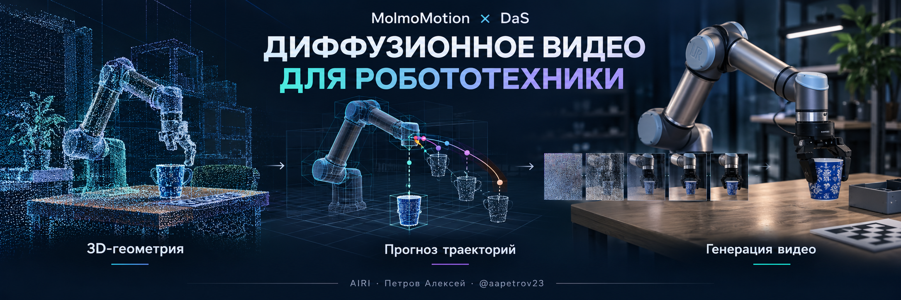
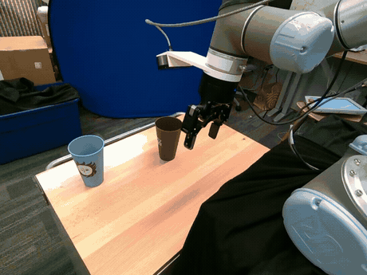
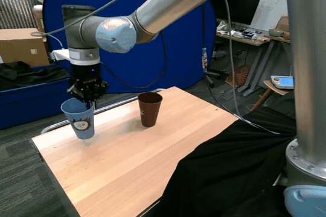
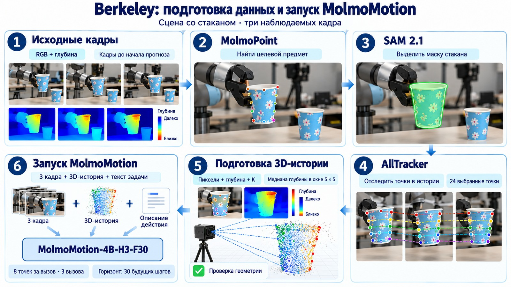
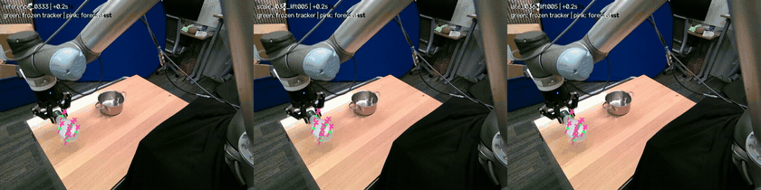
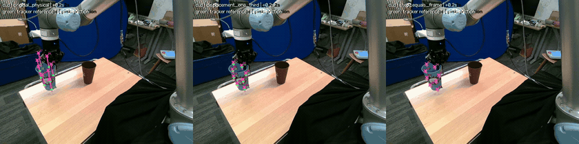
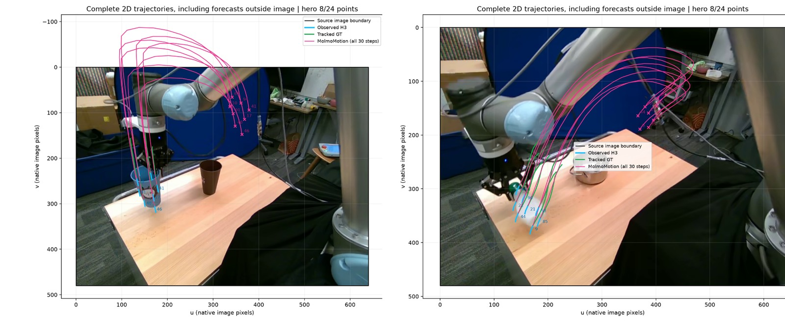
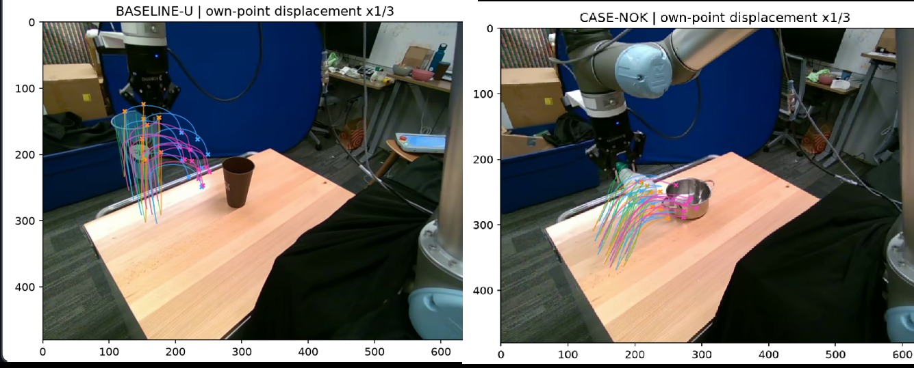
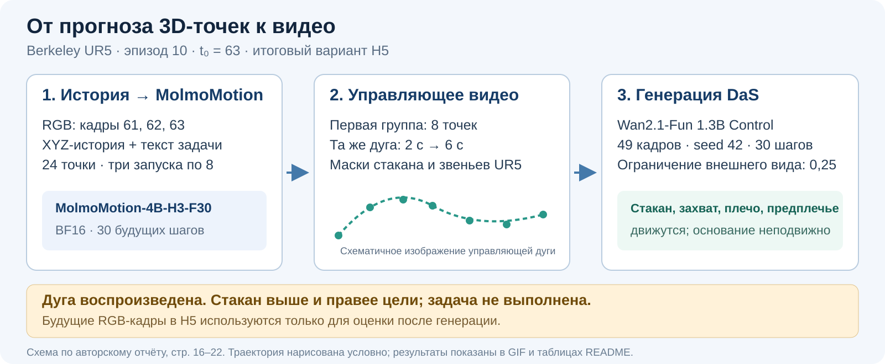
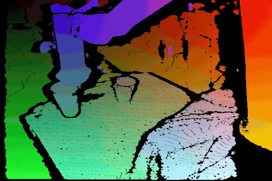

<p align="center">
  
</p>

<h1 align="center"><a href="README_RU.md">Прочитать на русском языке</a></h1>

# Diffusion Video Generation for Robotic Scenes

**MolmoMotion × Diffusion as Shader · AIRI · Alexey Petrov [@aapetrov23](https://t.me/aapetrov23)**

I used **Berkeley Autolab UR5 robotic scenes from ShareRobot**, reconstructed 3D geometry using neural estimates of camera parameters and measured depth, predicted point motion with MolmoMotion, and used the trajectory to condition the DaS diffusion model. The final **H5** variant generates video of the cup and robot arm in motion.

**RGB-D → neural 3D geometry estimation → 3D trajectory prediction → diffusion video generation.**

| Motion prediction | Video generation | Hardware |
|---|---|---|
| MolmoMotion-4B-H3-F30 · BF16 | DaS / Wan2.1-Fun 1.3B Control | RTX 4070, 12 GB VRAM · 32 GB RAM · Linux / WSL |

[3D geometry](#geometry) · [Trajectory prediction](#trajectories) · [H5 generation](#h5) · [Reproducing the results](#reproduce)

### Real Scene and Generated Video

| Full Berkeley UR5 recording | H5 diffusion generation |
|:---:|:---:|
| [][video-real] | [][video-h5] |
| All 120 frames, 24 seconds, at the original rate of 5 fps. | 49 frames, approximately 6 seconds; the predicted trajectory is played out over 6 seconds instead of 2. |

*Click a GIF to open the original MP4. The real recording shows the entire episode; H5 shows the continuation after t₀ = 63. The cover is a conceptual project illustration; experimental results are shown in the GIFs and tables.*

<a id="geometry"></a>
## 1. Reconstructing 3D Geometry

In Berkeley, I selected a bottle transfer, **episode 9, t₀ = 47**, and a cup transfer, **episode 10, t₀ = 63**. I prepared the inputs using frames up to t₀. In TFDS, I found RealSense depth aligned with RGB; I **estimated the camera intrinsics K with UniDepthV2**. I checked that the camera was stationary using the background.

<p align="center">
  
</p>

Input preparation:

1. **MolmoPoint** locates the object in frame t₀.
2. **SAM 2.1** segments the object mask.
3. **AllTracker** tracks the points through the preceding frames.
4. From 100 candidates, I select **24 points** that pass validation.
5. I reconstruct the 3D coordinate history from pixel positions, depth, and K.

For each point, I used the median depth in a **5 × 5 pixel window**. During smoothing, I changed the depth while preserving the point's image coordinates. The geometry remains approximate: the neural network estimates camera parameters, while measured depth provides distances. The **3D_est** label in the metrics reflects this uncertainty.

<a id="trajectories"></a>
## 2. Predicting 3D Trajectories

**MolmoMotion-4B-H3-F30** takes three RGB frames, a history of 3D points, and a textual action description. Each inference call predicts the motion of **8 points over 30 steps**; I used three calls for 24 points. I did not fine-tune the model; I ran inference in BF16 and checked the completeness of the output.

For the cup, I used frames **61, 62, 63**, corresponding to −0.4, −0.2, and 0 s relative to t₀. The original recording runs at **5 fps**, while the model is designed for **15 fps**. To compare with the real continuation, I selected prediction steps 3, 6, …, 30, corresponding to 0.2, 0.4, …, 2.0 s. I did not separately evaluate the effect of this frame-rate mismatch.

| Bottle transfer | Cup transfer |
|:---:|:---:|
| [][video-bottle] | [][video-cup] |

In these scenes, the model overestimated displacement. I tested reducing displacement relative to t₀: the saved bottle variant is **`late_036_lift005`**, and the cup correction shown here is **×1/3**. I selected the corrections using scenes I had already examined. For H5 generation, I retained the **original cup trajectory**, without the ×1/3 correction.

| Scene | Prediction | ADE 2D, px ↓ | FDE 2D, px ↓ | ADE 3D_est, mm ↓ |
|---|---|---:|---:|---:|
| Bottle | Original | 218.39 | 201.40 | 266.49 |
| Bottle | Corrected, `late_036_lift005` | 45.69 | 33.58 | 58.91 |
| Bottle | Constant velocity | 11.05 | 11.93 | 42.62 |
| Cup | Original | 193.57 | 224.48 | 222.20 |
| Cup | Displacement ×1/3 | 46.92 | 69.21 | 58.52 |
| Cup | Constant velocity | 2.91 | 7.37 | 14.29 |

ADE measures the average error over available point–frame pairs; FDE measures the error at the final prediction step. Constant velocity is more accurate by these metrics in both scenes. The metrics do not account for collisions and do not establish whether the action was completed. For 2D evaluation, **240/240 pairs** are available in each scene; for 3D_est, **235/240** are available for the bottle and **238/240** for the cup.

<details>
<summary><b>Original trajectories and the effect of correction</b></summary>





Pink indicates the original prediction, and light blue indicates the input history. In the final package, the primary bottle variant is `late_036_lift005`, and the primary cup variant is `original_physical`.

</details>

[Berkeley experiment history](runs/berkeley_ur5_molmomotion/research_story.md) · [saved predictions and metrics](https://github.com/AlexeyPetrov1/Airi_research_task/blob/f7403e5e5685fe8d235ad7565d8315804b4e0e11/docs/experiments.md).

<a id="h5"></a>
## 3. H5: Diffusion Video Generation

I used **DaS from the Wanfun branch with Wan2.1-Fun 1.3B Control**. DaS takes frame t₀ and a control video constructed from the saved MolmoMotion prediction. In H5, I used future RGB frames only for evaluation after generation.

<p align="center">
  
</p>

For control, I selected the **first group of eight points** because its trajectories were more consistent with the motion of a single rigid body. I kept each point's color consistent across frames. I extended the duration of the original spatial trajectory from **2 to 6 seconds**.

I approximately reconstructed the motion of the UR5 upper arm and forearm from joint states up to t₀. In the initial frame, I segmented the arm components, reconstructed the occluded background, and prepared their motion. I retained the cup and gripper trajectories. After each generation step, I used a reference video derived from t₀ to constrain appearance, with a coefficient of **0.25**.

[][video-control]

*H5 control video. The same color identifies the same surface point in every frame.*

| H5 parameter | Value |
|---|---|
| Frames and duration | 49 frames, approximately 6 seconds |
| Generation | Seed 42, 30 steps, BF16, and offloading model components to RAM |
| Generation time | 507.4 s |
| Peak allocated VRAM / process memory | 9.88 GiB / 21.14 GiB |
| ADE / FDE relative to the selected prediction | 4.31 / 5.06 px |
| Available pairs | 281/392, or 71.68% |

The H5 metrics compare the generated motion with the **selected control trajectory**. Points lost by the tracker are excluded from evaluation. I inspected all 49 frames: the cup remains recognizable, although its pattern changes. The approximate robot arm geometry is unsuitable for controlling a real robot.

### Final H5 Video

<p align="center">
  <a href="https://raw.githubusercontent.com/AlexeyPetrov1/Airi_research_task/eb3a5240140386b021b5555b8e0b3bde3ee60b0f/runs/berkeley_ur5_molmomotion/cup/das_full_motion/H5_group00_6s_whole_robot_prior025/generated_seed42.mp4">
    
  </a>
</p>

In H5, the **cup, gripper, upper arm, and forearm** move, while the base remains stationary. DaS reproduces the selected trajectory. The cup ends its motion above and to the right of the target cup and does not land inside it.

<a id="reproduce"></a>
## Reproducing the Results

The Berkeley predictions and shared CLI are in the **[`molmo-motion-packaged`](https://github.com/AlexeyPetrov1/Airi_research_task/tree/molmo-motion-packaged)** branch. The H5 generation code and artifacts are in **[`codex/das-full-motion-20261003`](https://github.com/AlexeyPetrov1/Airi_research_task/tree/codex/das-full-motion-20261003)**; DaS requires a separate environment.

<details>
<summary><b>Installing and running Berkeley prediction in Linux / WSL</b></summary>

```bash
git clone --single-branch --branch molmo-motion-packaged \
  https://github.com/AlexeyPetrov1/Airi_research_task.git
cd Airi_research_task
python3.11 -m venv .venv
source .venv/bin/activate
pip install torch==2.9.1 torchvision==0.24.1 \
  --index-url https://download.pytorch.org/whl/cu128
pip install torchcodec==0.9.1 \
  --index-url https://download.pytorch.org/whl/cpu --no-deps
pip install '.[dev]'
hf download allenai/MolmoMotion-4B-H3-F30 config.yaml model.pt \
  --revision 3f5e790a511ff2cdf21c8d2a14cb4d8409c94629 \
  --local-dir data/checkpoints/MolmoMotion-4B-H3-F30

# New cup prediction
molmo-motion-experiment --config configs/berkeley_cup.json \
  --checkpoint "$PWD/data/checkpoints/MolmoMotion-4B-H3-F30"

# Metrics and visualization of the saved prediction
molmo-motion-experiment --config configs/berkeley_cup.json --mode replay \
  --checkpoint "$PWD/data/checkpoints/MolmoMotion-4B-H3-F30"
```

For the bottle, use `configs/berkeley_bottle.json`. TorchCodec requires FFmpeg shared libraries; the weights occupy approximately 18 GB. Results are saved to `outputs/<run_id>/`, where `index.html` brings together predictions, metrics, plots, and videos.

</details>

This work is based on [Ai2's MolmoMotion](https://github.com/allenai/molmo-motion), upstream commit `61f5b21b694ad8f854ec7ecd2400005acc73f685`. [Model weights](https://huggingface.co/allenai/MolmoMotion-4B-H3-F30) · [main code license](LICENSE) · [visual asset provenance](assets/readme/sources.json). Datasets and third-party components have their own terms of use.

[video-real]: https://raw.githubusercontent.com/AlexeyPetrov1/Airi_research_task/eb3a5240140386b021b5555b8e0b3bde3ee60b0f/runs/berkeley_ur5_molmomotion/sources/videos/chunk-000/observation.images.image/episode_000010.mp4
[video-h5]: https://raw.githubusercontent.com/AlexeyPetrov1/Airi_research_task/eb3a5240140386b021b5555b8e0b3bde3ee60b0f/runs/berkeley_ur5_molmomotion/cup/das_full_motion/H5_group00_6s_whole_robot_prior025/generated_seed42.mp4
[video-bottle]: https://raw.githubusercontent.com/AlexeyPetrov1/Airi_research_task/f7403e5e5685fe8d235ad7565d8315804b4e0e11/fixtures/berkeley_bottle/media/legacy_comparison.mp4
[video-cup]: https://raw.githubusercontent.com/AlexeyPetrov1/Airi_research_task/f7403e5e5685fe8d235ad7565d8315804b4e0e11/fixtures/berkeley_cup/media/legacy_comparison.mp4
[video-control]: https://raw.githubusercontent.com/AlexeyPetrov1/Airi_research_task/eb3a5240140386b021b5555b8e0b3bde3ee60b0f/runs/berkeley_ur5_molmomotion/cup/das_full_motion/group00_stretched_6s_whole_robot_v1/control_720x480.mp4
