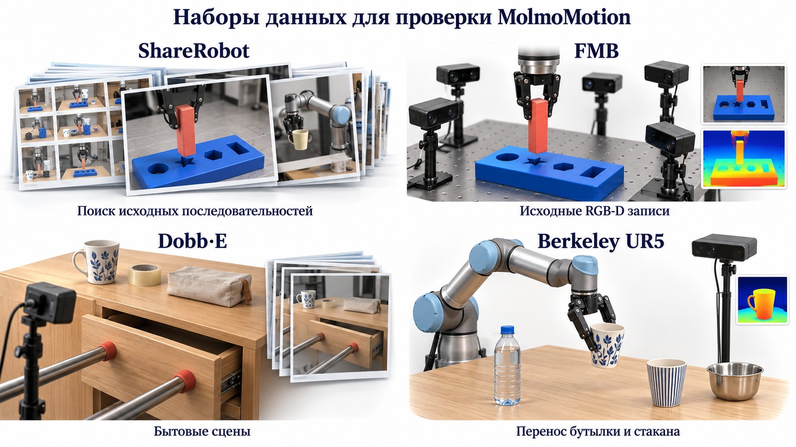
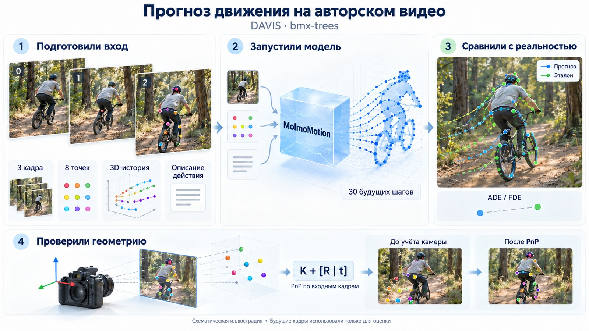
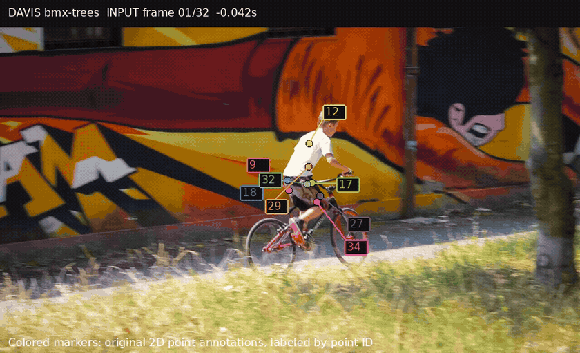
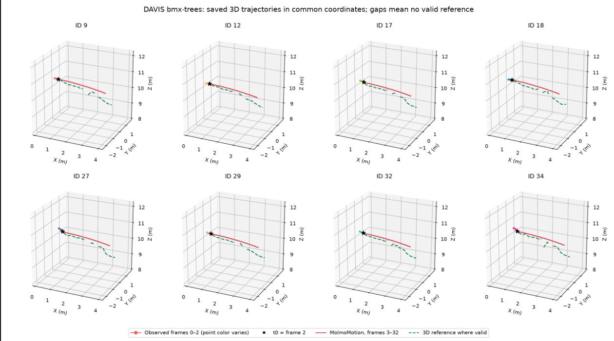
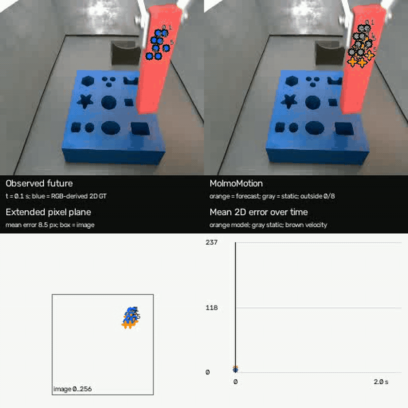
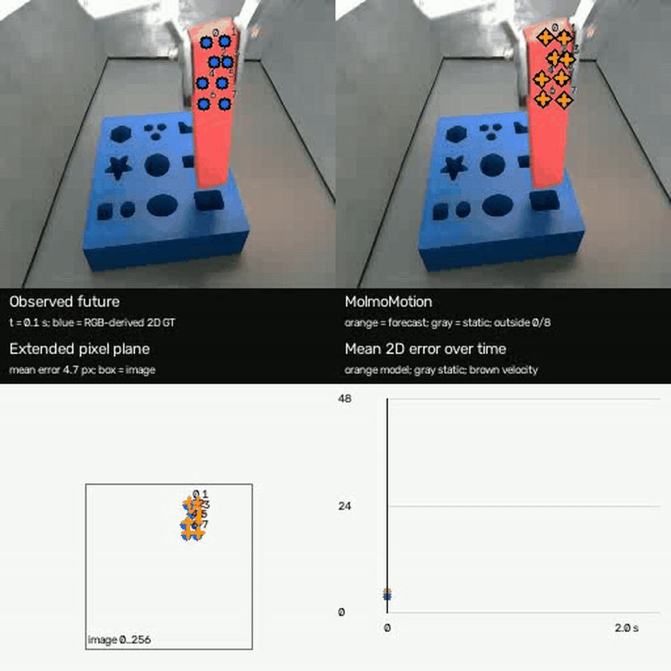
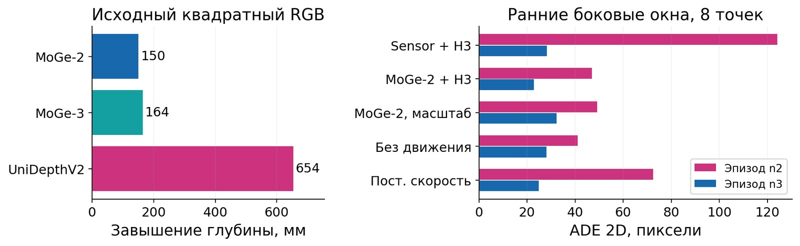
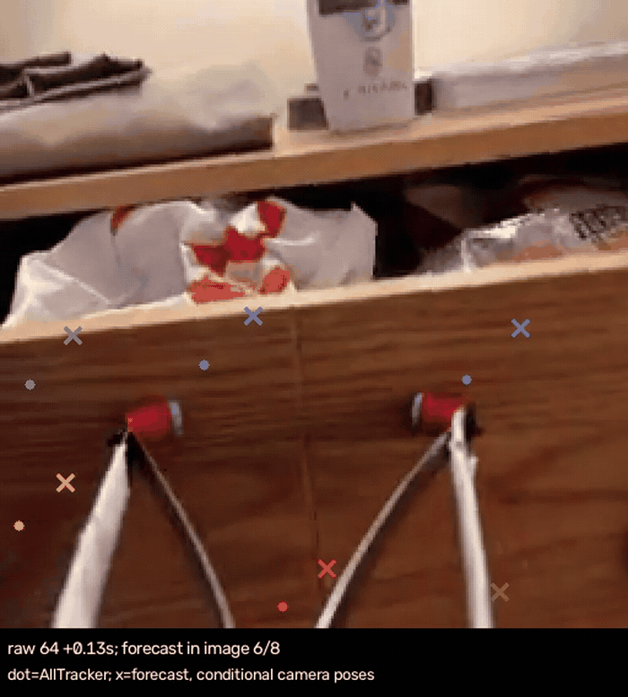
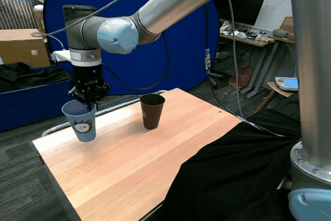
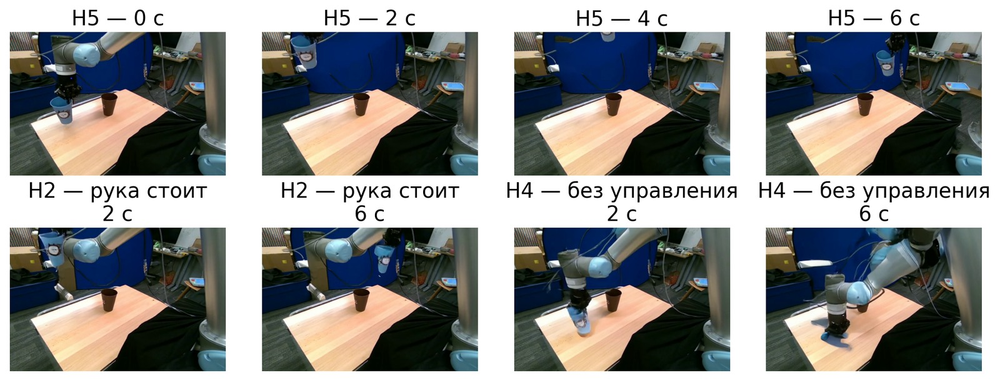

<p align="center">
  
</p>

# MolmoMotion: история экспериментов

**Тестовое задание AIRI · Петров Алексей [@aapetrov23](https://t.me/aapetrov23)**

Три дня работы и один день оформления.

Проверил прогноз движения 3D-точек на авторском видео DAVIS, применил модель к робототехническим данным ShareRobot и использовал предсказанную траекторию для генерации видео с помощью Diffusion as Shader (DaS).

Основная сложность возникла при восстановлении 3D-координат. RGB и глубины оказалось недостаточно: пришлось искать исходные записи, проверять калибровку камеры, масштаб глубины и совмещение изображения с картой глубины.

| Модель | Вход → прогноз | Оборудование | Среда |
|---|---|---|---|
| MolmoMotion-4B-H3-F30 | 3 кадра → 30 шагов | RTX 4070, 12 ГБ VRAM · 32 ГБ RAM | Linux / WSL · BF16 |

[Результаты](#results) · [DAVIS](#davis) · [FMB](#fmb) · [DobbE](#dobbe) · [Berkeley](#berkeley) · [DaS](#das) · [Воспроизведение](#reproduce) · [Выводы](#lessons)

### Реальное движение и итоговая генерация

| Реальная запись Berkeley UR5 | DaS, итоговый вариант H5 |
|:---:|:---:|
| [][video-real] | [][video-h5] |
| Продолжение от кадра 63; воспроизведение замедлено в 3 раза. | Исходная дуга MolmoMotion растянута с 2 до 6 секунд. |

В H5 движутся стакан, захват, плечо и предплечье; основание остаётся неподвижным. Стакан заканчивает движение выше и правее цели, поэтому задача переноса внутрь целевого стакана **не выполнена**. Генерация воспроизводит выбранную дугу, но это само по себе не подтверждает успешность действия.

*GIF открываются по клику как исходные MP4. Схемы и графики взяты из моего отчёта; происхождение файлов и параметры конвертации сохранены в [assets/readme/sources.json](assets/readme/sources.json).*

<a id="results"></a>
## Что получилось

| Часть задания | Работа | Результат |
|---|---|---|
| **1. Авторское видео** | DAVIS `bmx-trees`, 8 точек, полный прогноз F=30 | На одном эпизоде MolmoMotion точнее неподвижности и постоянной скорости по ADE/FDE. Входные 3D-координаты предоставлены авторами. |
| **2. ShareRobot** | Восстановление записей FMB, DobbE и Berkeley; пять подходов к геометрии и коррекция смещения | На FMB и DobbE прогноз существенно расходится с видео. На Berkeley движение визуально правдоподобнее, но постоянная скорость точнее по ADE/FDE. |
| **3. Генерация видео** | DaS / Wan2.1-Fun 1.3B Control, исправление дубликата и добавление движения манипулятора | H5 следует заданной дуге; стакан узнаваем, рисунок меняется. В цель он не попадает. |
| **4. Воспроизводимость** | Общий CLI, семь конфигураций, сохранённые входы, прогнозы и проверки | Шесть успешных запусков повторены; седьмой пример проверяет остановку при несогласованной геометрии. |

<p align="center">
  
</p>

### Как устроен эксперимент

MolmoMotion получает три RGB-кадра, историю координат выбранных 3D-точек и текстовое описание действия. За один запуск предсказывает движение восьми точек на 30 шагов; для 24 точек выполнял три запуска. Модель не дообучал. Проверял полноту ответа: все точки, все шаги и конечность координат.

В FMB v2 и Berkeley использовал общий конвейер: **MolmoPoint → SAM 2.1 → AllTracker → 3D-история → MolmoMotion**. Из 100 кандидатов выбирал 24 точки, прошедшие проверку. Глубину брал как медиану окна 5 × 5 пикселей; при сглаживании менял глубину, сохраняя положение точки на изображении. Доступа к SAM 3 не было.

**Метрики.** ADE измеряет среднее расстояние между прогнозом и эталоном по доступным парам «точка / кадр». FDE измеряет ошибку на последнем шаге прогноза. Методы сравнивал на общих доступных парах; выход за границы изображения также учитывал в ошибке. Покрытие эталоном указывал отдельно.

Обозначение **3D_est** означает оценку с приближённой геометрией. Она зависит от ошибок трекинга, глубины и калибровки. В ShareRobot ориентировался прежде всего на 2D-ошибку и просмотр траекторий; точность в реальных 3D-координатах этими оценками не подтверждена.

<a id="davis"></a>
## 1. DAVIS: авторское видео и аудит координат

Выбрал `bmx-trees`: велосипедист едет между деревьями. На вход подал кадры **0, 1, 2** и восемь точек; прогноз охватывает кадры **3–32**. При исходной частоте 24 кадра/с это 1,25 секунды. Здесь входные данные уже подготовлены авторами; их конвейер перевода 2D → 3D отдельно не воспроизводил.

<p align="center">
  
</p>

[][video-davis]

*В GIF показано реальное видео с авторскими 2D-соответствиями. Сравнение 3D-прогноза с разметкой приведено на графике ниже; эти точки в GIF не являются проекцией прогноза.*

| Метод | ADE 3D, м ↓ | FDE 3D, м ↓ |
|---|---:|---:|
| **MolmoMotion** | **0,376** | **0,724** |
| Без движения | 1,949 | 3,707 |
| Постоянная скорость | 0,573 | 1,089 |

Эталон доступен для **215/240 пар (89,58%)**; на последнем кадре видны все восемь точек. Результат относится к одному эпизоду. По сведениям авторов, 3D-разметка получена с помощью ViPE; её точность независимо не подтверждена.

<p align="center">
  
</p>

Перед прогнозом проверил проекции точек на трёх входных кадрах. При проекции только через K ошибка достигала **52,91 px**. Зафиксировав K, оценил R и t с помощью PnP; на использованных 2D–3D-соответствиях ошибка составила около **0,23 px**. Это проверка согласованности проекции с разметкой. Сохранённый прогноз DAVIS не переинтерпретировал как прогноз после исправления геометрии.

В дополнительном эпизоде WorldTrack перевод одной и той же истории из мировой системы в систему камеры t₀ снизил ADE 3D с **0,074 до 0,054 м**. Система координат влияет на результат.

Подробности: [эксперимент DAVIS](report/author_davis.md) · [аудит координат](report/author_davis_coordinate_audit.md) · [WorldTrack](report/second_episode_geometry.md).

<a id="fmb"></a>
## 2. ShareRobot: восстановление геометрии

### FMB: исходная запись, глубина и калибровка

Для ShareRobot `episode_5201` нашёл исходный FMB `1_M_L_3_vertical_n_2.npy`: **148 шагов, четыре RGB-D камеры и состояния робота**. Кадры ShareRobot 0 и 15 соответствуют шагам FMB 0 и 74. При выгрузке BGR был интерпретирован как RGB; исправил каналы и продолжил работу с исходной последовательностью.

В FMB проверил обратную проекцию по RGB-D, калибровку по CAD, MoGe-2/3, UniDepthV2 и COLMAP. Надёжную геометрию получить не удалось: после приведения RGB к 256 × 256 границы изображения и глубины расходились на **4–13 px**, а K оставалась неустойчивой.

| FMB n2 | FMB n3 |
|:---:|:---:|
| [][video-fmb-n2] | [][video-fmb-n3] |

*В обеих сценах сохранялось значительное расхождение с наблюдаемым движением. Вклад калибровки отделить от других факторов не удалось.*

<p align="center">
  
</p>

<details>
<summary><b>Что проверил при восстановлении геометрии FMB</b></summary>

| Подход | Наблюдение |
|---|---|
| RGB-D + K | Масштаб 0,0001 м/отсчёт согласуется с движением робота, но совмещение RGB/depth и K недостаточно надёжны. |
| CAD / PnP | Размер детали 40,32 × 25,92 × 150 мм. Лучший вариант расходился с глубиной датчика на 4–5 мм, но при ошибке разметки 2 px оценка fx менялась от 134 до 225 px. |
| Калибровка по плате | Ошибка проекции снизилась с 0,82 до 0,66 px, а ошибка Z выросла с 6,73 до 38,14 мм. Новую K не принял. |
| MoGe-2, MoGe-3, UniDepthV2 | Все завышали глубину. Изменение соотношения сторон и угла обзора уменьшало расхождение, но не устраняло его. |
| Масштабирование MoGe-2 | Ошибка Z снизилась с 24,69 до 11,66 мм в первом окне и со 139,17 до 9,48 мм во втором. Межкадровая нестабильность глубины сохранилась. |
| COLMAP на FMB | Внутренняя ошибка репроекции 0,68 px; глубина платы расходилась с датчиком на 233 мм. Независимая проверка не пройдена. |

Калибровка по захвату, аффинное совмещение RGB/depth и триангуляция по двум камерам также не дали надёжной оценки.

В FMB v1 вручную выбирал восемь точек, использовал номинальную K и ECC для 2D-эталона. В v2 одновременно исправил цвет, изменил выбор точек, трекер и геометрию. Поэтому разницу между версиями нельзя приписать одному изменению.

</details>

### Чувствительность прогноза FMB

Выполнил **26 прогнозов**, меняя текст, историю, масштаб XYZ, фокусное расстояние и порядок точек. Ниже показаны отдельные варианты на n2 относительно исходной ADE **124,14 px**.

| Изменение | ADE 2D, px ↓ | Наблюдение |
|---|---:|---|
| Перефразировать ту же задачу | 122,37 | Ошибка почти не изменилась. |
| Трижды повторить последний RGB-кадр и XYZ | 41,14 | Предсказанное движение почти исчезло. |
| Умножить все XYZ на 0,9 | 59,40 | Ошибка снизилась. |
| Переставить точки, сохранив первую опорную | 58,88 | Прогноз изменился. |

Низкая ADE при почти неподвижном прогнозе не означает, что модель решила задачу. Эти прогоны проверяют чувствительность входа; переносимость найденных изменений отдельно не подтверждена.

Материалы: [восстановление FMB](report/sharerobot_fmb_episode_5201.md) · [CAD](report/fmb_cad_metric_depth_experiment.md) · [калибровка K](report/fmb_effective_k_256_calibration.md) · [альтернативные методы](report/fmb_alternative_calibration_abc.md) · [геометрия и абляции](report/fmb_geometry_forecast_study.md) · [конвейер v2](report/fmb_v2_berkeley_matched.md).

<a id="dobbe"></a>
### DobbE: COLMAP, ViPE и проверка входа

Для ShareRobot `episode_3651` нашёл исходную сцену со стаканом, но метаданных Record3D `.r3d` с калибровкой не хватало. COLMAP обработал все **96 кадров** с внутренней ошибкой **1,21 px**; независимая проверка по точкам фона дала **25,52 px**. Такая реконструкция проверку не прошла.

С ViPE проверил три сцены: **A, стакан; B, рулон ленты; C, ящик**. Для подготовки входа использовал только кадры до t₀. Из 100 точек оставил восемь. Заранее задал пороги ошибки проекции статического фона: медиана ≤ 4 px, P90 ≤ 10 px.

| Геометрия | Медиана / P90, px | Решение |
|---|---:|---|
| A, ViPE без VideoDepthAnything | 5,92 / 24,74 | Проверка не пройдена. |
| B, ViPE без VideoDepthAnything | 7,25 / 22,43 | Проверка не пройдена; глубина завышена в 2,95 раза. |
| C, ViPE без VideoDepthAnything | 1,35 / 3,07 | Вход прошёл проверку. |
| C, сенсорная глубина с прежними K и позами | 5,52 / 7,84 | Проверка не пройдена; inference не запускал. |

В сцене B Small VideoDepthAnything поместилась в 12 ГБ VRAM, но ошибки выросли до **8,31 / 23,05 px**.

<p align="center">
  <a href="https://raw.githubusercontent.com/AlexeyPetrov1/Airi_research_task/f7403e5e5685fe8d235ad7565d8315804b4e0e11/fixtures/dobbe_pure_vipe/media/legacy_comparison.mp4">
    
  </a>
</p>

В сцене C получен полный прогноз, но **ADE/FDE = 488,85/1267,45 px**; у неподвижности **168,26/556,14 px**. Оценка доступна для **152/240 пар**, на последнем кадре размечены четыре из восьми точек. Параметры камеры будущих кадров ненадёжны, поэтому ошибка прогноза и ошибка проекции здесь не разделены.

Подробности: [исходные DobbE данные](report/dobbe_episode_3651_recovery.md) · [COLMAP](report/dobbe_colmap_official_baseline.md) · [ViPE](report/dobbe_vipe_v1.md).

<a id="berkeley"></a>
## 3. Berkeley UR5: измеренная глубина и коррекция смещения

Выбрал перенос бутылки, **эпизод 9, t₀ = 47**, и стакана, **эпизод 10, t₀ = 63**. В TFDS нашёл измеренную глубину RealSense, совмещённую с RGB; поле глубины LeRobot оказалось цветным видео. K оценил через UniDepthV2 на кадрах до t₀, неподвижность камеры проверил по фону.

<p align="center">
  
</p>

Исходная запись имеет частоту **5 кадров/с**, модель рассчитана на **15 кадров/с**. Для оценки взял шаги прогноза 3, 6, …, 30, соответствующие 0,2, 0,4, …, 2,0 с. Три входных кадра сохранил с интервалом 0,2 с. Влияние различия частот отдельно не проверял.

| Бутылка | Стакан |
|:---:|:---:|
| [][video-bottle] | [][video-cup] |

Модель предсказывала слишком большое перемещение. Проверил уменьшение смещения относительно t₀ в три раза. Для бутылки в итоговом наборе сохранён вариант `late_036_lift005`; строка «после коррекции» ниже относится к нему. Для стакана показана поправка ×1/3. Коррекцию выбирал на уже просмотренных сценах; для дальнейшего DaS-эксперимента со стаканом сохранил **исходный прогноз**.

| Сцена | Метод | ADE 2D, px ↓ | FDE 2D, px ↓ | ADE 3D_est, мм ↓ |
|---|---|---:|---:|---:|
| Бутылка | Исходный H3 | 218,39 | 201,40 | 266,49 |
| Бутылка | После коррекции, `late_036_lift005` | 45,69 | 33,58 | 58,91 |
| Бутылка | **Постоянная скорость** | **11,05** | **11,93** | **42,62** |
| Стакан | Исходный H3 | 193,57 | 224,48 | 222,20 |
| Стакан | Смещение ×1/3 | 46,92 | 69,21 | 58,52 |
| Стакан | **Постоянная скорость** | **2,91** | **7,37** | **14,29** |

Постоянная скорость точнее по ADE/FDE в обеих сценах. Эти метрики не учитывают столкновения: пригодность траектории для действия нужно проверять отдельно. Для 2D доступны **240/240 пар** в каждой сцене; для 3D_est **235/240** у бутылки и **238/240** у стакана.

<details>
<summary><b>Исходные траектории и результат коррекции</b></summary>


В исходном рисунке розовым показан прогноз, голубым обозначена входная история. В документации итоговой ветки основным вариантом бутылки выбран `late_036_lift005`, а стакана `original_physical`.

</details>

Материалы: [история Berkeley](runs/berkeley_ur5_molmomotion/research_story.md) · [итоговые варианты](https://github.com/AlexeyPetrov1/Airi_research_task/blob/f7403e5e5685fe8d235ad7565d8315804b4e0e11/docs/experiments.md) · [ограничения](https://github.com/AlexeyPetrov1/Airi_research_task/blob/f7403e5e5685fe8d235ad7565d8315804b4e0e11/docs/experiment_scope.md).

<a id="das"></a>
## 4. MolmoMotion → DaS: от первой генерации к H5

Для сцены со стаканом использовал **DaS из ветки Wanfun и Wan2.1-Fun 1.3B Control**. На RTX 4070 запускал BF16 с переносом частей модели в RAM. В MolmoMotion подал кадры **61, 62, 63** эпизода Berkeley 10 и соответствующую 3D-историю; DaS получила кадр t₀ и управляющее видео по сохранённому прогнозу.

<p align="center">
  
</p>

### Управление и первая попытка

| Управляющее видео для H5 | Первая генерация |
|:---:|:---:|
| [][video-control] | [][video-first] |

В первой генерации исходный стакан оставался на месте, а по заданной траектории двигалась его копия. Стакан деформировался, двигался отдельно от захвата и проходил сквозь манипулятор. Ошибка относительно реального продолжения выглядела небольшой: трекер следил за рисунком исходного стакана. Поэтому оценивал результат также просмотром видео.

Для устранения дубликата восстанавливал фон на исходном месте стакана, менял опорное изображение и после каждого шага генерации ограничивал освобождённую область изображением пустого фона. Движущийся стакан защищал от этого ограничения.

| v6: устранение постоянного дубликата | F: синтез с известным конечным кадром |
|:---:|:---:|
| [][video-v6] | [][video-f] |

**Вариант F использует реальный будущий кадр 73.** В нём исходную пространственную дугу заменил переходом между известными видами; MolmoMotion задаёт степень продвижения. Это отдельная проверка синтеза. В остальных описанных вариантах будущие RGB-кадры использовал только для оценки после генерации.

<details>
<summary><b>Как менялись варианты устранения дубликата v1–v6</b></summary>

| Вариант | Изменение | Результат |
|---|---|---|
| v1 | Восстановил скрытый фон управляющего видео. | Неподвижный стакан сохранился. |
| v2 | Отключил отдельное `ref_image`, сохранил начальный кадр и CLIP-условие. | Неподвижный стакан сохранился. |
| v3 | Передал в `ref_image` фон без стакана. | Неподвижный стакан сохранился. |
| v4 | Добавил ограничение пустой области после каждого шага генерации. | Остался полупрозрачный силуэт. |
| v5 | Расширил маску на 24 px с защитой движущегося объекта. | Основная часть дубликата исчезла; края ещё сохранялись. |
| v6 | Убрал тёмно-синий край стакана из маски защиты захвата. | С 0,5 с постоянный дубликат исчез; внешний вид стакана меняется. |

В серии фиксировал прогноз, 24 точки, движение жёсткого тела, seed 42 и 25 шагов генерации. Эти номера v1–v6 относятся к DaS; FMB v2 обозначает другой конвейер.

</details>

### H1–H5: сохранение дуги и движение манипулятора

Прогнозы трёх групп по восемь точек были несогласованы. Для H1–H5 использовал первую группу: её траектории лучше соответствовали движению одного жёсткого тела. Цвет каждой точки сохранял во всех кадрах управления.

| Вариант | Что изменил | Наблюдение |
|---|---|---|
| [H1][video-h1] | Дуга за 2 с, затем удержание до 6 с; без ограничения внешнего вида. | Стакан и захват теряли форму. |
| [H2][video-h2] | Ту же дугу растянул на 6 с. | Стакан и захват движутся; плечо и предплечье неподвижны. |
| [H3][video-h3] | К H2 добавил ограничение внешнего вида из t₀, коэффициент 0,25. | Форма и рисунок сохраняются лучше; ADE к управляющей траектории снизилась с 7,92 до 4,09 px. |
| [H4][video-h4] | Отключил управление траекторией относительно H2. | Требуемая дуга не воспроизвелась; стакан потерял форму. |
| [H5][video-h5] | Добавил движение плеча и предплечья и восстановил скрытый фон; ограничение 0,25. | Движется весь манипулятор, кроме основания; стакан не попадает в цель. |

*H1–H5 здесь обозначают номера DaS-экспериментов. В названии модели MolmoMotion-4B-H3-F30 H3 означает три входных кадра.*

| H2: плечо и предплечье неподвижны | H4: управление траекторией отключено |
|:---:|:---:|
| [][video-h2] | [][video-h4] |

В H5 восстановил приближённое движение звеньев UR5 по состояниям суставов до t₀. Пространственную дугу стакана и захвата сохранил; движение растянул с 2 до 6 секунд, получив 49 кадров. Опорное видео из t₀ использовал после каждого шага генерации с коэффициентом 0,25.

<p align="center">
  
</p>

| Проверка на общих видимых парах | ADE, px | Пары |
|---|---:|---:|
| Ограничение внешнего вида: H2 → H3 | 7,92 → 4,09 | 252 |
| Отключение управления: H2 → H4 | 7,21 → 199,91 | 225 |
| Точки плеча и предплечья: H3 / H5 | 17,03 / 0,90 | 133 |

В H5 ошибка относительно **выбранного прогноза**, а не реального продолжения, составляет **ADE 4,31 px / FDE 5,06 px** на **281/392 парах (71,68%)**. Потерянные трекером точки в оценку не входят. Просмотрел все 49 кадров: стакан узнаваем, но рисунок меняется. Приближённая геометрия манипулятора не подходит для управления реальным роботом.

Генерация H5 заняла **507,4 с** при **seed 42 и 30 шагах**; пик выделенной VRAM **9,88 GiB**, памяти процесса **21,14 GiB**.

Материалы DaS: [первая генерация][report-das-first] · [устранение дубликата][report-das-dedup] · [серия H1–H5 и команды][report-das-h] · [вариант F][report-das-f].

<a id="reproduce"></a>
## 5. Воспроизведение

Ветка **[`molmo-motion-packaged`](https://github.com/AlexeyPetrov1/Airi_research_task/tree/molmo-motion-packaged)** содержит общий CLI, фиксированные входы, эталоны и сохранённые прогнозы. Исходные алгоритмы модели при упаковке не менял. Код DaS находится отдельно, в **[`codex/das-full-motion-20261003`](https://github.com/AlexeyPetrov1/Airi_research_task/tree/codex/das-full-motion-20261003)**: ему требуется другая среда.

```text
Airi_research_task/             # ветка molmo-motion-packaged
├── src/
│   ├── molmo_motion/           # модель
│   └── motion_experiments/     # запуск, метрики, визуализация
├── configs/                   # семь фиксированных примеров
├── fixtures/                  # входы, эталоны, сохранённые прогнозы
├── tests/                     # проверки
├── tools/                     # итоговая проверка экспериментов
├── docs/                      # отчёты и происхождение данных
└── pyproject.toml
```

| Конфигурация | Пример |
|---|---|
| `author_davis` | DAVIS `bmx-trees`, 8 точек, H3/F30 |
| `fmb_wrist_1`, `fmb_wrist_2` | Две камеры FMB; выбранная кинематика и ограниченная поправка MolmoMotion |
| `berkeley_bottle` | Сохранённые варианты бутылки, основной `late_036_lift005` |
| `berkeley_cup` | Исходный физический прогноз стакана, `original_physical` |
| `dobbe` | DobbE C, `pure_vipe`, условная 2D-диагностика |
| `dobbe_blocked` | Ожидаемая остановка до inference при несогласованной геометрии |

### Установка в Linux / WSL

```bash
git clone --single-branch --branch molmo-motion-packaged \
  https://github.com/AlexeyPetrov1/Airi_research_task.git
cd Airi_research_task
python3.11 -m venv .venv
source .venv/bin/activate
pip install torch==2.9.1 torchvision==0.24.1 \
  --index-url https://download.pytorch.org/whl/cu128
pip install torchcodec==0.9.1 \
  --index-url https://download.pytorch.org/whl/cpu --no-deps
pip install '.[dev]'
hf download allenai/MolmoMotion-4B-H3-F30 config.yaml model.pt \
  --revision 3f5e790a511ff2cdf21c8d2a14cb4d8409c94629 \
  --local-dir data/checkpoints/MolmoMotion-4B-H3-F30
```

Нужны системные библиотеки FFmpeg для TorchCodec. Веса занимают около 18 ГБ. [Полная инструкция установки](https://github.com/AlexeyPetrov1/Airi_research_task/blob/f7403e5e5685fe8d235ad7565d8315804b4e0e11/README.md) и [снимок зависимостей](https://github.com/AlexeyPetrov1/Airi_research_task/blob/f7403e5e5685fe8d235ad7565d8315804b4e0e11/configs/installed-packages-wsl.txt) относятся к готовой ветке; [README_SETUP.md](README_SETUP.md) описывает раннюю подготовку первого запуска.

### Новый прогноз или воспроизведение сохранённого

```bash
# Новый inference
molmo-motion-experiment --config configs/author_davis.json \
  --checkpoint "$PWD/data/checkpoints/MolmoMotion-4B-H3-F30"

# Replay сохранённого прогноза с расчётом метрик и визуализацией
molmo-motion-experiment --config configs/author_davis.json --mode replay \
  --checkpoint "$PWD/data/checkpoints/MolmoMotion-4B-H3-F30"
```

Меняется конфигурация, расчёт метрик и визуализация остаются общими. Результаты сохраняются в `outputs/<run_id>/`: прогнозы, метрики, графики и видео собраны на странице `index.html`. Шесть успешных экспериментов повторены; результаты упаковки совпали с исследовательскими прогонами. Отдельная отрицательная проверка останавливает несогласованный вход до запуска модели.

[Итоговая проверка](https://github.com/AlexeyPetrov1/Airi_research_task/blob/f7403e5e5685fe8d235ad7565d8315804b4e0e11/docs/final_verification.md) · [конфигурации](https://github.com/AlexeyPetrov1/Airi_research_task/tree/f7403e5e5685fe8d235ad7565d8315804b4e0e11/configs) · [история исследования на main](report/) · [источники данных](DATA_SOURCES.md).

<a id="lessons"></a>
## Что вынес из работы

- Низкие ADE/FDE не гарантируют выполнение задачи. Метрики не штрафуют столкновения и сами по себе не проверяют попадание в цель.
- Геометрию нужно проверять независимо. Малая внутренняя ошибка COLMAP или PnP ещё не подтверждает верный масштаб глубины и устойчивую калибровку.
- Перед восстановлением 3D стоит проверить неподвижность камеры; для движущейся камеры нужны покадровые R и t.
- Текст, история, масштаб координат и порядок точек могут существенно менять прогноз. В FMB понижение ADE иногда сопровождалось исчезновением движения.
- Текстура стакана Berkeley могла помогать трекингу, а однотонные детали FMB могли мешать. Это гипотеза, влияние текстуры отдельно не проверял.
- Управление траекторией и ограничение внешнего вида улучшили DaS в этой сцене. H5 следует исходной дуге, но стакан не попадает в целевой стакан.

<details>
<summary><b>Сравнение подходов к геометрии и коррекции</b></summary>

| Подход | Что требуется | Практическое ограничение | Результат |
|---|---|---|---|
| RGB-D + K | Глубина, K, совмещение с RGB | Надёжный масштаб и калибровка | FMB остаётся приближённым; Berkeley имеет более надёжную глубину. |
| CAD / PnP | Размеры детали и её контур | Видимые соответствия и разные ракурсы | Глубина близка к датчику, K неустойчива. |
| MoGe / UniDepth | RGB до t₀ | Ошибка масштаба и межкадровая нестабильность | Масштабирование глубины не дало устойчивого улучшения прогноза. |
| COLMAP | Видео с различимыми деталями | Движущиеся объекты, почти неподвижная камера | Все кадры обработаны, независимая проверка не пройдена. |
| ViPE | Видео до t₀ | Отдельный контроль геометрии; точного 3D-эталона нет | Вход DobbE C прошёл проверку, прогноз расходится с видео. |
| Коррекция смещения | Готовый H3-прогноз | Подбор на уже просмотренных сценах | Berkeley точнее исходного прогноза, но уступает постоянной скорости. |

Metric3D, DepthAnythingV2, DUSt3R, MASt3R и VGGT рассматривал, но не запускал. VideoDepthAnything проверял в составе ViPE.

</details>

### Источники и авторство

Работа основана на [MolmoMotion от Ai2](https://github.com/allenai/molmo-motion), исходный commit `61f5b21b694ad8f854ec7ecd2400005acc73f685`. Исследовательские отчёты и эксперименты в этом репозитории выполнены Петровым Алексеем. Модель и исходный код принадлежат их авторам.

[Статья MolmoMotion](https://arxiv.org/abs/2606.18558) · [веса H3-F30](https://huggingface.co/allenai/MolmoMotion-4B-H3-F30) · [исходный README модели](https://github.com/allenai/molmo-motion/blob/61f5b21b694ad8f854ec7ecd2400005acc73f685/README.md) · [лицензия Apache 2.0](LICENSE).

Лицензии датасетов и сторонних компонентов указаны в [DATA_SOURCES.md](DATA_SOURCES.md) и [THIRD-PARTY-NOTICES](THIRD-PARTY-NOTICES). Их условия могут отличаться от лицензии основного кода.

[video-real]: https://raw.githubusercontent.com/AlexeyPetrov1/Airi_research_task/eb3a5240140386b021b5555b8e0b3bde3ee60b0f/runs/berkeley_ur5_molmomotion/sources/videos/chunk-000/observation.images.image/episode_000010.mp4
[video-h5]: https://raw.githubusercontent.com/AlexeyPetrov1/Airi_research_task/eb3a5240140386b021b5555b8e0b3bde3ee60b0f/runs/berkeley_ur5_molmomotion/cup/das_full_motion/H5_group00_6s_whole_robot_prior025/generated_seed42.mp4
[video-davis]: https://raw.githubusercontent.com/AlexeyPetrov1/Airi_research_task/f7403e5e5685fe8d235ad7565d8315804b4e0e11/fixtures/davis_bmx_trees/media/legacy_comparison.mp4
[video-fmb-n2]: https://raw.githubusercontent.com/AlexeyPetrov1/Airi_research_task/a2981b2fdcd0bf1bb9d50ecbe65c743e633b840b/runs/sharerobot_fmb_episode_5201/quantitative_2d_sensor_t126/study_media_v1/forecast_vs_observed.mp4
[video-fmb-n3]: https://raw.githubusercontent.com/AlexeyPetrov1/Airi_research_task/a2981b2fdcd0bf1bb9d50ecbe65c743e633b840b/runs/fmb_second_example_1_M_L_3_vertical_n_3/quantitative_2d_sensor_t130/study_media_v1/forecast_vs_observed.mp4
[video-bottle]: https://raw.githubusercontent.com/AlexeyPetrov1/Airi_research_task/f7403e5e5685fe8d235ad7565d8315804b4e0e11/fixtures/berkeley_bottle/media/legacy_comparison.mp4
[video-cup]: https://raw.githubusercontent.com/AlexeyPetrov1/Airi_research_task/f7403e5e5685fe8d235ad7565d8315804b4e0e11/fixtures/berkeley_cup/media/legacy_comparison.mp4
[video-control]: https://raw.githubusercontent.com/AlexeyPetrov1/Airi_research_task/eb3a5240140386b021b5555b8e0b3bde3ee60b0f/runs/berkeley_ur5_molmomotion/cup/das_full_motion/group00_stretched_6s_whole_robot_v1/control_720x480.mp4
[video-first]: https://raw.githubusercontent.com/AlexeyPetrov1/Airi_research_task/eb3a5240140386b021b5555b8e0b3bde3ee60b0f/runs/berkeley_ur5_molmomotion/cup/das_wanfun/generated_molmomotion_seed42.mp4
[video-v6]: https://raw.githubusercontent.com/AlexeyPetrov1/Airi_research_task/eb3a5240140386b021b5555b8e0b3bde3ee60b0f/runs/berkeley_ur5_molmomotion/cup/das_wanfun/variants/clean_reference_mask_v6/generated_molmomotion_seed42.mp4
[video-f]: https://raw.githubusercontent.com/AlexeyPetrov1/Airi_research_task/eb3a5240140386b021b5555b8e0b3bde3ee60b0f/runs/berkeley_ur5_molmomotion/cup/das_reference_repair/guided_endpoint_background/generated_seed42.mp4
[video-h1]: https://raw.githubusercontent.com/AlexeyPetrov1/Airi_research_task/eb3a5240140386b021b5555b8e0b3bde3ee60b0f/runs/berkeley_ur5_molmomotion/cup/das_full_motion/H1_group00_2s_no_prior/generated_seed42.mp4
[video-h2]: https://raw.githubusercontent.com/AlexeyPetrov1/Airi_research_task/eb3a5240140386b021b5555b8e0b3bde3ee60b0f/runs/berkeley_ur5_molmomotion/cup/das_full_motion/H2_group00_6s_no_prior/generated_seed42.mp4
[video-h3]: https://raw.githubusercontent.com/AlexeyPetrov1/Airi_research_task/eb3a5240140386b021b5555b8e0b3bde3ee60b0f/runs/berkeley_ur5_molmomotion/cup/das_full_motion/H3_group00_6s_prior025/generated_seed42.mp4
[video-h4]: https://raw.githubusercontent.com/AlexeyPetrov1/Airi_research_task/eb3a5240140386b021b5555b8e0b3bde3ee60b0f/runs/berkeley_ur5_molmomotion/cup/das_full_motion/H4_no_trajectory_control/generated_seed42.mp4
[report-das-first]: https://github.com/AlexeyPetrov1/Airi_research_task/blob/eb3a5240140386b021b5555b8e0b3bde3ee60b0f/report/das_wanfun_cup.md
[report-das-dedup]: https://github.com/AlexeyPetrov1/Airi_research_task/blob/eb3a5240140386b021b5555b8e0b3bde3ee60b0f/report/das_cup_dedup.md
[report-das-h]: https://github.com/AlexeyPetrov1/Airi_research_task/blob/eb3a5240140386b021b5555b8e0b3bde3ee60b0f/runs/berkeley_ur5_molmomotion/cup/das_full_motion/README.md
[report-das-f]: https://github.com/AlexeyPetrov1/Airi_research_task/blob/eb3a5240140386b021b5555b8e0b3bde3ee60b0f/runs/berkeley_ur5_molmomotion/cup/das_reference_repair/README.md
