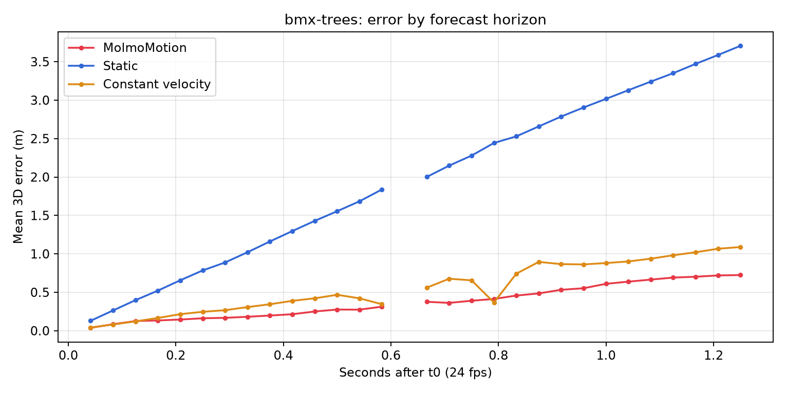
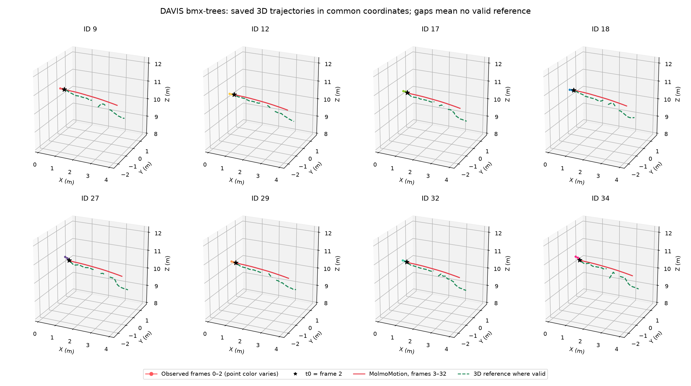
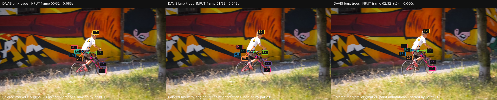
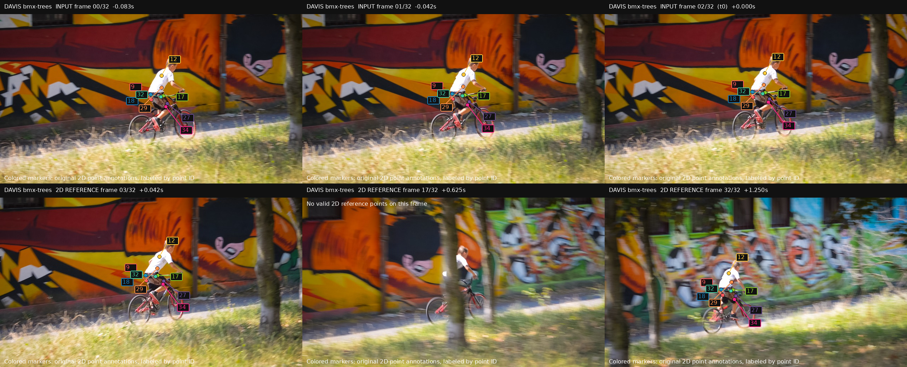

# Первый эксперимент AIRI: DAVIS `bmx-trees`

**Статус: PASS для одного авторского эпизода, F=30.** Модель MolmoMotion выдала все 240 будущих 3D-положений для восьми точек. В этом исправлении модель не запускалась: исходный ответ, входы и эталон проверены повторно, а описание координат и визуализации исправлены. Это не новый запуск с преобразованием геометрии входа.

## Данные и протокол

- Эпизод: `davis_bench / bmx-trees / bike_rider`; авторский пример [`examples/data/davis_bmx_trees`](../examples/data/davis_bmx_trees). Исходные ID точек: **9, 12, 17, 18, 27, 29, 32, 34**.
- Входные кадры DAVIS: **0, 1, 2**. Последний наблюдаемый кадр **t₀ = 2**. Будущее: **3–32**, ровно 30 шагов. Частота DAVIS в [PointMotionBench](https://huggingface.co/datasets/allenai/PointMotionBench) — **24 кадра/с**, поэтому последний прогноз расположен через **30/24 = 1,25 с** после t₀. Это временной протокол данного авторского примера, а не 15 fps протокол сводной таблицы статьи.
- RGB кадры извлечены из [DAVIS 2017 TrainVal 480p](https://davischallenge.org/davis2017/code.html). Авторские входные JPEG слегка повторно закодированы; средняя абсолютная разница с исходными кадрами 0–2 составляет 2,61–2,82 значения пикселя из 255. Контрольная сумма архива записана в [`provenance.json`](../runs/author_davis_bmx_trees_f30/provenance.json).
- 2D и 3D траектории взяты из `allenai/PointMotionBench`, ревизия `564ffa2e3cdb0ba443db8590b40e9691f487436c`, файлы `davis/tracks/bmx-trees_{2d,3d}.npz`. Эти 3D траектории — **авторская реконструкция в метрах**, а не прямое физическое измерение. [Описание конвейера авторов](https://github.com/allenai/molmo-motion/blob/61f5b21b694ad8f854ec7ecd2400005acc73f685/data_generation/README.md) указывает оценку глубины и позы камер, 2D отслеживание, подъём точек в 3D и сглаживание. Точность самой реконструкции здесь отдельно не оценивалась.
- Модель получила три исторических RGB кадра, 2D координаты восьми точек при t₀, **готовые исторические 3D координаты из авторской разметки** и подпись `A BMX rider rides through the trees`. Эксперимент **не проверяет получение исторической 3D геометрии исключительно из прошлых RGB кадров**. Точные входы процессора сохранены в [`processor_inputs.pt`](../runs/author_davis_bmx_trees_f30/processor_inputs.pt).

[`dataset_info.json`](../runs/author_davis_bmx_trees_f30/dataset_info.json) фиксирует индексы и кадровую частоту. Повторный аудит сравнил `ground_truth.npz` и входные `.pt` с исходными NPZ и авторским примером: ID, историю 0–2, будущее 3–32, 2D/3D значения, `K`, время и маску; все сравнения точные (`np.array_equal`). Следовательно, прогноз и эталон сравниваются в одной сохранённой системе и масштабе, без подгонки по будущему.

## Система координат

**Кадр 0 — первый кадр последовательности, а t₀ — кадр 2.** Сохранённые исторические 3D координаты совпадают с авторскими массивами. [`prepare_author_davis.py`](../scripts/prepare_author_davis.py) копирует их без преобразования; [`run_author_davis.py`](../scripts/run_author_davis.py) передаёт их в процессор без `c2w_at_t0`. Сохранённый `K` применён к историческим 3D точкам каждого кадра и результат сопоставлен с `history_2d` того же кадра:

| Исторический кадр | Средняя ошибка проекции через сохранённый `K`, пиксели |
|---:|---:|
| 0 | 0,267048 |
| 1 | 25,876272 |
| 2 = t₀ | 52,912284 |

Подробные значения для каждой точки сохранены в [`projection_check.json`](../runs/author_davis_bmx_trees_f30/projection_check.json). Отличие от независимых ориентиров в последних десятичных знаках (не более 0,000006 пикселя) совместимо с различиями в точности арифметики: здесь сохранённые `float32` массивы проецируются и сравниваются в `float64`; на вывод о системе координат разница не влияет. Небольшая ошибка на кадре 0 и её рост к кадру 2 — сильное свидетельство, что опубликованные 3D координаты заданы в общей мировой системе с привязкой к камере **первого кадра**, а не в системе камеры t₀. Это согласуется с описанием ViPE поз, привязанных к первому кадру, в документации авторов. Доступные для этого DAVIS эпизода файлы не содержат покадровых внешних параметров камеры, поэтому точную смену поз этим экспериментом восстановить нельзя.

Есть существенное отличие от [общего контракта `MolmoMotion` processor](../src/molmo_motion/processor.py): без `c2w_at_t0` он предполагает, что входная 3D история уже выражена в камере t₀. Авторский DAVIS пример подаёт опубликованные координаты как есть. В [коде датасета](../src/molmo_motion/data/trajectory_3d_dataset.py) `davis_bench` не входит в список наборов с переводом в камеру t₀: при отсутствии внешних параметров используются исходные мировые дельты. Поэтому данный запуск описывается только как **воспроизведение авторского примера с предоставленными входами**. Исходный прогноз не переинтерпретирован как геометрически исправленный прогноз в камере t₀.

## Полнота ответа и метрики

Сырой [`model_output_raw.txt`](../runs/author_davis_bmx_trees_f30/model_output_raw.txt) разобран отдельным строгим парсером, независимо от рабочего парсера модели: есть ровно временные отметки **3–32**, на каждой ровно ID **1–8** без повторов и пропусков. Все **240** деквантованных координат конечны. После деления на 1000 и прибавления сохранённой опорной 3D точки полученный массив **точно совпал** с [`prediction.npz`](../runs/author_davis_bmx_trees_f30/prediction.npz), максимальная разница **0 м**. В ответе нет пропущенных положений, которые можно было бы скрыть маской эталона.

Все методы оценены по одинаковой маске допустимого 3D эталона: **215/240** пар точка–кадр (89,6%). `ADE` — средняя евклидова 3D ошибка по этим парам. `FDE` — средняя ошибка **на фиксированном шаге 30, кадре 32**, где доступны все **8/8** точек; последний видимый кадр каждой точки вместо него не подставлялся. Будущий шаг 15, кадр 17, полностью исключён маской: на графике ошибки там разрыв, а метрика при пустой маске неопределена. Ошибки и число доступных точек для каждого шага записаны в [`metrics.json`](../runs/author_davis_bmx_trees_f30/metrics.json) и [`metrics.csv`](../runs/author_davis_bmx_trees_f30/metrics.csv).

| Метод | ADE, м ↓ | FDE на шаге 30, м ↓ |
|---|---:|---:|
| MolmoMotion | **0,3759451273** | **0,7243148887** |
| Неподвижность | 1,9485922336 | 3,7067261518 |
| Постоянная скорость | 0,5726836469 | 1,0888498924 |

Неподвижная база повторяет положение при t₀. База постоянной скорости берёт разность положений в кадрах 1 и 2 и умножает её на число будущих интервалов по 1/24 с. Повторный расчёт совпал с сохранёнными до исправления метриками с абсолютным допуском **1e-7 м**. Синтетические проверки охватывают нулевую ошибку, известное смещение, равномерное движение, частичную и пустую маски, отсутствие эталона на конечном шаге, NaN/Inf и неполный прогноз.



## Визуализации

Основной график сравнивает сохранённый прогноз и 3D эталон **непосредственно в общей системе координат разметки**. Оси X/Y/Z подписаны в метрах и имеют одинаковый пространственный масштаб. Восемь панелей помечены исходными ID. Цветная история охватывает кадры 0–2, чёрная звезда отмечает t₀; красная линия — MolmoMotion, зелёный пунктир — допустимый 3D эталон. Разрывы пунктира соответствуют пропускам эталона: скрытые интервалы не соединяются.



На отдельном изображении показаны **все три входных кадра** с восемью исходными 2D точками `history_2d`; цвет и ID каждой точки согласованы между кадрами, t₀ подписан на кадре 2. Это 2D аннотации на соответствующих реальных кадрах, а не проекция 3D прогноза.



Ниже — входные кадры и выбранные кадры реального продолжения. В будущих кадрах цветные метки обозначают **исходный 2D эталон и его видимость**, а не прогноз модели. Кадр 17 не содержит допустимых точек по маске.



[`real_continuation_gt.mp4`](../runs/author_davis_bmx_trees_f30/real_continuation_gt.mp4) содержит 33 кадра 0–32 при 24 кадрах/с; декодированы и сверены кадры 0, 2, 17 и 32. [Снимок декодированных кадров](../runs/author_davis_bmx_trees_f30/video_decoded_check.png) позволяет проверить историю, перекрытие и последний кадр. Наносить исходные 3D координаты только через `K` на движущиеся будущие RGB кадры некорректно: требуются соответствующие внешние параметры камеры. Диагностическая средняя разница такой проекции с будущими 2D треками — **448,17 пикселя** на допустимых парах. Поэтому ложная проекция на кадр t₀ удалена из основного рисунка.

## Воспроизводимость и ограничения

Чтобы повторить **только проверку, метрики и визуализации** из уже сохранённых файлов без загрузки модели, в PowerShell из `F:\AIRI_task\molmo-motion` выполните:

```powershell
wsl -d Ubuntu -- /mnt/f/AIRI_task/.venv/bin/python /mnt/f/AIRI_task/molmo-motion/scripts/evaluate_author_davis.py
```

Скрипт сверяет исходные файлы по [`correction_baseline_hashes.json`](../runs/author_davis_bmx_trees_f30/correction_baseline_hashes.json), повторно читает опубликованные NPZ PointMotionBench и сохраняет протокол в [`correction_validation.json`](../runs/author_davis_bmx_trees_f30/correction_validation.json). Модель и checkpoint не загружаются. Источники подготовки данных и команды первоначального запуска — [`prepare_author_davis.py`](../scripts/prepare_author_davis.py) и [`run_author_davis.py`](../scripts/run_author_davis.py); исходные сведения о запуске не изменены.

Первоначальный код MolmoMotion: commit `03609bc8d57782bf578e979519b55d86780828c9` перед запуском, официальный исходный commit `61f5b21b694ad8f854ec7ecd2400005acc73f685`. Checkpoint `MolmoMotion-4B-H3-F30`, Hugging Face ревизия `3f5e790a511ff2cdf21c8d2a14cb4d8409c94629`; SHA-256 `config.yaml`: `7e518af747f12fec9e1a249209380330207adf11aad8475a7362671b6ff912a0`; `model.pt`: 17 847 894 425 байт. Среда запуска: WSL Ubuntu, Python 3.11.16, PyTorch `2.9.1+cu128`, RTX 4070 12 ГБ. **Первоначальный запуск модели** занял **298,53 с**, пиковая выделенная CUDA память **9,74 ГиБ**, резерв CUDA **10,59 ГиБ**, пиковый RSS процесса **22,48 ГиБ**. Эти цифры относятся к первоначальному запуску, не к повторной оценке. Подробности — [`run_status.json`](../runs/author_davis_bmx_trees_f30/run_status.json) и [`provenance.json`](../runs/author_davis_bmx_trees_f30/provenance.json).

Один эпизод и восемь точек не позволяют оценить среднее качество на DAVIS. Реконструированный 3D эталон имеет ошибки восстановления геометрии, которые здесь не измерены. Входная геометрия авторского примера остаётся в своей исходной системе; преобразование в камеру t₀ и геометрически исправленный запуск не выполнялись. Будущие 3D траектории нельзя достоверно наложить на движущееся RGB видео без покадровых поз камер.
