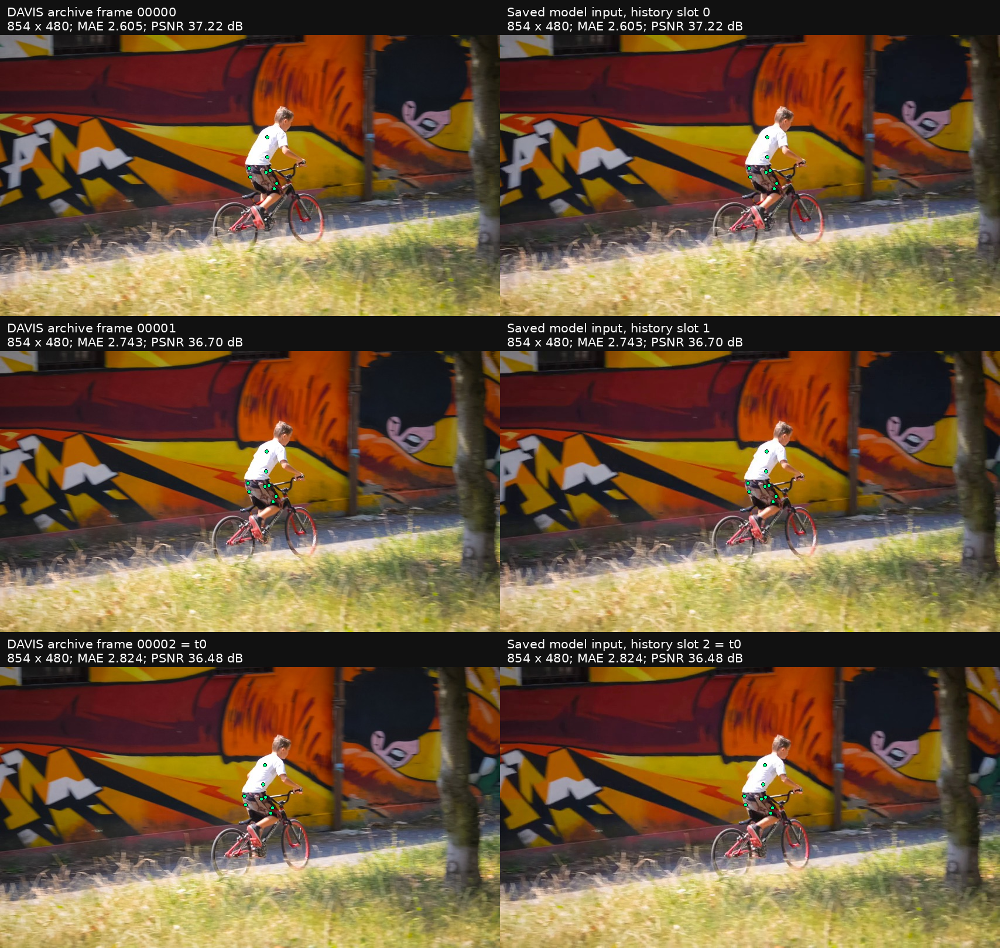
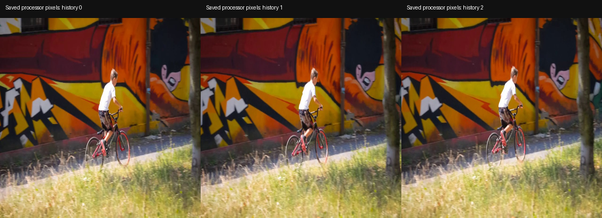
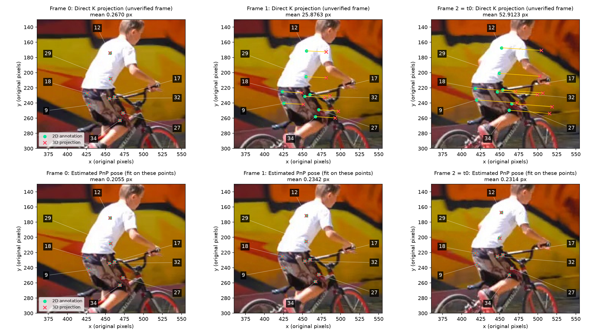

# Независимый аудит DAVIS `bmx-trees / bike_rider`

Аудит выполнен для ревизии **`93bbebeaa809102d34ab01873b9200eb910fde3f`**. Статус выполнения аудита: **PASS — проверки завершены, неопределённости перечислены**. Статус эксперимента: **воспроизведение предоставленного авторского примера подтверждено; геометрическая постановка в камере t₀ и причинность готовой 3D истории полностью не подтверждены**.

Изображения действительно соответствуют исходным кадрам 0, 1 и 2, а входные точки — соответствующим строкам авторской разметки. Ошибки нашей загрузки кадров, выбора ID, разбора прогноза и арифметики метрик не обнаружены. Расхождение появляется при попытке использовать опубликованные XYZ как координаты камеры соответствующего изображения: для кадра t₀ такая прямая проекция расходится с 2D точками на 52,912 пикселя. Авторский DAVIS путь сохраняет исходные координаты без перевода в камеру t₀; общее описание API этого исключения не отражает.

**Утверждение «точно камера первого кадра» сильнее имеющихся доказательств.** Общая мировая система, совместимая с камерой кадра 0, хорошо объясняет наблюдения и соответствует доступному коду реконструкции. Однако точная привязка, покадровые внутренние параметры и позы исходного эпизода не опубликованы. Оценённые здесь позы PnP объясняют проекции, но чувствительны к малому шуму и не заменяют отсутствующие авторские параметры.

Исходный эксперимент, его отчёт и метрики сохранены без изменений. Результаты этого аудита находятся в [`runs/author_davis_coordinate_audit`](../runs/author_davis_coordinate_audit). Модель не загружалась и не запускалась.

## 1. Сохранность и происхождение источников

До численных проверок зафиксированы SHA-256 **79 файлов**, включая весь каталог исходного эксперимента, входные примеры, проверяемый код, конфигурацию checkpoint, оба NPZ разметки и архив DAVIS. Финальная проверка не обнаружила побайтовых изменений. Перечень и размеры: [`baseline_manifest.json`](../runs/author_davis_coordinate_audit/baseline_manifest.json); итог: [`validation.json`](../runs/author_davis_coordinate_audit/validation.json).

На старте Windows Git показывал чистую рабочую копию. WSL Git без Windows-настройки `core.autocrlf=true` отображал текстовые различия; с одинаковой настройкой статус тоже чистый. Это сохранено в [`git_eol_state.json`](../runs/author_davis_coordinate_audit/git_eol_state.json). Инструкций `AGENTS.md` в репозитории и проверенных родительских каталогах нет.

У `inputs/caption.txt` и `inputs/meta.json` рабочие файлы имеют CRLF, а Git blob и официальный пример — LF. После **явной** замены `CRLF → LF`, затем оставшихся `CR → LF`, байты совпадают. Пробелы, JSON поля и текст подписи при сравнении не менялись. Бинарные `.pt` и JPEG совпали побайтно между сохранёнными входами, локальным примером и официальным upstream. Полные суммы всех копий: [`input_copies_and_eol.json`](../runs/author_davis_coordinate_audit/input_copies_and_eol.json).

| Файл | SHA-256 текущих байтов CRLF | SHA-256 после нормализации LF, совпадает с Git/upstream |
|---|---|---|
| `caption.txt` | `6cb867801b7be44924475e3440fb1893c1525cea511498559c4bc2fa35760cc6` | `d55bceef92f71fed92d8cd17dc5dfef2fd95d79cb27b1617f49470f902f4e358` |
| `meta.json` | `01494599627226839063d3d16a4a782896be259ece685bfcfca18b0051e5395c` | `2db9a2437ffa2339a2a70c9f0d6b6abf08f9ebbdd04554c7d649f639cefd0af4` |

Использованы следующие зафиксированные источники:

- Код авторов: `allenai/molmo-motion`, commit `61f5b21b694ad8f854ec7ecd2400005acc73f685`. Проверенные `processor.py`, `modeling.py`, `trajectory_3d_dataset.py`, `molmo2.py`, `molmo2_trajectory.py` совпадают с ним после нормализации строк.
- PointMotionBench: ревизия `564ffa2e3cdb0ba443db8590b40e9691f487436c`. SHA-256 локальных 2D/3D NPZ сверены с LFS-хешами именно этой ревизии. Для аудита дополнительно получены только небольшой README, скрипт реконструкции видео, список файлов и `bmx-trees_filter_meta.npz` размером **467 800 байт**. Полный датасет не скачивался.
- Checkpoint: ранее записанная ревизия `3f5e790a511ff2cdf21c8d2a14cb4d8409c94629`; прочитана только существующая конфигурация. SHA-256 `config.yaml`: `7e518af747f12fec9e1a249209380330207adf11aad8475a7362671b6ff912a0`. Веса в аудит не загружались.

URL, ревизии, суммы и проверка опубликованных NPZ: [`sources.json`](../runs/author_davis_coordinate_audit/sources.json). В полном списке DAVIS этой ревизии **273 записи**, файлов поз, глубины и внутренних параметров камеры нет. Отсутствие файлов в этой поставке не означает, что авторы не использовали их при создании разметки.

## 2. Каким изображениям соответствуют входы

Сравнение началось с кадров 0–6 из уже имеющегося официального ZIP. Все изображения имеют **854 × 480** пикселей; размер не менялся, сдвиг и обрезка при сравнении не подбирались. Для каждого входа лучший кадр определён по MAE и затем проверен визуально. Ближайший конкурент имеет примерно в восемь раз большую MAE. Сохранённые `frames/00000.jpg..00002.jpg` побайтно совпадают с соответствующими элементами ZIP.

| Файл входа | Позиция в истории, с нуля | Исходный JPEG | Время от начала при 24 fps | Время относительно t₀ | MAE / 255 | PSNR, дБ | Лучший сосед: кадр / MAE |
|---|---:|---|---:|---:|---:|---:|---|
| `frame_t-2.jpg` | 0 | `00000.jpg` | 0,000000 с | −0,083333 с | 2,605499 | 37,2238 | 1 / 22,6906 |
| `frame_t-1.jpg` | 1 | `00001.jpg` | 0,041667 с | −0,041667 с | 2,743043 | 36,7002 | 0 / 22,6449 |
| `frame_t+0.jpg` | 2 | `00002.jpg` | 0,083333 с | 0 с | 2,824306 | 36,4800 | 3 / 22,9762 |

По визуальному сопоставлению совпадают положение головы и рук велосипедиста, педалей и колёс, стволов деревьев и деталей граффити. Различия совместимы с повторным JPEG/видео кодированием. Доказательств перестановки, пропуска, смещения на один кадр или другого начала фрагмента нет. В нумерации с единицы это кадры 1–3; индексы массивов и имена JPEG используют 0–2.



Таблица со всеми кандидатами и точными значениями: [`frame_correspondence.json`](../runs/author_davis_coordinate_audit/frame_correspondence.json); компактный вариант: [`frame_correspondence.csv`](../runs/author_davis_coordinate_audit/frame_correspondence.csv).

**Смысл времени.** [Официальный README PointMotionBench](https://huggingface.co/datasets/allenai/PointMotionBench/blob/564ffa2e3cdb0ba443db8590b40e9691f487436c/README.md) и [скрипт реконструкции DAVIS](https://huggingface.co/datasets/allenai/PointMotionBench/blob/564ffa2e3cdb0ba443db8590b40e9691f487436c/davis/reconstruct_davis.py) задают **24 fps** при сборке MP4 из последовательных JPEG. Это подтверждённая договорённость реконструкции; сами JPEG не дают независимого измерения частоты исходной съёмки. Обрезка до чётного размера из скрипта не меняет кадр 854 × 480.

В `_build_davis_bench_entries()` код датасета записывает `fps=30` ([строка 955](../src/molmo_motion/data/trajectory_3d_dataset.py#L955)), что расходится с опубликованным реконструктором. При этом процессор и `_build_example()` передают уже выбранные кадры с **номинальными индексами времени 0.0, 1.0, 2.0**, а не физическими секундами; частота 24 не включена в текст запроса. `target_fps=1.0` здесь не пересэмплирует три предоставленных кадра. Будущее 3–32 соответствует следующим 30 индексам; при договорённости реконструкции последний кадр расположен через 1,25 с после t₀. Это не доказательство отдельной калибровки модели по физическому времени.

## 3. Фактическая цепочка данных

| Переход | Файл, функция | Что фактически происходит |
|---|---|---|
| DAVIS → авторский пример | ZIP `JPEGImages/480p/bmx-trees`; `examples/data/davis_bmx_trees` | Содержимое трёх JPEG сопоставлено с 0–2. 2D/3D значения независимо найдены в исходных NPZ. Скрипт изготовления самого примера и происхождение `K` не представлены. |
| Авторский пример → сохранённые входы | [`run_author_davis.py`, `main`, строки 39–43, 82–92](../scripts/run_author_davis.py#L39) | Файлы копируются в `inputs/`; вызов читает `SAMPLE`, кадры в порядке −2, −1, 0. Сохранённые бинарные копии совпадают с `SAMPLE` и upstream. Передаются 3D история, 2D точки, подпись и F=30; `K` и `c2w_at_t0` отсутствуют. |
| Разметка → эталон | [`prepare_author_davis.py`, `main`, строки 30–55](../scripts/prepare_author_davis.py#L30) | Объект `bike_rider`, ID `[9,12,17,18,27,29,32,34]`, история 0–2, будущее 3–32. Прямые срезы без поворота/масштабирования. Маска: 2D видимость и конечные XYZ. |
| 3D история → запрос | [`processor.py`, `__call__`, строки 169–224](../src/molmo_motion/processor.py#L169), [`_format_history_tracks`, строка 41](../src/molmo_motion/processor.py#L41) | Приведение к float32. Условный `inv(c2w_at_t0)` выполняется только при переданной позе; здесь его нет. Из всех точек вычитается одна опорная точка: первый выбранный ID в последнем историческом кадре. XYZ в метрах умножаются на 1000, округляются и записываются в текст. |
| RGB → визуальные токены | [`video_preprocessor.py`, `video_to_patches_and_tokens`, строка 116](../src/molmo_motion/preprocessing/video_preprocessor.py#L116), [`siglip_resize_and_pad`, строка 226](../src/molmo_motion/preprocessing/image_preprocessor.py#L226) | Все три полных кадра изменяются с 854 × 480 до **378 × 378**, bilinear, `antialias=False`. Геометрическая пропорция меняется; обрезки, поворота и полей в этой ветке нет. Далее 27 × 27 патчей по 14 × 14 RGB, uint8. Нормализация SigLIP выполняется в vision backbone; `K` в этих операциях не участвует. |
| Сохранённый запрос → фактическая модель | [`modeling.py`, `from_pretrained` и `predict_trajectory`](../src/molmo_motion/modeling.py#L86); [`Molmo2Config.build_model`, строка 131](../src/molmo_motion/models/molmo2/molmo2.py#L131); [`Molmo2.generate`, строка 826](../src/molmo_motion/models/molmo2/molmo2.py#L826) | `model_name: video_olmo` загружает **Molmo2Config → Molmo2**, а не опциональную модель с внедрением признаков 2D точек. Переданные пиксельные `coords_2d` остаются в metadata; в этой генерации они не используются. В тексте нет `<points>` или point-feature токенов. Реальное условие — RGB, подпись, текст 3D истории. |
| Ответ → абсолютные XYZ | [`egodex_3d_evaluator.py`, `tracks_to_array`, строка 70](../src/molmo_motion/eval/egodex_3d_evaluator.py#L70); [`modeling.py`, строки 180–194](../src/molmo_motion/modeling.py#L180) | ID 1–8 преобразуются в индексы 0–7; шаги начинаются с H=3. Целые XYZ делятся на 1000, к каждой точке прибавляется сохранённая опорная точка. Смена ориентации координат при разборе не происходит. |
| Прогноз → оценка/рисунки | [`evaluate_author_davis.py`](../scripts/evaluate_author_davis.py) | Евклидовы ошибки считаются по исходной общей маске. Современный `plot_tracks` рисует общие 3D координаты; `draw_frame` использует исходные 2D аннотации. Прямая проекция через `K` остаётся диагностикой и не доказывает систему камеры. |

Процессор заново выполнен **на CPU, без модели, в offline-режиме**, только с локальными конфигурацией и токенизатором. Все **10 полей** сохранённого `processor_inputs.pt` воспроизведены точно, включая `input_ids` из 624 токенов, изображения, pooling и metadata. Это связывает фактические сохранённые визуальные тензоры с проверенными JPEG. Декодированный запрос: [`saved_prompt_decoded.txt`](../runs/author_davis_coordinate_audit/saved_prompt_decoded.txt); протокол: [`processor_audit.json`](../runs/author_davis_coordinate_audit/processor_audit.json).



## 4. Точки, оси, единицы и камера

Для `bike_rider` исходный 2D массив имеет форму **(80, 86, 2) = (время, точка, x/y)**, 3D — **(86, 80, 3) = (точка, время, X/Y/Z)**. Авторская история `.pt` имеет форму **(3, 8, 3)**. Для каждой из восьми её траекторий выполнен точный поиск среди всех исходных ID и возможных начал трёхкадрового окна. Найдено ровно одно совпадение: нужный ID, начало 0. Каждая входная 2D точка также точно и однозначно найдена в строке **кадра 2**. Это проверка значений, независимая от `meta.json`.

| ID в тексте модели, с единицы | ID опубликованной разметки | Строка исходного массива `P_smoothed` до фильтрации |
|---:|---:|---:|
| 1 | 9 | 13 |
| 2 | 12 | 16 |
| 3 | 17 | 22 |
| 4 | 18 | 23 |
| 5 | 27 | 34 |
| 6 | 29 | 36 |
| 7 | 32 | 40 |
| 8 | 34 | 42 |

Сопоставление осей, ID, времени и сохранённого GT: [`point_mapping.json`](../runs/author_davis_coordinate_audit/point_mapping.json). Ничего не переставлялось ради снижения ошибки.

2D координаты переданы в **пикселях исходного кадра**. XYZ имеют заявленные авторами единицы **метры**. Проверены одинаковые численные масштабы истории/эталона и деквантование ответа; независимая физическая калибровка метра по этой сцене отсутствует. Опорная точка равна `[0.2630821168, −0.0013838371, 10.5357513428]` м — **ID 9 на кадре 2**. Вычитание этой точки меняет начало координат, но не поворачивает оси в камеру t₀ и не является оценкой позы камеры. Максимальная ошибка округления входной истории: **0,0004894473 м**, в пределах половины шага квантования 0,001 м.

Сохранённая матрица:

```text
K = [[1821.5830078125,    0,               427.0000305175781],
     [   0,             1821.8399658203125,240.0            ],
     [   0,                0,                 1.0          ]]
```

Центр проекции согласуется с половиной размера 854 × 480; кадр 0 даёт малый остаток проекции. Однако файл `intrinsics_K.pt` не содержит времени калибровки, модели искажения, переменных внутренних параметров или истории масштабирования. **Не установлено**, была ли эта `K` взята из первого кадра, t₀ либо усреднения. Для PnP ниже фиксируется именно эта `K` и нулевая дисторсия как диагностическое допущение. Систематическая ошибка калибровки этим не исключается.

Код подъёма 2D в 3D задаёт `X=(x−cx)Z/fx`, `Y=(y−cy)Z/fy`, `Z=depth`, затем `X_world = X_camera @ R_c2w.T + t_c2w` ([`vipe_to_colmap_general.py`, строки 252–283](../data_generation/third_party/vipe/scripts/vipe_to_colmap_general.py#L252)). Значит, в камерной части X направлена вправо, Y вниз, Z вперёд. Для общей мировой системы направления наследуются от выбранной исходной позы. Процессор при явной позе использует `w2c=inv(c2w)`. В нашем вызове ни одно из этих внешних преобразований не применялось.

**DAVIS режим предусмотрен кодом.** `davis_bench` отсутствует в `_CAMERA_FRAME_SUPPORTED` ([строка 994](../src/molmo_motion/data/trajectory_3d_dataset.py#L994)); `_build_example()` при отсутствии поддержки сохраняет исходные мировые дельты ([строка 1902](../src/molmo_motion/data/trajectory_3d_dataset.py#L1902)). История, опорная точка и GT при этом остаются согласованы. Это сознательная ветка авторского загрузчика. Общие формулировки README и docstring «camera-frame-at-t₀» описывают её неточно. Совпадение с этой веткой не доказывает, что именно такая версия кода и все её настройки использовались при обучении конкретных весов: полный журнал обучения здесь недоступен.

**Отдельный дефект авторского опционального 2D загрузчика.** `_load_davis_bench_2d()` передаёт массив `(T,N,2)` в `_sample_2d()`, который индексирует его как `(N,T,2)` ([строка 970](../src/molmo_motion/data/trajectory_3d_dataset.py#L970), [строка 1305](../src/molmo_motion/data/trajectory_3d_dataset.py#L1305)). Для выбранных точек это даёт среднюю разницу **120,6814 пикселя**; вычисление сохранено в [`inactive_2d_loader_diagnostic.json`](../runs/author_davis_coordinate_audit/inactive_2d_loader_diagnostic.json). **Этот путь не использован в сохранённом запуске:** вход взят из `.pt`, а механизм 2D features отключён. Дефект не объясняет текущие проекции или метрики. Минимальное исправление при использовании этой ветки — транспонировать `(T,N,2) → (N,T,2)` до `_sample_2d()` и сверить результат с `tracks[t, IDs]/[W,H]`. Исходный код в рамках аудита не изменялся.

## 5. Геометрическая диагностика

Для прямой проверки вычислено `u = (K X)[:2]/(K X)[2]` в float64 без внешней матрицы. Такая формула **проверяет гипотезу**, что сохранённые XYZ уже находятся в камере данного изображения. Отсутствующая поза не заменена «известной единичной». Даже если вся история была бы выражена в камере t₀, для её проекции на более ранние изображения потребовались бы соответствующие относительные позы. Поэтому ключевая отдельная проверка — именно кадр **2 = t₀**.

| Кадр | Схема | Среднее, px | Медиана, px | RMSE, px | Максимум, px | Число точек |
|---:|---|---:|---:|---:|---:|---:|
| 0 | Прямая `K × XYZ` | 0,267046 | 0,316687 | 0,286271 | 0,357803 | 8 |
| 1 | Прямая `K × XYZ` | 25,876278 | 25,903322 | 25,877753 | 26,389784 | 8 |
| 2 = t₀ | Прямая `K × XYZ` | 52,912282 | 52,907637 | 52,912824 | 53,241594 | 8 |
| 0 | Оценённая PnP поза | 0,205527 | 0,208846 | 0,213978 | 0,333143 | 8 |
| 1 | Оценённая PnP поза | 0,234195 | 0,223628 | 0,251274 | 0,392974 | 8 |
| 2 = t₀ | Оценённая PnP поза | 0,231392 | 0,258855 | 0,261317 | 0,429593 | 8 |

Во всех шести строках нечисловых 2D/3D значений и точек с неположительной глубиной **0**; использованы все восемь точек, фильтрации по ошибке нет. Полные ошибки каждой точки, `K`, оценённые матрицы `R_w2c`, `t_w2c`, маски и статистики: [`geometry.json`](../runs/author_davis_coordinate_audit/geometry.json).

Полученные прямые средние **точно совпали с числами независимого ориентира**. В прежнем `evaluate_author_davis.project()` промежуточная арифметика оставалась float32, хотя результирующий массив создавался как float64. Здесь сами XYZ и K приведены к float64 перед умножением: это объясняет прежние различия порядка нескольких миллионных пикселя. Они не имели геометрического значения.



PnP оценён **только по восьми историческим соответствиям каждого отдельного кадра**, OpenCV SQPnP и локальное уточнение ITERATIVE. Будущие кадры не использовались для подбора или выбора решения. Найден один положительный по глубине кандидат для каждого кадра. При подборе одной точки исключались, затем ошибка считалась на этой отложенной точке; повторены все восемь исключений.

| Кадр | Средняя ошибка отложенной точки, px | Максимальная ошибка отложенной точки, px | Среднее / максимальное изменение ориентации при шуме, градусы | Среднее / максимальное изменение центра камеры, м |
|---:|---:|---:|---:|---:|
| 0 | 0,331748 | 0,495397 | 1,520 / 2,513 | 0,278 / 0,453 |
| 1 | 0,386023 | 0,640301 | 1,651 / 2,603 | 0,303 / 0,477 |
| 2 | 0,394637 | 0,770027 | 1,708 / 2,917 | 0,310 / 0,524 |

Протокол чувствительности задан до расчёта: 20 испытаний на кадр, независимый Gaussian шум σ=0,5 пикселя на 2D наблюдениях, seed `20260930`. Это исследование чувствительности, а не оценка доверительных интервалов реальных аннотаций. Центр камеры вычисляется как `C=−R.T @ t`. Точки имеют полный пространственный ранг: отношение наименьшего к наибольшему сингулярному значению **0,242; 0,224; 0,220**. Однако они сосредоточены на небольшом участке объекта примерно в 10,5 м от камеры. Небольшие ошибки изображения допускают заметные изменения позы. Малая ошибка подгонки, даже вместе с проверкой отложенной точки того же объекта, не устанавливает истинную позу всей сцены.

Для реализованных операций проверены прямое и обратное жёсткое преобразование, ортогональность и детерминант вращений, синтетическая проекция с известными параметрами против `cv2.projectPoints`, одинаковое изменение единиц сцены/переноса и обработка NaN/Inf/неположительной глубины. Допуск **1e-10** выбран для float64 и хорошо обусловленного синтетического примера; он не переносится на физическую точность реконструкции. Для реальных проекций произвольный порог «геометрического PASS» не назначался.

## 6. Реконструкция, сглаживание и возможное использование будущего

Опубликованный `bmx-trees_filter_meta.npz` содержит `P_original`, `P_smoothed`, маски и веса для **200 точек × 80 кадров**. Для каждой проверяемой траектории опубликованные XYZ **точно совпадают** с единственной строкой `P_smoothed` на всех 80 кадрах, включая расположение NaN. Значит, происхождение готовой истории из сглаженной авторской разметки подтверждено непосредственно массивами.

| Исторический кадр | Среднее / максимальное изменение XYZ при сглаживании, м | Средняя прямая ошибка до сглаживания, px | После сглаживания, px |
|---:|---:|---:|---:|
| 0 | 0,001606 / 0,004691 | 0,267038 | 0,267046 |
| 1 | 0,001621 / 0,004207 | 25,876006 | 25,876278 |
| 2 | 0,002460 / 0,007293 | 52,912069 | 52,912282 |

Таким образом, именно доступный этап сглаживания **не создаёт большого расхождения 26–53 пикселя**. Реализованный авторский подъём округляет 2D координаты до пикселя перед выборкой глубины ([код](../data_generation/third_party/vipe/scripts/vipe_to_colmap_general.py#L256)). Если на кадре 0 сравнить исходную проекцию с такими округлёнными 2D аннотациями, средняя ошибка снижается с 0,267038 до **0,028765 пикселя**. Это согласуется с растровым округлением как существенной частью малого начального остатка, но не объясняет дальнейшее большое смещение. Все эти числа: [`reconstruction_provenance.json`](../runs/author_davis_coordinate_audit/reconstruction_provenance.json).

Доступный [`track-filter-smooth.py`](../data_generation/third_party/vipe/track-filter-smooth.py#L450) оптимизирует всю последовательность и использует значения с обеих сторон времени (`P_plus` и `P_minus`), включая будущие относительно данного кадра. Конвейер также запускает SLAM и трекинг на видео. Это не описание строго причинной подготовки истории. Однако точные команды, версия алгоритма и журнал получения именно опубликованного `bmx-trees` не предоставлены; одних итоговых массивов недостаточно для восстановления причинной зависимости. **Использовались ли будущие кадры при получении конкретных исторических значений — не установлено.** Это не объявляется ни доказанной утечкой будущего, ни подтверждённым отсутствием утечки. Тестирование получения 3D только из прошлых RGB остаётся за пределами этого эксперимента.

## 7. Конкурирующие объяснения

| Гипотеза и наблюдаемое следствие | Проверка и результат | Статус |
|---|---|---|
| Неверный старт/сдвиг: вход должен лучше совпадать с другим кадром | Соседние JPEG 0–6, визуальная проверка, однозначные точные окна 3D истории среди всей разметки: старт 0, t₀=2 | **Опровергнута для сохранённых входов** |
| Перепутаны ID: входные точки не совпадут со своими строками NPZ | Каждый входной ID найден точно и однозначно; порядок в запросе и ответе проверен | **Опровергнута для данного запуска**; отдельный неиспользованный дефект авторского 2D loader описан выше |
| Ошибка размера/обрезки нашего входа: 2D/K сравниваются с другой геометрией изображения | Исходные и входные JPEG 854 × 480; проекция сравнивается до resize. Сохранённые патчи точно воспроизведены. K не участвует в модели | **Ошибка нашей подготовки не обнаружена**; происхождение и актуальность калибровки K не установлены |
| Общая мировая система, совместимая с камерой кадра 0: для поздних изображений нужна внешняя поза | Мировой подъём в коде, прямое сохранение DAVIS XYZ, малый остаток на 0, PnP объясняет 1/2, сглаживание не объясняет смещение | **Согласуется с данными**. Точное равенство мировой системы камере кадра 0 без исходных поз **не доказано** |
| Координаты уже в камере t₀: при корректной K должны проектироваться на изображение t₀ | На самом t₀ средняя ошибка 52,912 px, максимум 53,242 px | **Совместимость с сохранённой K опровергнута**. Вывод относится к паре XYZ/K, а не отдельно к неизвестной истинной камере |
| Собственная камера каждого кадра при одной сохранённой K: проекции 1/2 также должны совпасть | Прямые ошибки 25,876 и 52,912 px | **Эта конкретная схема опровергнута**. Вариант с иными покадровыми K/искажением проверить нечем |
| Неверное направление c2w/w2c или перестановка XYZ в нашем коде | Поза вообще не передана; значения и порядок XYZ в токенах проверены; прямая/обратная диагностика прошла | **Опровергнута в нашем пути**; правильность недоступных исходных поз реконструкции не проверена |
| Сглаживание вызвало всё смещение | `P_original` уже даёт практически те же 26–53 px; изменения истории миллиметровые | **Опровергнута как основная причина**. Остаточные ошибки реконструкции/калибровки допустимы |
| Неверная опорная точка или деквантование ответа | Anchor = ID 9, кадр 2; независимый разбор 240 положений точно восстановил `prediction.npz` | **Опровергнута** |
| Изменяющаяся K, искажения или недокументированная геометрия реконструкции объясняют часть расхождения | В поставке нет K по времени, коэффициентов дисторсии, поз и журнала реконструкции | **Недостаточно данных**; параметры не подбирались ради улучшения ошибки |

Рост ошибки сам по себе не использован как доказательство привязки к первому кадру. Обоснованное утверждение уже: **формула прямой проекции опубликованных XYZ с данным K на t₀ не соответствует наблюдаемым 2D точкам**. Общий мировой режим подтверждён путём данных; его точная калибровочная привязка остаётся ограничением источников.

## 8. Что означают метрики

Отдельный строгий парсер проверил единственный блок ответа, ровно шаги **3–32**, на каждом ID **1–8** без повторов/пропусков, все **240** конечных положений. После деквантования `÷1000` и прибавления сохранённого anchor максимальная разница с `prediction.npz` — **0 м**.

Метрики заново посчитаны в отдельные файлы по исходной маске: **215/240** пар, **8/8** точек в фиксированном кадре 32, **0/8** в кадре 17. Ошибка по каждому шагу тоже точно совпала со старой. Прогноз не маскировался по собственным пропускам и не подгонялся к эталону.

| Метод | ADE, м | FDE, м, кадр 32 |
|---|---:|---:|
| MolmoMotion | 0,37594512733247365 | 0,7243148886849737 |
| Неподвижность | 1,9485922335844852 | 3,7067261518064893 |
| Постоянная скорость | 0,5726836468673794 | 1,0888498923564605 |

Неподвижность повторяет последнее историческое XYZ. Постоянная скорость использует разность последних двух положений и число следующих равных интервалов. ADE усредняет нормы по общей маске; FDE использует только фиксированный последний шаг. Сохранены [`metrics_recomputed.json`](../runs/author_davis_coordinate_audit/metrics_recomputed.json) и [`metric_error_arrays.npz`](../runs/author_davis_coordinate_audit/metric_error_arrays.npz). Допуск сравнения с предыдущим результатом — **1e-7 м**, сами значения совпали точно.

При применении одной исторически оценённой жёсткой матрицы к прогнозу и эталону максимальное изменение попарных евклидовых ошибок составило **1,78e-15 м**. Это численная проверка математической инвариантности, а не новый запуск и не доказательство корректности исходного входа.

Три разных утверждения имеют разный статус:

1. **Арифметика метрик корректна:** подтверждено независимым разбором и расчётом.
2. **Численная система прогноза и эталона согласована в коде:** оба используют опубликованные XYZ и общий anchor без смены масштаба/ориентации. Это позволяет сохранить метрики данного авторского примера; абсолютная физическая точность мировой реконструкции не проверена.
3. **Вход соответствует фактическому авторскому примеру:** подтверждено точным воспроизведением сохранённого процессора. Соответствие общей формулировке «история в камере t₀, полученная только из прошлого» этим не подтверждено.

О влиянии какой-либо альтернативной подготовки входа на качество модели без отдельного контрольного запуска выводов нет.

## 9. Ответы и минимальное дальнейшее действие

1. **С чего начинается история?** С `DAVIS/JPEGImages/480p/bmx-trees/00000.jpg`, затем 00001 и 00002. Это проверено изображениями и значениями разметки, а не только именами файлов.
2. **Где t₀ и что прогнозировалось?** t₀ — исходный кадр 2; 30 прогнозов сопоставлены кадрам 3–32. Физический горизонт 1,25 с относится к опубликованной реконструкции при 24 fps; запрос модели содержит номинальные индексы.
3. **В какой системе вход и GT?** В неизменённой общей системе опубликованных XYZ, которую авторский DAVIS код обрабатывает как мировые дельты. Совместимость с первым кадром сильная; точная привязка к его камере не установлена независимо от реконструкции.
4. **Как код интерпретировал вход/выход?** История минус одна опорная точка, квантование XYZ ×1000, затем обратное деквантование и добавление anchor. Автоматического превращения в камеру t₀ не было. 2D координаты присутствуют в metadata, но этот checkpoint их отдельно не использует.
5. **Почему появились 0,267 / 25,876 / 52,912 px?** Прямая проекция игнорирует недостающую связь общей системы с камерой позднего изображения. Калиброванное движение камеры — правдоподобное объяснение, совместимое с PnP и кодом, но точные позы/K недоступны. Начальный субпиксельный остаток согласуется с округлением 2D при подъёме; большое смещение уже было до сглаживания.
6. **Есть ли доказанная ошибка нашего эксперимента?** Доказана прежняя неверная интерпретация прямой проекции как проекции из камеры t₀. Ошибка подготовки сохранённого авторского входа или расчёта метрик не найдена. Обнаружены документальное противоречие, ограничение калибровочных данных и отдельный неиспользованный дефект авторского 2D loader.
7. **Что можно сохранить?** Полноту F=30, сопоставление кадров/ID, арифметику ADE/FDE, исходные прогноз и GT, современные графики в общей 3D системе. Следует уточнить прежние утверждения о доказанной точной камере кадра 0, активном использовании 2D точек моделью и причинности входной 3D истории.
8. **Что исправлять?** Для данного сохранённого запуска достаточно точного описания режима и корректной визуализации общих координат, уже подготовленной в `93bbebe`; этот аудит уточняет обоснование. Переподготовка входа или новый прогноз сейчас не обоснованы. Если потребуется именно протокол камеры t₀, его сначала надо определить с проверенными K/позами и правилами получения 3D истории; сравнение качества тогда потребует отдельного контрольного запуска.
9. **Чего не хватает?** Покадровых K, модели дисторсии, `c2w/w2c` и правила привязки мировой системы, а также команды/версии и временного окна реконструкции, трекинга и сглаживания именно этого эпизода.

**Один следующий шаг:** получить у источника единый комплект параметров камер и журнала реконструкции `bmx-trees`, затем проверить проекцию на исторических кадрах без подбора поз. Эта цель автоматически не запускается.

## Воспроизведение аудита

В текущем окружении из `F:\AIRI_task\molmo-motion`:

```powershell
wsl -d Ubuntu -- /mnt/f/AIRI_task/.venv/bin/python -u /mnt/f/AIRI_task/molmo-motion/runs/author_davis_coordinate_audit/audit.py
```

Нужны уже существующие локальные входы/результаты, официальный ZIP DAVIS, два NPZ, конфигурация checkpoint и кэш токенизатора. Малые дополнительные источники сохранены рядом со скриптом. Он работает offline, не читает веса модели и пишет только в каталог аудита. Бинарные исходники проверяются побайтно; для текстов отдельно учитывается строгое совпадение после нормализации окончаний строк. Синтетические проверки, PnP, отложенные точки, чувствительность, разбор ответа и перерасчёт метрик воспроизводятся этим скриптом. Изображения были открыты и визуально проверены.
