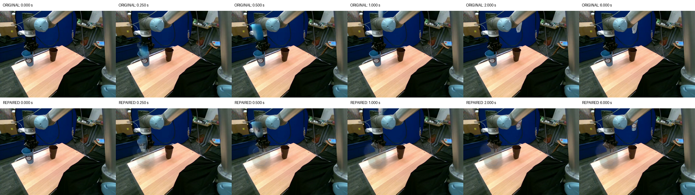
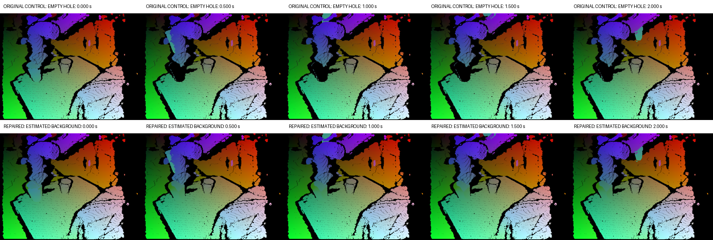
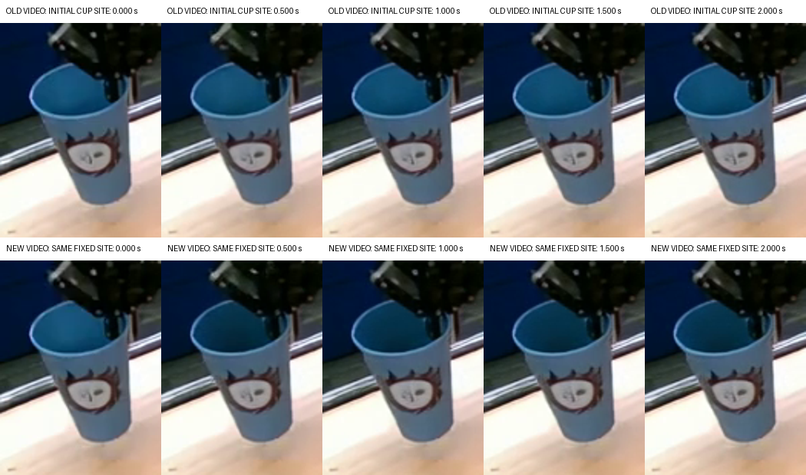
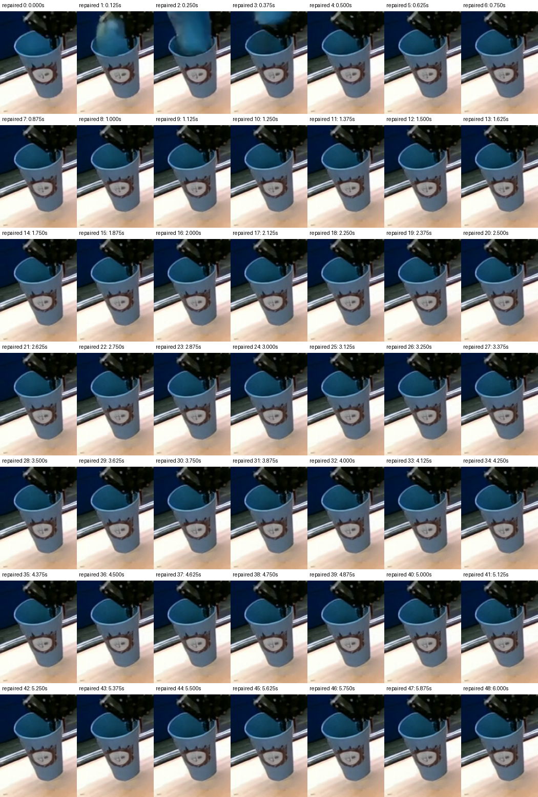
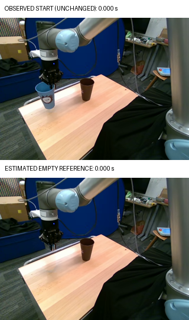
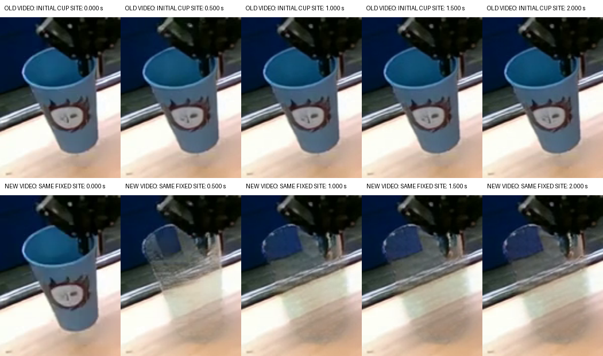

# DaS: устранение стакана в исходном месте

Продолжение эксперимента Berkeley UR5, episode 10, t0=63, в ветке `codex/das-cup-dedup-20261003-1154`. Предыдущие ролики и метрики остаются отдельными исходными результатами. Прогноз MolmoMotion, 24 выбранные точки, Kabsch-движение, seed 42, 25 шагов, BF16, 49 кадров и 8 FPS сохранены.

**Результат:** в выбранном v6 неподвижный исходный стакан и остаточный ободок исчезают; на кадрах 4…48 (0.5…6.0 с) исходное место остаётся пустым. Проверены все 49 кадров. Короткий переход/дублирование на 0.125…0.375 с сохраняется, а движущийся объект деформируется и теряет рисунок. Исправлено постоянное дублирование; физически корректный перенос одного узнаваемого стакана пока не достигнут.

[Новое сгенерированное видео v6](../runs/berkeley_ur5_molmomotion/cup/das_wanfun/variants/clean_reference_mask_v6/generated_molmomotion_seed42.mp4), [старое/новое, все 6 с](../runs/berkeley_ur5_molmomotion/cup/das_wanfun/variants/clean_reference_mask_v6/before_after_full_duration.mp4), [увеличенное исходное место](../runs/berkeley_ur5_molmomotion/cup/das_wanfun/variants/clean_reference_mask_v6/initial_site_before_after.mp4), [real/control/new, первые 2 с](../runs/berkeley_ur5_molmomotion/cup/das_wanfun/variants/clean_reference_mask_v6/triple_comparison.mp4).

Решение объединяет causal completion control-фона, исправленное пустое RGB-reference и ограничение освобождённой области **во время denoising** с защитой прогнозируемого foreground. Готовые RGB-кадры не ретушировались. Это расширение inference официального DaS Wanfun с тем же обученным Control-checkpoint, а не заявление об успешности штатного режима или дообучение модели. V6 выбран по отсутствию постоянного дубля, не по минимальному ADE.



## Диагностика и последовательность изменений

Существующий control video действительно перемещает плотное облако стакана, но оставляет чёрную область его прежнего силуэта в статическом слое. Отсутствующая глубина не является явным изображением свободного фона. Одновременно официальный DaS передаёт один RGB t0 в три входа Wan: `start_image`, `clip_image` и `ref_image`. Последний кодируется в пространственные `full_ref`-токены, участвующие на каждом шаге denoising. Это возможные факторы закрепления исходного вида, а не доказанная единственная причина дублирования.

| Вариант | Изменение относительно предыдущего | Статус |
|---|---|---|
| Исходный controlled | Официальные RGB-условия, чёрная область под удалённым стаканом | Исходный стакан остаётся; появляется движущаяся копия |
| `background_completion_v1` | Только восстановление скрытого фона в control | Сгенерирован и оценён; исходный стакан сохраняется |
| `background_initial_only_v2` | От v1: `ref_image=None`, исходные start/CLIP сохранены | Видео восстановлено из сохранённых latents; неподвижный стакан сохраняется |
| `clean_background_reference_v3` | От v1: пустой RGB-фон только для `ref_image`, исходные start/CLIP сохранены | Видео получено; неподвижный стакан сохраняется |
| `vacancy_prior_v4` | От v3: ограничение пустого фона после каждого шага denoising | Тело и рисунок подавлены, остаётся полупрозрачный силуэт |
| `vacancy_context_v5` | От v4: маска ограничения расширена на 24 px; защита foreground сохранена | Тело исчезает, тонкий край остаётся в самом reference |
| `clean_reference_mask_v6` | От v5: тёмно-синий край исключён из маски защиты захвата | Выбран: постоянный дубль исчезает с 0.5 с; ранний переход и деформации остаются |

Для v1 из SAM-маски и наблюдаемой depth t0 получается область восстановления 5476 пикселей. Inverse depth интерполируется из окружающих наблюдаемых значений; нижняя граница глубины 0.693 м помещает оценённый фон за исходной поверхностью стакана. Вне этой области измеренная depth не меняется. Движущиеся 3D-точки, их цвета и времена полностью переиспользованы. Скрытая поверхность является оценкой, а не новым измерением.



В v1 узнаваемый рисунок всё ещё остаётся на исходном месте. Средняя нормализованная корреляция рисунка t0 в локальном окне с допуском смещения ±12 px на кадрах 4…16 составляет 0.978, против 0.984 у исходного ролика. Это признак сохранения текстуры, а не вероятностная оценка числа стаканов. Визуальный обзор подтверждает неподвижный стакан. ADE/FDE v1 относительно control — 199.88/238.06 px на 186/240 видимых парах; относительно real — 46.06/83.38 px на 239/240 парах. Мера с фоном сама по себе не дала требуемого исправления.



Для v3 built-in `imagegen` подготовил пустой фон из **наблюдаемого RGB t0**. Используется только его область стакана с защитой тёмных частей захвата и мягкой границей. Вне этой области восстановлены точные исходные пиксели. Изначальный стакан остаётся в start-image и CLIP; в длительном RGB-reference его место показано пустым. Синтетическая оценка сохраняется вместе с [точным prompt](../runs/berkeley_ur5_molmomotion/cup/das_wanfun/repair_assets/imagegen_prompt.txt), [PNG](../runs/berkeley_ur5_molmomotion/cup/das_wanfun/repair_assets/clean_plate_imagegen.png) и [receipt](../runs/berkeley_ur5_molmomotion/cup/das_wanfun/repair_assets/clean_reference_receipt.json). Это изменённый протокол inference, а не реальное будущее и не дообучение модели.


На кадрах 4…16 NCC исходного рисунка в v2 составляет 0.950, в v3 — 0.947. Обзор всех 49 кадров v3 подтверждает сохранение стакана до конца. Более низкая корреляция здесь отражает небольшое изменение вида, а не успешное освобождение места.



В v4 callback после шага FlowMatch Euler смешивает текущие latents с `z_empty*(1−sigma_next)+noise*sigma_next` только в маске освобождённого места. `z_empty` — VAE-encoding пустого causal reference; отдельный noise seed 9043 не меняет генератор seed 42 основной выборки. Начальный latent защищён. Для каждого последующего latent защищено объединение прогнозируемого foreground его четырёх кадров, расширенное на 5 px; при downsampling любая затронутая foreground ячейка полностью исключается из ограничения. Strength=1. Это явное расширение inference официального DaS Wanfun, не штатный режим, не дообучение и не исправление RGB после генерации. Временная компрессия VAE означает, что защита объединения foreground может задержать освобождение некоторых пикселей первых кадров; результат нужно проверить отдельно.

Результат v4 — частичное исправление. К 0.375 с исчезает большая часть тела и рисунок стакана, но прозрачная оболочка остаётся до 6 с. NCC 0.538 на 0.5…2 с ниже исходной 0.984; это недостаточно для признания отсутствия копии. VAE кодирует соседние пиксели совместно, поэтому граница SAM-support не является границей влияния его latent-признаков. В v5 тот же prior получает дополнительный 24-px контекст вокруг causal маски; фон в нём берётся из того же reference, foreground и latent 0 по-прежнему защищены. Это проверяемая гипотеза об остаточном контуре, а не утверждение о доказанной причине.

V5 не принят как окончательное исправление: тонкий полукруг остаётся до конца. Проверка RGB-reference в исходных 640×480 выявила более конкретный дефект подготовки. Условие `(gray<85)&(y<260)&~SAM` защищало тёмные части захвата, но также тёмно-синие пиксели края стакана за пределами SAM. Таким образом, часть контура попадала в «пустой» reference. V6 исключает из этой защиты blue hue 85…125 при saturation≥40 внутри той же локальной области; чёрные/нейтральные части захвата и все пиксели вне support сохраняются. Updated support — 5338 px против 4850 в старом reference. Два теста проверяют удаление тёмно-синего края и сохранение чёрного захвата, а также полную замену exact cup mask, включая чёрный рисунок. Старые reference и receipts сохранены как отдельные входы v3–v5. Это исправление собственного препроцессинга, а не свойство checkpoint.





Результаты на собственных масках выглядят следующим образом; `control` и `real` могут иметь разное число соответствий и не должны сравниваться как единая выборка:

| Вариант | Control ADE/FDE, px (пары) | Real ADE/FDE, px (пары) | NCC рисунка, 0.5…2 с | Локальный warp MAE/255 |
|---|---|---|---:|---:|
| Исходный controlled | 199.02/237.89 (187) | 45.95/83.43 (240) | 0.984 | 8.36 |
| v1 | 199.88/238.06 (186) | 46.06/83.38 (239) | 0.978 | 7.15 |
| v2 | 199.41/238.88 (187) | 45.84/83.30 (240) | 0.950 | 7.55 |
| v3 | 200.26/237.54 (185) | 45.71/82.75 (238) | 0.947 | 7.73 |
| v4 | 69.43/76.60 (154) | 110.19/151.91 (195) | 0.538 | 8.86 |
| v5 | 54.92/128.36 (91) | 77.88/62.84 (122) | 0.419 | 8.46 |
| **v6** | **89.29/225.51 (93)** | **62.36/63.32 (122)** | **0.418** | **8.49** |

У v4 уменьшается покрытие треков и ухудшается совпадение с real. Улучшение control ADE нельзя принимать как доказательство переноса исходного предмета: трекер может менять соответствие после исчезновения рисунка. Визуальный дефект контура имеет приоритет над техническим PASS и одним улучшившимся числом.

У v5 покрытие control составляет только 91/240 (37.9%), на временах 1.0, 1.2 и 1.4 с нет валидных пар, ни одна точка не видима на всём горизонте. Поэтому его ADE 54.92 px особенно уязвим к отбору по видимости: простое сопоставление с исходными 199.02 px было бы некорректным. PSNR 17.69 dB, global MAE 16.50/255 и Laplacian variance 275.12 не доказывают улучшения изображения относительно baseline 17.63 dB, 16.15/255 и 308.60. Локальный warp 8.46/255 почти не улучшен относительно 8.36; 24-px контекст может выходить за стандартную 7-px область локальной метрики, поэтому дополнительные границы проверяются в обзоре полного кадра.

## Качество выбранного результата v6

| Критерий задания | Качественный результат | Количественное свидетельство и предел |
|---|---|---|
| Изображение | Помещение, стол, робот и коричневый стакан узнаваемы; восстановленная область мягче, около захвата есть небольшие локальные границы | PSNR 17.71 dB, global MAE 16.52/255, Laplacian 272.71 против real 508.66; заметного общего улучшения детализации нет |
| Согласованность кадров | Нет постоянного стакана в исходном месте после 0.5 с; в начале виден fade, подвижная форма деформируется | Локальный warp MAE 8.49/255 против baseline 8.36 и real 3.61; flow coverage 74.8%, 72.6% и 77.7% соответственно |
| Узнаваемость/единственность | Постоянная копия с рисунком и ободком исчезает; подвижный фрагмент не сохраняет надёжную форму и рисунок исходного стакана | NCC исходного рисунка 0.418 на 0.5…2 с и 0.425 на 2.125…6 с; визуальная receipt охватывает все 49 кадров, NCC не считает экземпляры |
| Движение по прогнозу | Реакция вверх вдоль руки сохранена, частичный выход за кадр около 1 с; взаимодействие захвата и предмета неправдоподобно | AllTracker control ADE/FDE 89.29/225.51 px, только 93/240 пар; на 1.0…1.4 с control-сравнение отсутствует, полностью видимых треков нет |
| Совпадение с real | Постоянное дублирование исправлено, но реальное продолжение не воспроизведено | Real ADE/FDE 62.36/63.32 px на 122/240 парах; этот набор отличается от исходных 240 пар |

Локальный RGB MAE в одной и той же области движения составляет 55.01/255 против исходных 59.14/255. Это описательное уменьшение расхождения в ROI, включающей фон и перекрытия; вместе с ухудшением резкости, малым покрытием траекторий и потерей рисунка оно не подтверждает общего превосходства видео.

На **общих 93/240 парах исходного ролика и v6** control ADE/FDE меняется с 143.05/230.96 до 89.29/225.51 px, real ADE/FDE — с 29.93/86.43 до 69.11/63.32 px. Control ADE улучшается, real ADE ухудшается; покрытие только 38.75%, пропущены 1.0…1.4 с и нет целиком видимых треков. Общая маска всех семи controlled-роликов содержит лишь 83/240 пар (34.6%), поэтому она сохранена в JSON для аудита, но не используется для заявления об общем улучшении модели. Ни одинаковая маска, ни уверенность трекера не решают потерю физической идентичности. Полные попарные и общие расчёты — [variant_comparison.json](../runs/berkeley_ur5_molmomotion/cup/das_wanfun/variant_comparison.json).

## Что улучшено в оценке

Предыдущая глобальная ошибка RGB после компенсации потока была 0.757/255 у генерации и 2.019/255 у real. Большую часть кадра занимает почти неподвижный фон. Новая оценка рассматривает одинаковую область: исходную маску стакана и проектируемую движущуюся поверхность, расширенные на 7 px. В среднем это 3.96% кадра. Время и проверка прямого/обратного потока прежние.

В этой области исходная генерация имеет ошибку **8.36/255**, real — **3.61/255**, v1 — **7.15/255**. Покрытие проверкой потока — примерно 72.6%, 77.7% и 75.2% соответственно. Такое сравнение лучше показывает локальные проблемы движения; оно всё ещё включает фон, перекрытия и ошибку оптического потока. Низкая ошибка также возможна при неподвижном стакане и не доказывает правильный перенос.

Отдельная проверка рисунка охватывает все 49 декодированных кадров. Она дополняет ADE/FDE, потому что AllTracker может продолжать уверенно отслеживать сохранившуюся копию. Физическая идентичность предмета, отсутствие второго экземпляра и освобождение исходного места требуют визуальной проверки; технический PASS не заменяет эти требования.

Для независимого описательного ориентира NCC также вычислена на отдельном реальном продолжении: 1.000 в t0, 0.539 в 0.6 с и 0.350 в 2 с; среднее 0.415 на 0.6…2 с. Эти данные прочитаны только после генерации и не участвуют в восстановлении фона или выборе маски. Высокая остаточная NCC у v1–v3 согласуется с визуально сохранившимся стаканом. Само снижение NCC может также означать размытие, закрытие захватом или потерю предмета и не принимается как единственный критерий успеха.

Прогноз и физическая реалистичность остаются отдельными ограничениями. Исходный MolmoMotion уже имеет ADE/FDE 193.57/224.48 px относительно реального будущего; жёсткое приближение добавляет 56.29/113.04 px относительно самого прогноза. После 2 с используется hold конечной позы, а не новый прогноз до 6 с. Поэтому устранение старой копии не гарантирует совпадения с реальным продолжением. Новое RGB-reference и vacancy-prior меняют протокол; исходный no-control ролик остаётся исходной абляцией, его нельзя выдавать за парную абляцию этих новых условий.

Скрипт `das_compare_variants.py` пересчитывает generated→real и generated→control на пересечении масок всех включённых завершённых оценок, а не сравнивает ADE с разным набором видимых точек. На общей маске исходного ролика и v1 имеется 186/240 пар: control ADE 199.84 и 199.88 px, real ADE 45.02 и 44.98 px. Изменение восстановления фона не даёт заметного переноса исходного предмета; разница в сотые пикселя не свидетельствует об улучшении.

## Ресурсы и проверка

v1 завершён за 374.52 с внутри процесса, без OOM, при прежнем официальном CPU offload. Первая попытка до загрузки весов остановилась на UTF-8 BOM в JSON после записи из Windows; файл исправлен, чтение visual gate допускает UTF-8 BOM, исходная ошибка и receipt сохранены.

Во время v2 на той же GPU начал работать другой FMB-эксперимент. Denoising завершён и latents сохранены; VAE decode надолго остался в переносе модулей. Наш процесс отменён SIGTERM через 1012.71 с. Чужой процесс не остановлен. Последующее GPU-декодирование заняло 39.86 с внутри decode и сохранило неизменённые latents с SHA256 `ecb2977e…`; `decode_recovery.json` отдельно подтверждает успех, исходная receipt не переписана как успешная. v3 завершён за 334.32 с внутри процесса. Следующий GPU-запуск ждёт конкретный PID вместе с start-time identity, чтобы PID reuse не запускал ошибочное ожидание. Времена при конкуренции за GPU не являются benchmark скорости конфигураций.

Три теста восстановления depth прошли: плоский скрытый фон, сохранение невалидных измерений вне области восстановления и запрет перекрытия исходного стакана оценённым фоном. Четыре теста vacancy-prior проверяют защиту стартового latent, объединение foreground четырёх кадров, расширение контекста с защитой foreground и уровень шума/финальный фон с сохранением защищённых ячеек и состояния RNG. Два теста RGB-mask проверяют ошибку dark-blue/gripper и exact cup/outside support. Проверка v1 подтвердила 16 технических условий, v4/v5 — ещё пять условий vacancy prior, включая все 25 применений и пересчёт mask receipt. При этом качество устранения копии v1–v5 остаётся неудовлетворительным.

V6 завершён за 347.19 с внутри процесса (365.29 с с запуском), без OOM. Peak CUDA allocated 10,607,566,848 B, reserved 12,448,694,272 B; peak RSS 22,697,660,416 B. Все 25 шагов prior применены; mean latent-mask fraction 3.857%, latent 0 и foreground защищены. [Финальная проверка](../runs/berkeley_ur5_molmomotion/cup/das_wanfun/variants/clean_reference_mask_v6/verification.json) подтверждает 23 технических условия и отдельный `PASS_MANUAL_REVIEW` для устранения **постоянного** дубля после 0.5 с. Критерий не скрывает ранний fade и не сертифицирует физическую идентичность.

Все будущие Berkeley-кадры читаются только отдельными скриптами оценки после генерации. Фон, reference и управляющая геометрия построены без реального продолжения. Сохранены все шесть новых видео, неудачные варианты, recovery receipts, параметры, треки и общий [индекс](../runs/berkeley_ur5_molmomotion/cup/das_wanfun/README.md). Постоянный дубль исправлен; согласованность движения, узнаваемость подвижного стакана и качество сравнения с real честно остаются ограничениями этой конфигурации.

[Аудит доставки](../runs/berkeley_ur5_molmomotion/cup/das_wanfun/delivery_verification.json) дополнительно сверяет исходные и общие численные результаты с этим текстом, проверяет ссылки, SHA выбранного видео, визуальный gate и метаданные обоих сравнительных MP4. Все 14 условий выполнены.

## Воспроизведение новых вариантов

Окружение, checkpoint и pinned DaS commit описаны в [основном отчёте](das_wanfun_cup.md). Новый опыт требует отдельной папки; генератор отказывается перезаписывать готовые MP4. `das_repair_background.py --scene SCENE --output NEW_VARIANT` копирует frozen-геометрию и заново строит causal control. До запуска просмотрите `control_contact_sheet.png`, облако и глубину и сохраните `generation_ready=true`, `visual_review_required=false` с замечаниями проверки в новом `control_validation.json`; control SHA должен совпасть. Готовое RGB-reference можно воспроизвести из сохранённых imagegen PNG, prompt и маски наблюдаемого t0. Другой результат imagegen создаст другой inference-протокол и должен иметь собственную receipt.

Для v1 используется default `--reference-mode original`; v2 добавляет `--reference-mode initial-only`; v3 добавляет `--reference-mode clean-background --reference-image CLEAN_RGB`. v4 использует те же аргументы v3 и следующие дополнительные параметры:

```bash
../.venv-das/bin/python scripts/das_generate.py \
  --image "$NEW_VARIANT/image_t0_720x480.png" \
  --tracking_path "$NEW_VARIANT/control_molmomotion_720x480.mp4" \
  --prompt 'Pick up the blue cup and put it into the brown cup.' \
  --checkpoint_path ../models/Wan2.1-Fun-V1.1-1.3B-Control \
  --das_root ../third_party/DiffusionAsShader-Wanfun \
  --output_path "$NEW_VARIANT/generated_molmomotion_seed42.mp4" \
  --seed 42 --num_inference_steps 25 \
  --reference-mode clean-background --reference-image "$REPAIR_ASSETS/clean_reference_720x480.png" \
  --vacancy-strength 1 --background-bundle "$NEW_VARIANT/background_completion.npz" \
  --reference-alpha "$REPAIR_ASSETS/clean_reference_alpha.png"
```

`NEW_VARIANT` — новая подготовленная папка, `REPAIR_ASSETS` — папка сохранённого causal reference. Фактический argv каждого выполненного опыта находится в его `config.json` и `process_exit.json`. На занятой GPU `das_queue_command.py` ждёт указанную идентичность процесса без загрузки Torch/весов. После генерации `das_batch_evaluate.py` последовательно выполняет AllTracker, контроль рисунка, локальную оценку качества и техническую проверку. Визуальную receipt нужно заполнить по всем 49 кадрам; затем `das_verify_variant.py` повторно подтверждает её связь с SHA видео. `das_compare_variants.py` строит сравнение на общей маске, `das_artifact_manifest.py --root ARTIFACT_ROOT --verify` проверяет финальные размеры и SHA всех доставленных файлов.

V5 добавляет `--vacancy-context-px 24`. Для v6 сначала выполните `das_prepare_clean_reference.py --scene SCENE --plate IMAGEGEN_PNG --output NEW_REPAIR_ASSETS --gripper-protection non-blue-dark`; просмотрите новый `clean_reference_640x480.png` в исходном разрешении. Затем используйте именно этот reference и alpha, сохранив `--vacancy-context-px 24`. Старый reference v3–v5 воспроизводится с `--gripper-protection gray-only`. Оба варианта маски имеют отдельные receipts, старые MP4 не переписываются.
