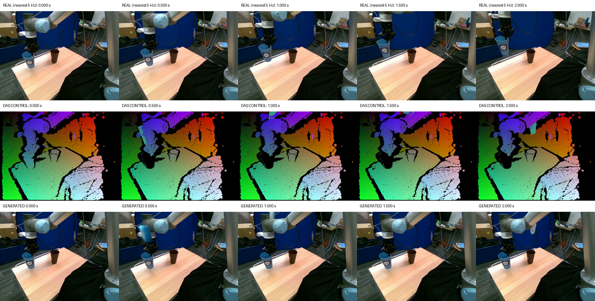
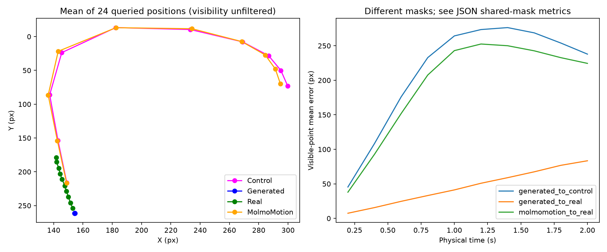
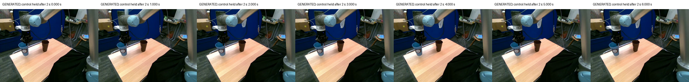
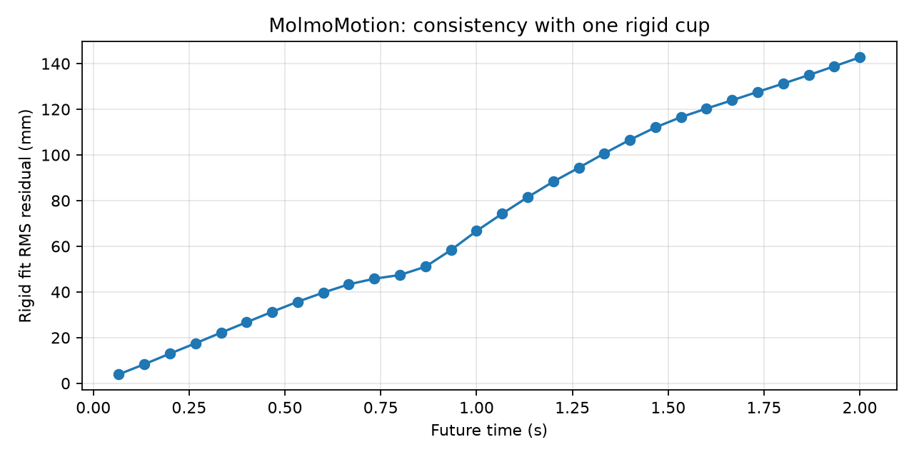
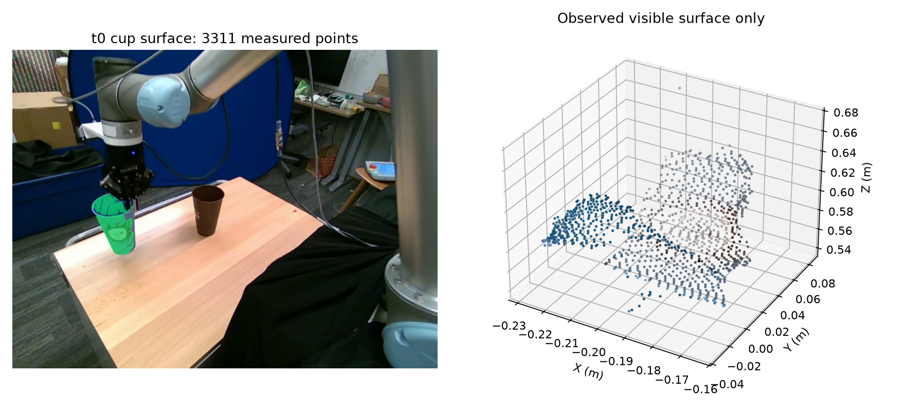
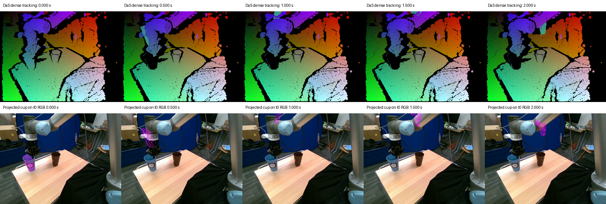

# MolmoMotion → DaS Wanfun: Berkeley UR5, голубой стакан

Работа начата 3 октября 2026 года в отдельной ветке `codex/das-wanfun-cup-20261003-0856`. Используется уже завершённый [Berkeley-эксперимент](../runs/berkeley_ur5_molmomotion/research_story.md): эпизод 10, t0=63, 24 точки, 30 будущих шагов. Входы исходного эксперимента сохранены; повторного запуска MolmoMotion нет.

Основной запуск выполнен и оценён. Получено видео 49 кадров 720×480 при 8 FPS. Генератор почти сохраняет исходный стакан на месте и создаёт отдельную голубую копию/фрагмент вдоль заданной траектории. Перенос одного исходного предмета с сохранением идентичности не выполнен. Контроль без траектории выполняется отдельно; итоговый статус конвейера фиксируется после его оценки.

## Результаты основного запуска

| Сравнение | ADE, px | FDE, px | Оцениваемые пары |
|---|---:|---:|---:|
| MolmoMotion → real | 193.57 | 224.48 | 240/240 |
| Rigid approximation → MolmoMotion | 56.29 | 113.04 | 240/240 |
| Временное пересэмплирование → исходный rigid forecast | 0.67 | <0.0001 | 240/240 |
| Generated → control | 199.02 | 237.89 | 187/240 |
| Generated → real | 45.95 | 83.43 | 240/240 |

Generated→control исключает точки контроля вне кадра; сохраняются 77.9% пар и восемь полностью видимых треков. На общей маске 187 пар generated→real ADE=44.82 px, FDE=83.43 px; generated→control остаётся 199.02/237.89 px. Ошибка привязки сгенерированного кадра 0 к t0 — 0.051 px.

Эти числа описывают соответствия **исходного стакана**, чей узнаваемый рисунок остаётся около начального положения. AllTracker не переключается на появляющуюся копию. Поэтому большая generated→control ошибка не означает полного отсутствия реакции изображения на управление: подвижный голубой артефакт действительно виден возле прогнозируемого положения. Она означает, что исходный предмет не перенесён согласно прогнозу. Подвижная копия не имеет независимо подтверждённых соответствий физических точек и отдельный ADE для неё не выдаётся.





Картинка сохраняет помещение, стол, робота и коричневый стакан; исходный голубой стакан остаётся узнаваемым. В первые 0.5 с возле руки возникает дополнительная голубая форма, к 1 с она частично выходит за верхний край, к 2 с виден узкий бело-голубой фрагмент рядом с плечом робота. Его форма деформируется и первоначальный рисунок не сохраняется надёжно. Захват остаётся около исходного стакана: согласованного движения руки с новым объектом нет. На контактных кадрах сильных скачков всей сцены и крупного фонового мерцания нет; переходы движущейся копии и её перекрытия рукой выглядят физически неправдоподобно. После 2 с статический исходный стакан и фрагмент возле руки в основном сохраняются до 6 с.



PSNR generated→real=17.63 dB, MAE=16.15/255. Дисперсия Laplacian — 308.60 у генерации против 508.66 у реальных кадров; это согласуется с более мягкой детализацией, но не является валидированной оценкой восприятия. Ошибка RGB после компенсации потока — 0.757/255 у генерации и 2.019/255 у реальных кадров. Меньшее значение объясняется в том числе почти статической сценой: его нельзя трактовать как превосходство по временной реалистичности. Корреляция HSV-гистограммы трекового окна со стаканом t0 около 0.44–0.55, доля синих пикселей около 0.56–0.60. Эти признаки подтверждают сохранение голубого цвета в исходном месте, но не выполнение переноса и не идентичность подвижного фрагмента.

Основная генерация занимает 358.48 с внутри измеренного запуска; полный дочерний процесс с импортами — 377.44 с. Пик CUDA allocated=9.87 GiB, reserved=11.58 GiB; RSS процесса=21.08 GiB, оценка занятой системной памяти WSL=21.54 GiB. CUDA `mem_get_info` в отдельные моменты показывал весь доступный объём занятой памяти устройства; этот показатель включает память вне текущего allocator. Windows-монитор, запущенный во время загрузки модели, зарегистрировал общий пик физически занятой RAM около 31.1 GiB; он включает остальные процессы и не покрывает начало запуска. OOM не было. Подробности и временные стадии — в `resource_usage.json`, `host_resource_usage.json`, `generation.log`, `process_exit.json`.

Первый технический запуск завершился до загрузки модели из-за Windows-пути `.git` рабочей копии, недоступного Linux Git. Ошибка и код завершения сохранены в `attempts/01_windows_worktree_path`; чтение ветки исправлено без изменения входов/весов. Рабочая генерация использовала официальный CPU offload без квантования и изменения размера/числа кадров.

## Какая модель используется и обучена ли она

Используется официальный код [DaS, ветка Wanfun](https://github.com/IGL-HKUST/DiffusionAsShader/tree/Wanfun), commit `47dcaf13f78fe3cafd2a4aed20df1e059917599a`, с готовым checkpoint [alibaba-pai/Wan2.1-Fun-V1.1-1.3B-Control](https://huggingface.co/alibaba-pai/Wan2.1-Fun-V1.1-1.3B-Control), revision `a116c52b08182f7a5916eae7a47fcd61a9467a04`. Это обученная управляющая модель Alibaba PAI; она поддерживает reference image и trajectory control. В карточке заявлено обучение с 81 кадром при 16 FPS. Модель не является исходным CogVideoX-checkpoint статьи DaS. Отдельный DaS-specific Wan checkpoint здесь не загружается и его существование не утверждается.

Инференс следует `_infer_wanfun_ctrl` из `models/pipelines_wanfun.py`: BF16, FlowMatchEulerDiscreteScheduler, guidance=6, TeaCache threshold=0.10, sequential CPU offload. Модель не дообучается на Berkeley.

## Подготовленное управление

Для каждого из 30 шагов прогноз `[24,30,3]` аппроксимируется Kabsch/SVD одним преобразованием в SO(3), без масштаба и отражения. P0 берётся из фактического отфильтрованного входа MolmoMotion. Его средняя ошибка обратной проекции относительно исходных 2D-запросов — около 0.000006 px.

Плотное облако восстановлено из маски SAM 2.1 и измеренной RealSense depth в t0 через наблюдаемую оценённую K. Применено прежнее правило глубины: конечные значения строго между 0 и 10 м; локальная медиана 5×5 при большинстве валидных значений; для облака дополнительно требуется валидный центральный пиксель. Получено 3311 точек из 4034 пикселей маски. Это видимая поверхность предмета, а не полная замкнутая 3D-модель.

Средняя RMS-невязка жёсткой аппроксимации — 73.50 мм. К концу горизонта она достигает примерно 143 мм, что существенно относительно размера стакана. Следовательно, превращение прогноза в жёсткое движение само вносит заметную ошибку. Нельзя приписывать последующие расхождения исключительно генератору.





Поза интерполируется на 49 кадров при 8 FPS: SLERP для вращений, линейная интерполяция переноса, первые 17 кадров соответствуют 0…2 с. После 2 с сохраняется конечная поза. Последняя временная отметка — 6 с; длительность MP4 с 49 кадрами — 6.125 с. Двухсекундный прогноз не растягивается на шесть секунд.

RGB-код каждой физической точки задаётся однократно: исходная горизонтальная/вертикальная координата и inverse depth с нормализацией по p2/p98 всей валидной сцены t0. Фон остаётся на месте, исходная поверхность стакана удаляется из него. Точки стакана перемещаются с z-buffer; точки за камерой и вне кадра исключаются. Управление 640×480 и исходный RGB одинаково растягиваются bilinear до 720×480.



Визуальная проверка выявила движение вверх к руке робота, частичный выход облака за верхний край около 1 с и возврат в кадр к 2 с. Такое направление следует сохранённому прогнозу; оно не исправляется по реальному будущему. Рука и захват не имеют отдельного прогноза движения и остаются статическими в управляющей геометрии. Это ограничивает физическую согласованность ожидаемого результата. В depth остаются дырки и перепады глубины у границы объекта.

## Совместимость официальной ветки

Зафиксированная ветка содержит импорты `videox_fun.dist`, но самой директории нет. Кроме того, штатные импорты затягивают CogVideoX, MoGe и трекеры, не требующиеся при готовом tracking video. [Адаптер](../scripts/das_wanfun_runtime.py) загружает только неизменённые Wan-модули, предоставляет интерфейсы режима одной GPU для отсутствующего distributed-модуля и извлекает официальный inference-метод через AST, удаляя три неиспользуемых локальных импорта. Distributed-запуск запрещён самим адаптером. Весов, attention, вычислений VAE и официального offload это исправление не заменяет.

Окружение WSL изолировано в `.venv-das`; базовые Torch/CUDA-пакеты доступны через `.pth` из существующего `.venv`. Дополнительно установлены `diffusers==0.33.1`, `transformers==4.49.0`, `tokenizers==0.21.4`, ftfy и sentencepiece. Полный список пакетов записывается в артефакты опыта. На компьютере RTX 4070 12 GB и 32 GB физической RAM; WSL настроен с лимитом 24 GB. Другие исследовательские задания могут влиять на общее потребление памяти.

## Протокол оценки

Генератор получает только RGB t0, точную инструкцию `Pick up the blue cup and put it into the brown cup.` и построенное tracking video. Контрольные суммы входов фиксируются до генерации. Будущее Berkeley используется только в отдельном скрипте оценки.

AllTracker `Net(16)` с прежним checkpoint, четырьмя итерациями и разрешением 512×384 отслеживает те же 24 точки в сгенерированных первых 17 кадрах. Кадры возвращаются в координаты 640×480. Для соответствия исходным запросам добавляется реальный t0 как опорный кадр перед сгенерированным кадром 0; эта дополнительная позиция не оценивается. Ошибка соответствия в сгенерированном кадре 0 сохраняется отдельно.

Траектории генерации интерполируются на физические времена 0.2, 0.4, …, 2.0 с; требуются валидные оба конца интервала. Отдельно измеряются MolmoMotion→real, rigid→MolmoMotion, дополнительная ошибка временного пересэмплирования, generated→control и generated→real. Сохраняются покрытие, число видимых точек, метрики общих масок и полностью видимых треков. AllTracker является измерительным приближением; его уверенность не доказывает идентичность объекта.

Качество изображения описывают MAE/PSNR относительно реальных кадров, дисперсия Laplacian и визуальный обзор. Согласованность кадров — ошибка RGB после компенсации оптическим потоком Farneback с проверкой прямого/обратного потока. Для RGB берутся ближайшие сгенерированные кадры к реальным отметкам 5 Hz; несовпадение времени не превышает 0.05 с и записано отдельно. Интерполяция движения для ADE/FDE использует точные физические времена. Сохранение цвета оценивается корреляцией HSV-гистограмм и долей синих пикселей в окне, смещённом по треку. Эти показатели не заменяют визуальную оценку формы, рисунка, захвата, деформации, мерцания и пересечений.

Контроль без траектории выполняется после успешного основного запуска, при тех же изображении, prompt, seed, шагах, размере и длительности. В официальном `WanFunControlPipeline` предусмотрен `control_video=None`: он создаёт нулевые управляющие latent-каналы без VAE-encoding чёрного видео. Это абляция Control-checkpoint с отсутствующим видеоусловием; она не является экспериментом с другой обычной i2v-моделью.

## Воспроизведение

Из WSL в рабочей копии:

```bash
# Уже сохранённый прогноз; генерация управления не открывает evaluation/.
../.venv/bin/python scripts/das_prepare_control.py \
  --scene runs/berkeley_ur5_molmomotion/cup \
  --das-root ../third_party/DiffusionAsShader-Wanfun
# Просмотреть облако/control_contact_sheet, записать visual review в control_validation.json.
bash scripts/run_das_cup.sh controlled
../.venv/bin/python scripts/das_evaluate.py \
  --scene runs/berkeley_ur5_molmomotion/cup \
  --tracker-repo ../molmo-motion \
  --tracker-checkpoint ../.cache/torch/hub/checkpoints/alltracker.pth
# После успеха основного запуска:
bash scripts/run_das_cup.sh no-control
../.venv/bin/python scripts/das_evaluate.py \
  --scene runs/berkeley_ur5_molmomotion/cup --no-control \
  --tracker-repo ../molmo-motion \
  --tracker-checkpoint ../.cache/torch/hub/checkpoints/alltracker.pth
../.venv/bin/python scripts/das_verify.py --scene runs/berkeley_ur5_molmomotion/cup
```

Пять CPU-тестов проверяют известный rigid transform, запрет отражения, временную сетку/hold, обработку перекрытий и невалидной глубины. Два управляющих MP4 проверены декодированием: 49 кадров, 8 FPS, заданные размеры. Итоговая проверка также проверит сгенерированные ролики и неизменность причинных входов.
