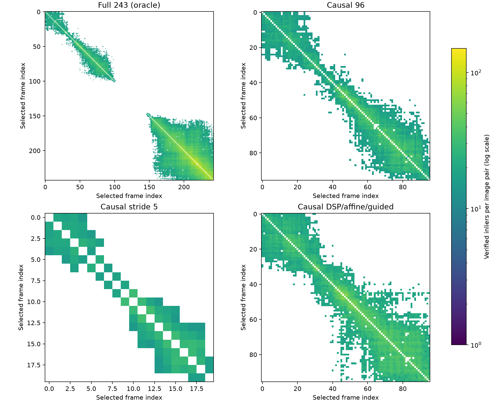
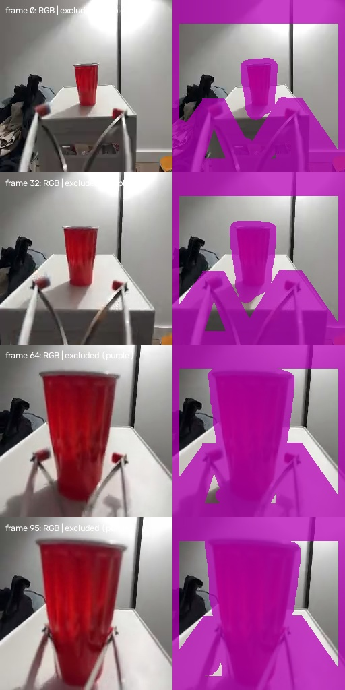

# Dobb·E: исправленные контрольные запуски COLMAP

Дата: 2026-10-02. Выполнены **все четыре предложенных контроля**. Получены частичные реконструкции, но **подтверждённая causal K пока не найдена**.

Прежние `9/96` относятся к нестандартной legacy конфигурации и **не доказывают**, что COLMAP self-calibration невозможна для сцены A. Новое заключение ограничено четырьмя проверенными конфигурациями, выбранной маской и экспортированным RGB `256×256`.

## Результаты

| Контроль | Входных кадров | Моделей | Крупнейшая модель | Различных восстановленных кадров | Вывод |
|---|---:|---:|---:|---:|---|
| Full oracle | 243 | 12 | 24 | 76 | локальные компоненты, общей калибровки нет |
| Causal 0–95 | 96 | 1 | 4 | 4 | слишком мала для принятия K |
| Causal stride 5: 0,5,…,95 | 20 | 0 | 0 | 0 | модель не построена |
| Causal DSP-SIFT + affine + guided | 96 | 4 | 18 | 33 | matching улучшен, K не прошла depth/poses проверку |

Крупнейшая модель — одна реконструкция. Модели могут содержать одинаковые кадры; уникальное покрытие посчитано отдельно. Размеры моделей full: `24,22,17,17,15,14,13,13,12,11,11,10`; усиленный causal: `18,15,11,2`. [Машинная таблица](../runs/dobbe_colmap_clean_rerun_v1/experiment_results.csv).

## Исправления

| Замечание | Исправление |
|---|---|
| Principal point уточнялся с начала mapping | Default `ba_refine_principal_point=False`; `cx=cy=128` в COLMAP |
| Придуманные fx=fy=200 становились prior | `camera_params=""`; в каждой новой DB реально `has_prior_focal_length=False` |
| Ослабленные mapper thresholds | Все параметры mapper соответствуют установленному PyCOLMAP 4.2.1, кроме потоков и seed |
| Не было foreground масок | Одна замороженная политика для четырёх запусков; keypoints в исключённых областях: **0** |
| `multiple_models=False`, `min_model_size=2` | Default `True` и `10`; фактически возвращённые модели <10 явно отклонены |
| Не было full sequence | Отдельный full-243 oracle; его K не используется в causal результате |
| Только соседние even/odd subsets | Отдельный stride-5 контроль |
| Аудит только строк DB | Реальные raw matches и verified inliers каждой пары, связи каждого кадра, компоненты при четырёх порогах |
| Смешение pixel conventions | В новых K и validation: `cx_cv=cx_colmap−0.5`, `cy_cv=cy_colmap−0.5` |

Начальная default K каждой новой DB: `(307.2,307.2,128,128)`, без focal prior. Это эвристическая инициализация. Непустые вручную заданные параметры помечаются как prior: [COLMAP image reader](https://github.com/colmap/colmap/blob/main/src/colmap/controllers/image_reader.cc).

Установленные defaults: `init_min_num_inliers=100`, `init_min_tri_angle=16°`, `abs_pose_min_num_inliers=30`, `abs_pose_min_inlier_ratio=0.25`, `ba_local_min_tri_angle=6°`. Изменены только `num_threads=6`, `random_seed=17`; проверено совпадение всего словаря, включая вложенные настройки. Одна общая PINHOLE камера, CPU SIFT, exhaustive matching. Depth и labels в COLMAP не загружаются. DSP/affine/guided добавлены только в четвёртом запуске.

Несмотря на default `min_model_size=10`, PyCOLMAP фактически вернул 4- и 2-кадровые модели. Параметр не гарантирует минимального размера всех выходных моделей; такие результаты отклонены явно. Внутренние повторные попытки mapper могут менять стратегию, при сохранении исходных options.

Фиксация principal point, DSP/affine/guided и перевод pixel centers следуют [COLMAP FAQ](https://colmap.github.io/faq.html). PINHOLE выбран как предложенная простая модель с раздельными fx/fy для растянутого RGB; distortion здесь не оценивается.

## Граф verified matches

| Контроль | Median keypoints/кадр | Пар ≥30 | Пар ≥50 | Пар ≥100 | Крупнейшая компонента ≥15 / ≥30 |
|---|---:|---:|---:|---:|---:|
| Full oracle | 57 | 1964 | 547 | 6 | 102 / 91 |
| Causal 96 | 51 | 194 | 1 | 0 | 96 / 51 |
| Causal stride 5 | 49.5 | 4 | 0 | 0 | 20 / 2 |
| Causal усиленный | 55 | 574 | 21 | 0 | 96 / 90 |



Цвет — число verified inliers; белый — отсутствие verified совпадений, диагональ не содержит самосопоставлений. Для stride-5 ось обозначает индекс выбранного кадра; frame IDs сохранены в CSV.

Префикс связен при пороге 15; утверждать отсутствие matches неверно. Но сильных пар мало. Усиление увеличило число связей, сохранив отсутствие пар ≥100. Inlier count сам по себе не доказывает достаточный параллакс. Full graph разделён на ранний и поздний фрагменты с промежутком слабых совпадений.

В папках [full oracle](../runs/dobbe_colmap_clean_rerun_v1/main_full-oracle_pinhole_masked_stride1_all), [causal](../runs/dobbe_colmap_clean_rerun_v1/main_causal_pinhole_masked_stride1_all), [stride 5](../runs/dobbe_colmap_clean_rerun_v1/main_causal_pinhole_masked_stride5_all), [усиленный causal](../runs/dobbe_colmap_clean_rerun_v1/main_causal_pinhole_masked_stride1_all_dsp_affine_guided) сохранены configs, summaries, pair/image CSV, graph JSON и sparse models. Все K и frame IDs находятся в summaries. SfM trajectories имеют произвольный масштаб и не называются метрическими poses.

## Проверка новых K измеренной depth

Крупнейшая oracle модель покрывает кадры 172–200 с пропусками. Её fx/fy=`61.26/80.70`, средняя внутренняя перепроекция `0.472 px`. По всем oracle моделям fx варьируется от `15.12` до `4775.22`, fy — от `22.88` до `8714.24`. Низкая внутренняя ошибка не подтверждает правильность K. Oracle параметры не переносились в causal.

Три усиленные causal модели ≥10 кадров проверены одинаковыми **22 соответствиями**. Из 94 исторических RGB RANSAC наблюдений оставлены точки, оба конца которых проходят frozen foreground mask. Пары `0→20`, `20→40`, `40→60`, `60→80`, `80→95`; количества `5,5,3,4,5`. K не подгонялась к depth/labels. Применены ранее обоснованные c2w labels и оптический базис экспортера, с переводом K в OpenCV.

| K, depth как Z | Размер модели | fx / fy | Median 3D, м | Median reprojection, px | P90 reprojection, px |
|---|---:|---|---:|---:|---:|
| Naive OpenCV `(200,200,128,128)` | baseline | 200 / 200 | 0.07292 | 6.40 | 11.20 |
| Усиленный model 3 | 18 | 1781.69 / 2699.53 | 0.05642 | 75.05 | 135.61 |
| Усиленный model 1 | 15 | 707.39 / 3483.67 | 0.06085 | 38.06 | 193.56 |
| Усиленный model 2 | 11 | 2085.36 / 5615.74 | 0.05595 | 93.53 | 295.93 |

При depth как ray length медианная перепроекция соответственно `6.20`, `75.15`, `38.21`, `93.51 px`. Baseline не считается установленной K и не передавалась в новые COLMAP DB. Улучшение одной 3D медианы при ухудшении перепроекции не позволяет принять новые intrinsics. [Полные значения](../runs/dobbe_colmap_clean_rerun_v1/causal_geometry_validation.json), [отфильтрованные соответствия](../runs/dobbe_colmap_clean_rerun_v1/causal_validation_correspondences.json).

Это проверка внешними измеренными depth/poses, а не внутренним SfM objective. Она использует calibration prefix, а не отдельную тестовую сцену. Выборка мала, соответствия автоматические и не размечены вручную как static landmarks. Эти числа выявляют несогласованность кандидатов, но не сертифицируют baseline. Z-versus-ray остаётся нерешённым.

## Маски и ограничения

Политика создана по causal RGB кадрам `0,32,64,95`, сохранена до декодирования full ряда и не менялась по future. Фиксированные коридоры аппаратуры/рук, границы изображения и красный HSV foreground с dilation применяются одинаково ко всем кадрам. Depth/labels не участвуют. [Policy](../runs/dobbe_colmap_clean_rerun_v1/mask_policy_frozen.json), [protocol и hashes RGB/масок](../runs/dobbe_colmap_clean_rerun_v1/clean_protocol.json).



Маска консервативна и несовершенна; оставляет 16.9–43.4% пикселей full ряда и может удалить полезный неподвижный фон. Unmasked ablation в этих четырёх контролях не проводился. Слабая текстура, малый параллакс, разрешение, сжатие и потеря полезных признаков маской — возможные факторы; причинный вклад здесь не измерен. [Oracle обзор масок](../runs/dobbe_colmap_clean_rerun_v1/mask_review_oracle.jpg).

## Практический вывод

**Частичная SfM получена, matching улучшен, согласованная causal K не подтверждена.** Формальный gate остаётся BLOCKED с ограниченным обоснованием для проверенных конфигураций. Это не доказывает невозможность self-calibration.

Ранее выполненный [приближённый COLMAP/F2-NeRF → MolmoMotion эксперимент](dobbe_approx_colmap_f2nerf_molmo.md) доступен с прежними ограничениями. Frozen `(3,8,3)`, prediction и partial GT сохранены. Новые неподтверждённые K и oracle не заменяют этот вход. F2-NeRF конвертирует найденные камеры в свой формат; конвертация не исправляет ошибочную калибровку.

## Воспроизведение

Перед запусками проверены установленные зависимости и исходные репозитории. Использована WSL `.venv`, `pycolmap==4.2.1` без CUDA, OpenCV, NumPy, SciPy, Matplotlib. RGB source указан в protocol; depth validation требует `target_raw` depth/labels и исторические RGB correspondences из предыдущего исследования. SIFT COLMAP не требует нейросетевых весов.

```bash
python scripts/run_dobbe_rgb_colmap.py --prepare-only
python scripts/run_dobbe_rgb_colmap.py --scope full-oracle --model PINHOLE
python scripts/run_dobbe_rgb_colmap.py --scope causal --model PINHOLE
python scripts/run_dobbe_rgb_colmap.py --scope causal --model PINHOLE --stride 5
python scripts/run_dobbe_rgb_colmap.py --scope causal --model PINHOLE --enhanced
python scripts/summarize_dobbe_colmap_clean.py
python scripts/audit_dobbe_colmap_clean.py
```

Default профиль теперь clean, исторический — явный `--profile legacy`. Новые DB независимы от legacy. При первом full запуске исправлены технические ошибки аудита Python: нулевое число keypoints и list вместо dict из `read_all_cameras`. Extraction/matching возобновлены с тем же конфигом; научные настройки не менялись.

Runner при существующем summary печатает сохранённый результат. Для пересчёта используйте отдельную рабочую копию без папки конкретного запуска. Published artifacts включают masks, configs, CSV, sparse models, figures, summaries, validation. SQLite DB, RGB PNG и полные console logs остаются локально и восстанавливаются runner. Абсолютные paths в config фиксируют WSL окружение; на другой машине config hash изменится.

[Аудит PASS](../runs/dobbe_colmap_clean_rerun_v1/audit.json): реальные SQLite verified matches, sparse counts, hashes, defaults, маски, causal/oracle разделение и сохранение frozen входа. Код: [runner](../scripts/dobbe_colmap_clean.py), [сводка/validation](../scripts/summarize_dobbe_colmap_clean.py), [аудит](../scripts/audit_dobbe_colmap_clean.py). [Машинное решение](../runs/dobbe_colmap_clean_rerun_v1/clean_decision.json).
