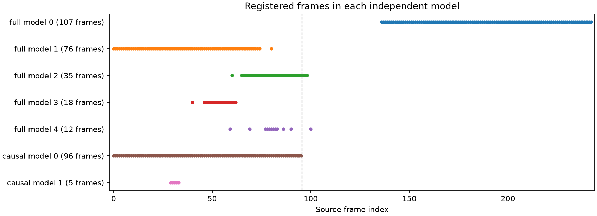
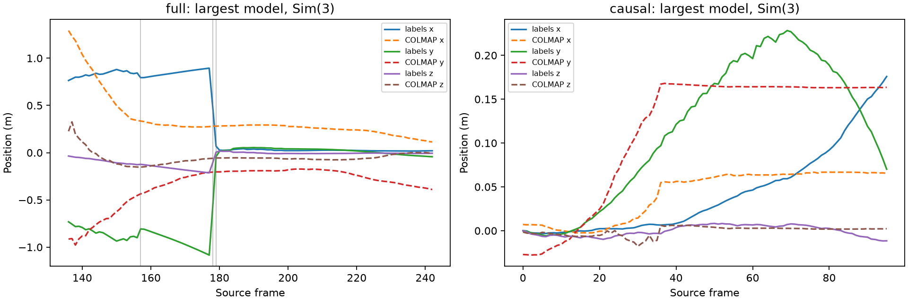
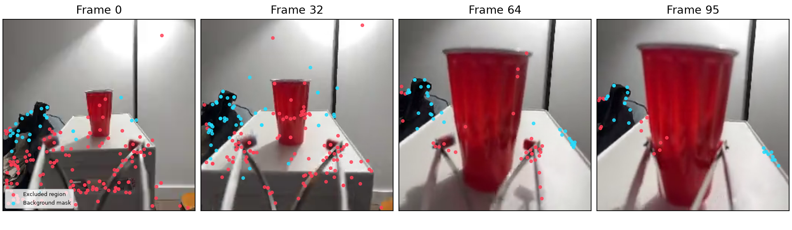
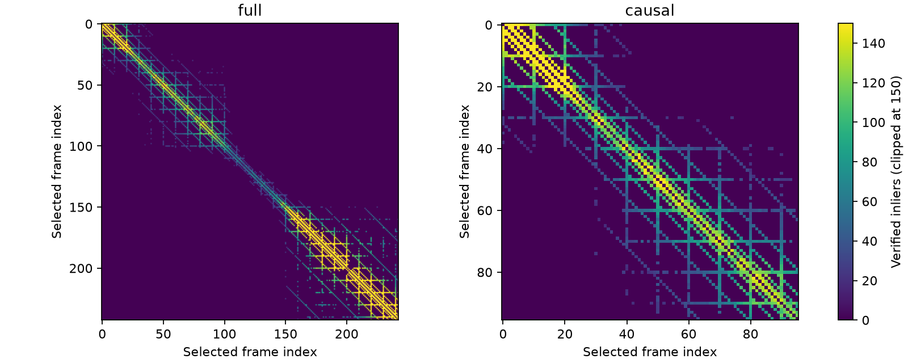

# Dobb·E официальный автоматический COLMAP

Дата: 2026-10-02. Официальный `automatic_reconstructor` восстановил **все 96 causal-кадров в одной модели**, но найденная камера **не прошла проверку измеренной depth и labels**. Полная последовательность дала пять отдельных моделей, крупнейшая — 107/243 кадров. Следовательно, прежние неудачные запуски не показывали предел возможностей SfM для префикса; при этом полная регистрация кадров сама по себе не подтверждает правильность калибровки.

## Результаты реконструкции

| Вход | Кадров | Моделей | Размеры моделей | Уникальных зарегистрированных кадров | Крупнейшая модель |
|---|---:|---:|---|---:|---:|
| Полная последовательность, oracle | 243 | 5 | 107, 76, 35, 18, 12 | 207 | 44,0% |
| Causal 0–95 | 96 | 2 | 96, 5 | 96 | 100% |

Модели могут перекрываться; сумма их размеров не равна уникальному покрытию. Дополнительная causal-модель из пяти кадров содержит **ноль 3D-точек** и не считается пригодной реконструкцией. Основная causal-модель содержит **703 точки**, 11 163 наблюдения и медианную длину трека 11 кадров. Её средняя внутренняя ошибка — **1,208 px**.



Третий запуск с stride 5 не потребовался: он был условным, для успешного full и неуспешного causal. До запуска в protocol был зафиксирован диагностический критерий покрытия: ≥80% входа в одной модели. Здесь получено **FULL PARTIAL, CAUSAL COVERAGE PASS**. Этот критерий характеризует связность реконструкции, а не валидность K; его выбор не влияет на вывод о полном покрытии causal и раздробленном full.

[Машинные результаты](../runs/dobbe_colmap_official_v1/experiment_results.csv), [решение](../runs/dobbe_colmap_official_v1/decision.json), [full summary](../runs/dobbe_colmap_official_v1/full/summary.json), [causal summary](../runs/dobbe_colmap_official_v1/causal/summary.json).

## Настройки официального запуска

Использована официальная Windows CUDA-сборка **COLMAP 4.2.1**, commit `bd1fcf6`, опубликованная 2026-09-29. Хеш архива совпал с SHA-256 release asset; стандартный SIFT vocabulary tree также проверен по хешу из исходников. [Release](https://github.com/colmap/colmap/releases/tag/4.2.1), [локальное подтверждение загрузки](../runs/dobbe_colmap_official_v1/provenance/download_receipt.json).

В обоих запусках: `data_type=video`, `single_camera=1`, `camera_model=SIMPLE_RADIAL`, `quality=high`, `sparse=1`, `dense=0`, `use_gpu=1`. Исходное видео декодировано ffmpeg в 243 PNG `256×256`, без изменения размера, отбрасывания или повторения кадров. Causal-папка содержит только `000000.png`–`000095.png`. Нет foreground-масок на входе, вручную заданных intrinsics, initial pair или mapper thresholds. Depth и labels используются только после завершения COLMAP.

SQL-аудит обеих баз подтвердил одну камеру, начальные параметры `(307.2,128,128,0)` и `prior_focal_length=False`. Это штатная эвристическая инициализация COLMAP. Principal point сохранился `(128,128)`.

Исходники именно версии 4.2.1 подтверждают sequential matcher и loop detection для video; high включает affine SIFT, предел 8192 features и guided matching. Video-профиль сам меняет настройки mapper, включая половину default initial triangulation angle. Это штатные presets, без ручного подбора. Логи подтверждают Covariant SIFT CPU extraction и GPU matching. [Automatic controller](https://github.com/colmap/colmap/blob/4.2.1/src/colmap/controllers/automatic_reconstruction.cc), [presets](https://github.com/colmap/colmap/blob/4.2.1/src/colmap/controllers/option_manager.cc).

Full занял 61,3 секунды, causal — 29,1 секунды, без учёта установки и последующего анализа. Ceres выдал соответственно **114 и 29 предупреждений о сбое шага линейного решателя**, включая Cholesky/CHOLMOD; оба процесса завершились с кодом 0. Предупреждения сохранены в логах и ограничивают доверие к численной устойчивости результатов.

[Protocol и хеши PNG](../runs/dobbe_colmap_official_v1/protocol.json), [help установленного CLI](../runs/dobbe_colmap_official_v1/automatic_reconstructor_help.txt), [full execution](../runs/dobbe_colmap_official_v1/full/execution.json), [causal execution](../runs/dobbe_colmap_official_v1/causal/execution.json).

## Камеры и внешняя проверка K

Каждая отдельная модель заново оценивает параметры общей камеры внутри своей компоненты. Поэтому `single_camera=1` не создаёт единую калибровку между независимыми моделями.

| Модель | Кадров | Точек | f, px | Радиальный k | Внутренняя ошибка, px |
|---|---:|---:|---:|---:|---:|
| Full 0, кадры 136–242 | 107 | 1264 | 128,435 | −0,02173 | 1,252 |
| Full 1, кадры 0–80 с пропусками | 76 | 654 | 109,508 | 0,69458 | 1,238 |
| Full 2 | 35 | 254 | 105,002 | 0,23684 | 1,066 |
| Full 3 | 18 | 19 | 228,792 | −0,31765 | 0,994 |
| Full 4 | 12 | 5 | 762,378 | 34,04184 | 0,125 |
| Causal 0 | 96 | 703 | **680,019** | **2,95299** | **1,208** |
| Causal 1, непригодна | 5 | 0 | 2548,243 | −31,57094 | нет наблюдений |

Для основной causal-модели `cameras.txt` содержит:

```text
1 SIMPLE_RADIAL 256 256 680.01917210088925 128 128 2.9529929357062183
```

В OpenCV principal point переводится в `(127.5,127.5)`; `fx=fy=680.019`. Радиальный коэффициент сохранён в проекции и обратной проекции: проверка только матрицы K с отбрасыванием distortion была бы другой камерой. Эквивалентность проекций SIMPLE_RADIAL и OpenCV проверена численно.

Внешняя проверка использует те же **22 автоматических RGB-соответствия** на парах `0→20`, `20→40`, `40→60`, `60→80`, `80→95`, что и прошлый masked-контроль: `5,5,3,4,5` точек. Все кандидаты проверяются на одной выборке с measured HoNY depth, c2w labels и ранее проверенным оптическим базисом экспортера. Никакие intrinsics или distortion не подгоняются к depth/labels.

| Кандидат, depth как Z | Median 3D, м | Median reprojection, px | P90 reprojection, px |
|---|---:|---:|---:|
| Диагностический naive OpenCV `(200,200,128,128)` | 0,07292 | 6,40 | 11,20 |
| **Causal 0, официальный COLMAP** | **0,06072** | **25,52** | **38,46** |
| Full 0, oracle | 0,08862 | 6,90 | 11,72 |
| Full 1, oracle | 0,07649 | 6,73 | 11,57 |

При depth как ray length медианная causal-перепроекция — **25,49 px**, то есть альтернативная интерпретация depth не снимает расхождение. Улучшение одной 3D-медианы при четырёхкратном ухудшении пиксельной ошибки не подтверждает K. Naive baseline также не является установленной калибровкой. Full-кандидаты оцениваются только как oracle-диагностика и не заменяют causal K.

Выборка мала и не размечена вручную как набор неподвижных landmarks. Поэтому проверка выявляет несогласованность кандидата, но не сертифицирует baseline. [Источники, хеши и conventions](../runs/dobbe_colmap_official_v1/validation_sources.json); все варианты сохранены в summaries.

## Траектории и measured depth на sparse tracks

Sim(3) оценивается по центрам камер на одних и тех же зарегистрированных кадрах; он не меняет K. Для causal 96 RMSE положения после alignment — **5,28 см**, при максимальном расстоянии labels от их среднего **14,17 см**. Это ошибка на кадрах, использованных для самого alignment, а не на отложенном тесте.

В full labels обнаружены большие межкадровые изменения: **177→178: 64,60 см**, **178→179: 70,23 см** и **156→157: 10,49 см**, при общей медиане шага **0,577 см**. Причина скачков не установлена. Поэтому глобальная full RMSE **50,61 см** отражает также неоднородность labels и не может целиком приписываться ошибке COLMAP.

Дополнительная проверка после просмотра графика разделила full-модель по шагам labels >10 см, исключив кадры назначения этих шагов. Это **post-hoc диагностика**, не новая реконструкция и не заранее заданный тест:

| Участок крупнейшей full-модели | Кадров | RMSE положения, см | Масштаб Sim3 |
|---|---:|---:|---:|
| 136–156 | 21 | 2,35 | 0,01323 |
| 158–177 | 20 | 1,63 | 0,08675 |
| 180–242 | 63 | 1,02 | 0,02299 |

Локальные участки согласуются с положениями labels существенно лучше, но используют разные fitted масштабы. Это не подтверждает единую метрическую траекторию. Causal 0–95 не пересекает обнаруженные скачки; его проверка K не зависит от этой проблемы. [Аудит движения labels](../runs/dobbe_colmap_official_v1/label_motion_audit.json).



Causal covariance singular values: `0.3063, 0.006225, 0.0001710`. Почти линейная траектория слабо определяет вращение Sim(3) вокруг направления движения. Полученная медианная ошибка ориентации `124,8°` поэтому не является надёжной отдельной оценкой camera axes. Положения, ориентации и singular values сохранены для каждой модели; совпадение всей формы causal-траектории пока не подтверждено.

Из 11 163 causal-наблюдений 9229 прошли проверку measured depth: допустимый диапазон 0,08–3 м, не менее семи валидных значений в patch 3×3 и разброс ≤0,08 м. **2322** таких наблюдения находятся внутри прежней frozen background mask; остальные — в исключённых ею областях. Эта маска применяется только для диагностики готовых tracks и не участвовала в реконструкции.



Голубые точки проходят background mask, красные попадают в исключённые области. Маска консервативна: красный цвет сам по себе не доказывает принадлежность движущейся аппаратуре.

Для 131 background-трека с ≥3 валидными наблюдениями измеренные точки, перенесённые через K и labels в общую систему, имеют медианное отклонение от медианы своего трека **2,32 см**, P90 — **9,36 см**. После отдельной оценки одного масштаба медианная относительная ошибка SfM depth в этой группе — **9,32%**. Масштаб depth `0,07098` отличается от масштаба Sim(3) `0,01940`; это дополнительное расхождение диагностик, а не метрически подтверждённая реконструкция. Для всех наблюдений depth residual — 55,89% при отдельно оценённом масштабе. Z/ray остаётся нерешённым, а маска не гарантирует статичность выбранных tracks. Full world-scatter statistics дополнительно чувствительны к обнаруженным скачкам labels.

## Граф сопоставлений и вывод

| Вход | Median features/кадр | Пар с записями в DB | Пар ≥30 inliers | Пар ≥100 inliers | Крупнейшая компонента ≥30 / ≥100 |
|---|---:|---:|---:|---:|---:|
| Full | 226 | 2649 | 1844 | 936 | 243 / 102 |
| Causal | 200,5 | 926 | 758 | 317 | 96 / 96 |



Features и сильные verified matches есть. Causal-граф связен даже при пороге 100 inliers; full-граф при этом разделяется. Значит, результат нельзя объяснить отсутствием признаков или всех геометрически проверенных соответствий. Граф inliers при этом не гарантирует правильную геометрию и достаточный параллакс.

**Официальный baseline установил возможность полной регистрации causal RGB, но не дал подтверждённую causal K.** Нельзя заключать, что префикс принципиально недостаточен для запуска COLMAP. Также нельзя приписать улучшение одному фактору: одновременно изменились masking, camera model, matcher и presets относительно [предыдущих четырёх контролей](dobbe_colmap_clean_rerun.md). Вклад аппаратуры, обработки RGB, модели камеры и обусловленности self-calibration этим сравнением не разделён.

## Артефакты и воспроизведение

В каждой папке запуска сохранены `database.db`, RGB PNG, полные logs, native sparse `.bin`, а также официальные TXT-экспорты `cameras`, `images`, `points3D`, `frames`, `rigs` для каждой модели. Summaries содержат intrinsics, все frame IDs, c2w poses, независимые проверки и track statistics. `trajectory.csv` находится рядом с TXT каждой модели. Пары и статистика каждого изображения сохранены в `match_pairs.csv` и `match_images.csv`.

```powershell
cd F:\AIRI_task\molmo-motion
.\scripts\run_dobbe_colmap_official.ps1
```

Runner требует указанную официальную сборку, WSL Ubuntu и существующую `.venv` с PyCOLMAP 4.2.1, NumPy, SciPy, OpenCV, Matplotlib, imageio-ffmpeg и liblzfse. Параметры путей можно передать через `-ColmapExe` и `-WslPython`; папка результатов задана в Python runner. Существующие успешные receipts повторно используют готовые реконструкции и пересчитывают диагностику. Для нового независимого запуска задайте другую папку `OUT` в отдельной копии runner.

```bash
/mnt/f/AIRI_task/.venv/bin/python scripts/check_dobbe_colmap_official_math.py
/mnt/f/AIRI_task/.venv/bin/python scripts/dobbe_colmap_official.py audit
```

[Аудит PASS](../runs/dobbe_colmap_official_v1/audit.json) проверяет исходные и subset hashes, реальные SQL counts, отсутствие focal prior, CLI-параметры, causal/oracle разделение, sparse counts и TXT exports. Код: [PowerShell runner](../scripts/run_dobbe_colmap_official.ps1), [подготовка и анализ](../scripts/dobbe_colmap_official.py), [численная проверка](../scripts/check_dobbe_colmap_official_math.py). Артефакты находятся локально в `runs/dobbe_colmap_official_v1`.
