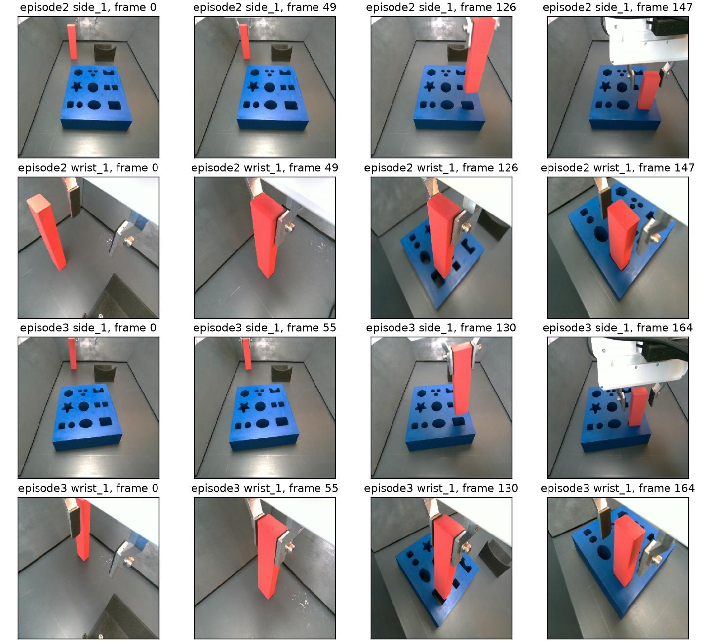
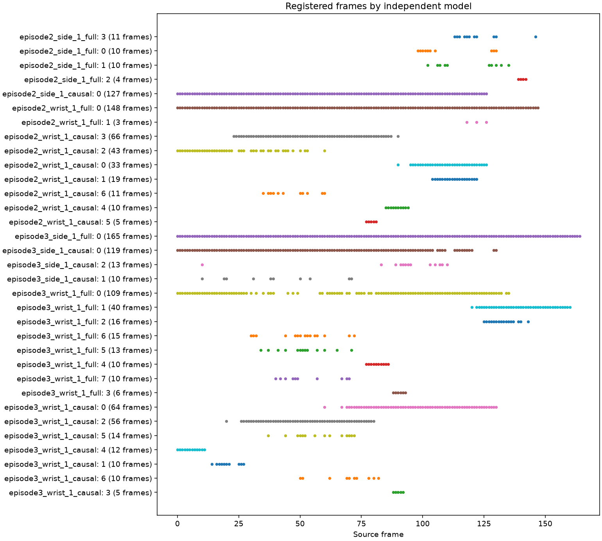

# FMB официальный автоматический COLMAP

Дата: 2026-10-02. Выполнены **10 запусков COLMAP 4.2.1 на двух существующих FMB-эпизодах**: восемь стандартных `SIMPLE_RADIAL` и два дополнительных `PINHOLE`. Некоторые модели регистрируют все кадры, но **проверенную калибровку side_1 получить не удалось**. Wrist-камера даёт локальные реконструкции; наиболее интересные PINHOLE-компоненты около t₀ имеют медианное расхождение с sensor depth 5,8–5,9% после подгонки одного масштаба, однако покрывают только 32 и 38 кадров. Это диагностические кандидаты, а не установленная K.

## Данные и протокол

Использованы `1_M_L_3_vertical_n_2.npy` (**148 кадров**, episode2, прежний t₀=126) и `1_M_L_3_vertical_n_3.npy` (**165 кадров**, episode3, t₀=130). Это те же два эпизода из [предыдущего FMB-исследования](fmb_geometry_forecast_study.md); результаты не являются оценкой на всём датасете или на новой независимой тестовой выборке.

Каждая камера запускалась отдельно. `side_1` закреплена в рабочей зоне, `wrist_1` движется вместе с запястьем. FMB публикует BGR-массивы 256×256, соответствующие depth-массивы и TCP pose конечного эффектора. Типы креплений описаны в [официальной документации FMB](https://functional-manipulation-benchmark.github.io/files/index.html), поля данных — в [карточке датасета](https://huggingface.co/datasets/charlesxu0124/functional-manipulation-benchmark). TCP не является позой камеры: для сравнения траекторий нужен неизвестный здесь camera-to-TCP transform.



Из BGR-массивов сохранены lossless PNG без изменения размера; декодированные PNG проверены на точное совпадение с массивами. Для episode2 causal-папка содержит только **0–126**, для episode3 — **0–130**. Full использует все кадры и рассматривается как oracle-диагностика. Full-модели не инициализируют causal-запуски, K wrist не переносится на side.

Восемь базовых запусков используют официальный Windows CUDA `automatic_reconstructor`:

```text
--data_type video --single_camera 1 --camera_model SIMPLE_RADIAL
--quality high --sparse 1 --dense 0 --use_gpu 1
```

Нет ручных intrinsics, initial pair, масок или mapper thresholds. Sensor depth, CAD и TCP не передаются в COLMAP. Два дополнительных запуска меняют только camera model на `PINHOLE` и используют causal wrist_1. Эта модель разрешает разные fx и fy, что представляет интерес для опубликованных изображений 256×256.

Использована та же официальная сборка, что в [Dobb·E baseline](dobbe_colmap_official_baseline.md). Version, CLI help, argv, хеш executable и длительности сохранены в выходных папках. Video matching и high presets соответствуют исходникам [automatic controller](https://github.com/colmap/colmap/blob/4.2.1/src/colmap/controllers/automatic_reconstruction.cc) и [option manager](https://github.com/colmap/colmap/blob/4.2.1/src/colmap/controllers/option_manager.cc). Логи всех запусков подтверждают Covariant SIFT CPU extraction, GPU matching и vocabulary loop pairing. [Release 4.2.1](https://github.com/colmap/colmap/releases/tag/4.2.1).

[Базовый protocol с хешами источников и PNG](../runs/fmb_colmap_official_v1/protocol.json), [PINHOLE protocol](../runs/fmb_colmap_official_pinhole_v1/protocol.json).

## Покрытие реконструкций

«Крупнейшая» означает компоненту с наибольшим числом зарегистрированных кадров. «Уникальные» — объединение кадров всех моделей; независимые модели имеют собственные координаты, масштаб и оценку камеры, поэтому такое объединение не является общей реконструкцией.

| Эпизод | Камера | Вход | Кадров | Моделей | Крупнейшая | Уникальные | 3D-точек в крупнейшей |
|---|---|---|---:|---:|---:|---:|---:|
| 2 | side_1 | full | 148 | 4 | 11 | 30 | 93 |
| 2 | side_1 | causal | 127 | 1 | **127** | 127 | 69 |
| 3 | side_1 | full | 165 | 1 | **165** | 165 | 321 |
| 3 | side_1 | causal | 131 | 3 | 119 | 121 | 183 |
| 2 | wrist_1 | full | 148 | 2 | **148** | 148 | 1122 |
| 2 | wrist_1 | causal | 127 | 7 | 66 | 127 | 112 |
| 3 | wrist_1 | full | 165 | 8 | 109 | 154 | 548 |
| 3 | wrist_1 | causal | 131 | 7 | 64 | 125 | 621 |

У side_1 causal episode3 две дополнительные компоненты имеют **ноль 3D-точек**. У wrist_1 causal episode2 одна такая компонента также есть. Они не считаются пригодной геометрией. Диагностический критерий ≥80% входа в одной компоненте с положительным числом точек выполнен в четырёх из восьми запусков; он не проверяет K.

Full не гарантирует улучшение: side_1 episode2 full распался, хотя causal зарегистрировал 127/127; wrist_1 episode2 full зарегистрировал 148/148, но плохо согласуется с depth. Дополнительные кадры меняют matching, initialization и последующую оптимизацию. Эти наблюдения не доказывают влияние одного конкретного этапа.



[CSV покрытия](../runs/fmb_colmap_official_v1/experiment_results.csv), [CSV камер всех моделей](../runs/fmb_colmap_official_v1/camera_diagnostics.csv).

## Проверка side_1 по доске

Ниже параметры крупнейшей модели каждого запуска. Во всех случаях COLMAP principal point равен `(128,128)`; для OpenCV он переведён в `(127.5,127.5)`. Радиальный коэффициент сохранён при проекции. SIMPLE_RADIAL предполагает fx=fy.

| Эпизод и вход | f, px | Радиальный k | Внутренняя ошибка, px | RGB доски на отложенных кадрах, RMSE px | Median abs Z доски, мм |
|---|---:|---:|---:|---:|---:|
| 2 full | 7498,64 | −276,362 | 0,355 | 8,88 | 13915,92 |
| 2 causal | 48,09 | −0,02178 | 0,682 | 11,83 | 233,26 |
| 3 full | 407,75 | −0,81065 | 0,941 | 6,80 | 457,32 |
| 3 causal | 1089,75 | 562230,625 | 0,450 | 54,42 | нет допустимых samples |

Проверка фиксирует полученные K и distortion и подгоняет **только одну позу неподвижной CAD-доски** по RGB кадров `0,16,32,48`. Features `8,12,16` исключены из подгонки. RGB оценивается на кадрах `8,24,40,56`; depth сравнивается на внутренних точках синей поверхности, с eroded RGB-mask и median positive depth в патче 5×5. Во всех четырёх основных pose fits оптимизатор завершился успешно. Ни K, ни distortion не подгоняются к CAD/depth.

Для сопоставления тот же протокол с прежней номинальной гипотезой `fx=152.0836, fy=202.7781, cx=124.2908, cy=129.2973`, zero distortion дал:

| Эпизод | RGB RMSE всех features, px | RGB RMSE исключённых features, px | Depth samples | Median abs Z, мм |
|---|---:|---:|---:|---:|
| 2 | 0,821 | 0,418 | 190 | 7,79 |
| 3 | 0,769 | 0,353 | 180 | 6,61 |

У causal episode2 ошибка только исключённых features равна 0,702 px: отдельный небольшой набор RGB-точек выглядит лучше общей ошибки, однако расхождение Z остаётся 233 мм. У causal episode3 ошибка исключённых features — 44,804 px, а depth samples отсутствуют. Отсутствие samples не означает нулевую ошибку. Остальные три full-компоненты episode2 также не дали согласованной камеры: RGB RMSE 8,61–8,81 px и median abs Z 4562–37532 мм.

Номинальная гипотеза тоже **не является эталонной калибровкой активной COLOR-камеры**. CAD outline/hole landmarks извлечены автоматически и приближённы; depth registration и масштаб `0.0001 м/count` независимо не сертифицированы. Проверка показывает серьёзное расхождение этих COLMAP-кандидатов с доступной геометрией, но не устанавливает истинную K.

[Источники и conventions проверки](../runs/fmb_colmap_official_v1/validation_sources.json), [номинальная проверка episode2](../runs/fmb_colmap_official_v1/episode2_nominal_board_check.json), [episode3](../runs/fmb_colmap_official_v1/episode3_nominal_board_check.json), [предыдущий аудит effective K](fmb_effective_k_256_calibration.md).

## Граф соответствий и движение

У side_1 есть features и хорошо связанный граф: медиана **201–213 SIFT keypoints на кадр**, 1062–1160 пар с ≥100 verified inliers. Крупнейшие компоненты такого графа содержат 113–134 кадра. У causal side_1 медианное по парам смещение inliers составляет **0,117 и 0,123 px**, медианная доля соответствий со смещением <1 px — **93,9% и 93,4%**.

Таким образом, множество совпадений здесь не свидетельствует о полезном параллаксе. Неподвижная камера не даёт camera-translation parallax для статической сцены. Движущиеся робот и объект дополнительно нарушают предположение о неподвижных 3D-точках. Восстановленные side_1 траектории нельзя интерпретировать как физическое движение этой камеры: например, episode3 full даёт поворот до **20,62°** и размах центров **0,414 медианной глубины сцены**. Это интерпретация диагностик с учётом известного крепления; она не доказывает невозможность калибровки FMB другими методами.

У wrist_1 медиана keypoints меньше, **114–138**, и пар с ≥100 inliers только 46–79. Компоненты графа при этом пороге содержат 15–24 кадра. Порог 100 используется только для анализа, он не передавался mapper. Pixel displacement также не является triangulation angle.

[Графы verified matches](../runs/fmb_colmap_official_v1/verified_match_graphs.png). Для каждого запуска сохранены `database.db`, `match_pairs.csv`, `verified_pair_displacements.csv`, графовые counts и `trajectory.csv` каждой модели.

## Wrist и sensor depth

Для каждого COLMAP track observation берётся Z точки в текущей камере и sensor depth соответствующего пикселя. Используется патч 3×3 с ≥7 положительными значениями и размахом ≤20 мм. Подгоняется **один общий масштаб** `s = median(Zsensor/Zsfm)`; ниже `abs(s·Zsfm−Zsensor)/Zsensor` на той же выборке. Это проверка согласованности с независимым измерением после подгонки масштаба, а не отложенная валидация K. Движущиеся точки не исключены.

| Крупнейшая wrist модель | Кадров | f, px | k | Наблюдений depth | Median relative residual | P90 relative residual |
|---|---:|---:|---:|---:|---:|---:|
| Episode2 full | 148 | 44,95 | −0,0000597 | 9174 | **75,41%** | 10732,31% |
| Episode2 causal | 66 | 144,60 | −0,10105 | 1318 | **8,64%** | 85,17% |
| Episode3 full | 109 | 1034,24 | 11,44097 | 6149 | **37,28%** | 99,59% |
| Episode3 causal | 64 | 169,96 | 0,00450 | 3809 | **9,69%** | 99,68% |

Полное покрытие episode2 full сопровождается сильной несогласованностью depth. Локальные causal-компоненты существенно лучше по медиане, но имеют большие хвосты ошибок. Крупнейшая episode2 causal модель покрывает кадры 23–90 с пропусками и **не содержит t₀=126**; отдельная модель 0 содержит 33 кадра из диапазона 90–126, включая t₀, и даёт median residual 12,86%. Крупнейшая episode3 causal содержит t₀=130 и 64 кадра из диапазона 60–130.

## Дополнительные PINHOLE контроли

Оба causal wrist запуска повторены с PINHOLE. Ручные параметры и остальные CLI options не менялись.

| Эпизод | Вход | Моделей | Крупнейшая | Уникальные | fx и fy крупнейшей, px | Median depth residual крупнейшей |
|---|---:|---:|---:|---:|---|---:|
| 2 | 127 | 7 | 53 | 113 | 541,16; 1144,68 | 38,57% |
| 3 | 131 | 11 | 38 | 104 | 142,29; 223,04 | 5,82% |

Покрытие крупнейшей компоненты уменьшилось относительно SIMPLE_RADIAL: **66→53** и **64→38**. Это одиночные автоматические запуски; random seed вручную не фиксировался. Сравнение не является оценкой среднего эффекта camera model по повторным seeds.

В episode2 PINHOLE модель **0** около t₀ содержит **32 кадра 95–126**, 386 точек и `fx=202.05, fy=301.88`. Её internal error — 0,791 px, median depth residual **5,90%**, P90 **52,52%**, 2371 наблюдение. В episode3 модель **0** содержит **38 кадров 93–130**, 498 точек; internal error 0,781 px, median **5,82%**, P90 **45,98%**, 2842 наблюдения. Обе содержат t₀, что делает их кандидатами для дальнейшей отдельной проверки локальной wrist-геометрии.

Однако параметры этих двух кандидатов заметно различаются, остальные компоненты часто имеют экстремальные focal values, а хвосты depth residual остаются большими. Проверенная общая wrist K не установлена. PINHOLE-контроли здесь не исследуют side_1 и не позволяют перенести wrist K на неё.

[PINHOLE результаты](../runs/fmb_colmap_official_pinhole_v1/experiment_results.csv), [все камеры](../runs/fmb_colmap_official_pinhole_v1/camera_diagnostics.csv), [покрытие компонентов](../runs/fmb_colmap_official_pinhole_v1/registered_frame_coverage.png).

## Артефакты и воспроизведение

Все 10 native процессов завершились с кодом 0; предупреждения оптимизации сохранены в `colmap.log`. У episode2 wrist full, несмотря на полное покрытие, отмечено **553 Linear solver failure warnings**. Успешный exit code не гарантирует численную устойчивость геометрии.

Аудит подтвердил SHA-256 источников/PNG, точные full/causal subsets, одну камеру в каждой SQLite-базе без focal prior, штатный набор CLI options, counts моделей и соответствие BIN/TXT камер, поз, 3D-точек и экспортированных траекторий. Проекции каждой полученной камеры численно сверены между pycolmap и OpenCV с поправкой −0,5 px: максимальное расхождение **7,28×10⁻¹² px** для SIMPLE_RADIAL и **2,84×10⁻¹⁴ px** для PINHOLE. [Аудит восьми baseline запусков](../runs/fmb_colmap_official_v1/audit.json) и [двух PINHOLE запусков](../runs/fmb_colmap_official_pinhole_v1/audit.json) — **PASS**. Это аудит артефактов и вычислений, а не сертификат K.

Реконструкции, SQLite, PNG, TXT exports, логи и summaries находятся в [`runs/fmb_colmap_official_v1`](../runs/fmb_colmap_official_v1/) и [`runs/fmb_colmap_official_pinhole_v1`](../runs/fmb_colmap_official_pinhole_v1/). Подготовка, анализ и аудит реализованы в [fmb_colmap_official.py](../scripts/fmb_colmap_official.py); запуск — в [run_fmb_colmap_official.ps1](../scripts/run_fmb_colmap_official.ps1) через общий [native runner](../scripts/run_dobbe_colmap_official.ps1).

Из корня репозитория, с существующими FMB `.npy`, установленной Windows COLMAP 4.2.1 и WSL Python environment:

```powershell
powershell -NoProfile -ExecutionPolicy Bypass -File scripts/run_fmb_colmap_official.ps1
powershell -NoProfile -ExecutionPolicy Bypass -File scripts/run_fmb_colmap_official.ps1 -Profile wrist-pinhole
```

Runner сохраняет завершённые native реконструкции и при повторном вызове проверяет argv, повторяет exports, анализ и аудит. Для нового независимого повторения нужно выбрать новую выходную папку в конфигурации. Полученные side_1 кандидаты не дают основания заменить существующую геометрическую гипотезу в FMB-пайплайне; local wrist кандидаты требуют проверки вне использованных для scale-fit наблюдений.
