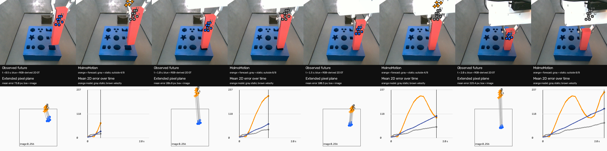
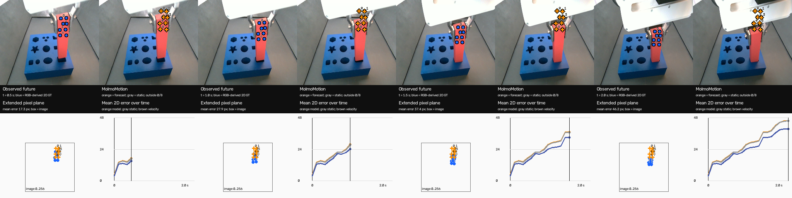

# MolmoMotion на FMB: историческая 3D-геометрия и наблюдаемое будущее

**Статус:** условная оценка двух FMB-демонстраций на одном типе детали и одной камере. Результат относится к двум зафиксированным окнам, а не к среднему качеству модели на FMB. Основной критерий — расхождение с наблюдаемым продолжением в 2D. Геометрия, прогноз и проекция оцениваются отдельно там, где доступны соответствующие данные.

## Постановка и происхождение данных

Использован [авторский MolmoMotion-4B-H3-F30](https://huggingface.co/allenai/MolmoMotion-4B-H3-F30), checkpoint revision `3f5e790a511ff2cdf21c8d2a14cb4d8409c94629`, SHA-256 локального `model.pt` `506beccd01e9edd4d3ebf0bf88fec00b83530eec525571168187c7c4888ee205`. [Карточка модели](https://huggingface.co/allenai/MolmoMotion-4B-H3-F30) задаёт три исторических кадра, 30 шагов будущего и примерно две секунды при 15 Гц. Исходные записи взяты из [официального FMB на Hugging Face](https://huggingface.co/datasets/charlesxu0124/functional-manipulation-benchmark); исходный [код MolmoMotion](https://github.com/allenai/molmo-motion) доступен отдельно. Внутри опубликованных FMB `.npy` RGB и depth имеют 256×256, RGB закодирован в BGR; аппаратных меток времени и intrinsics активного RGB-потока в этих файлах нет.

| Пример | Файл, камера | История → `t₀` → наблюдаемое будущее | Статус источника |
|---|---|---|---|
| Первый | `1_M_L_3_vertical_n_2.npy`, `side_1` | 124, 125, 126 → 126 → 127–146 | Сопоставлен с ShareRobot `episode_5201` |
| Второй | `1_M_L_3_vertical_n_3.npy`, `side_1` | 128, 129, 130 → 130 → 131–150 | Другая исходная FMB-демонстрация; ShareRobot ID не установлен |

У каждого примера восемь внутренних точек на красной детали. Исторические точки получены до прогнозирования. Исторические XYZ в основном варианте вычислены из медианы положительных Z16 в 5×5 области, масштаба `0.0001 м/raw` и предполагаемой `K_nominal` для `side_1`: `fx=152.0836`, `fy=202.7781`, `cx=124.2908`, `cy=129.2973 px`. Это гипотеза пересчёта опубликованного профиля 640×480 на 256×256, **не подтверждённая active color K**. Отдельный [аудит калибровки](fmb_effective_k_256_calibration.md) не нашёл однозначной эффективной K. Её неопределённость сохраняется во всех метрических выводах.

Оба окна уже участвовали в разработке протокола. Второй файл отличен от первого, но не является нетронутой отложенной демонстрацией, поэтому двухэпизодное сравнение не заменяет независимую проверку на заранее скрытом исходнике.

Точный текст входной команды в обоих опытах: `Insert the red rectangular peg into the matching hole on the blue board.` Это зафиксированный до inference пересказ primitive `insert`, а не дословное поле FMB. FMB частота 10 Гц номинальная, тогда как 30 шагов модели интерпретируются как `j/15 с`; прогноз в 3D линейно интерполирован к 20 **реальным** кадрам будущего `j/10 с`. Аппаратная синхронизация не подтверждена, и временная интерпретация остаётся условием оценки. [Подробный первый протокол](fmb_quantitative_2d_episode_5201.md) и [второй протокол](fmb_quantitative_2d_second_trial.md) фиксируют SHA-256 исходных файлов, точки, действие, preflight и последовательность подготовки.

Реестр рассмотренных источников геометрии отделяет запуски от планов:

| Источник | Точный вариант или артефакт | Статус |
|---|---|---|
| FMB sensor Z16 | опубликованные `obs/side_1_depth`; выбранные 5×5 области | Основной прогноз обоих эпизодов |
| CAD + planar PnP | официальный STEP FMB, тело 48: 40,32×25,92×150 мм; RGB соответствия | Диагностические прогнозы обоих эпизодов |
| CAD-силуэт + TCP prior | тот же STEP, приближённая поза по историческим RGB | Диагностические прогнозы обоих эпизодов |
| [MoGe-2 ViT-L](https://github.com/microsoft/MoGe) | SHA-256 весов `3eefd4abb2102f38f12b2d1992e5ff15e4923e5431c67dd494afe157e0111cd5` | RGB глубина проверена ранее на шести кадрах первого исходника и отдельно на обоих фиксированных H3-окнах; выполнена отдельная ветвь прогнозирования |
| [MoGe-3 ViT-L](https://github.com/microsoft/MoGe) | revision `184008f877d7ad1ad4c2cd2182a9bd1f63d0e5be`, SHA-256 `9b41b7b9f65ad80aab7ad686f5e9cc0d1fd33f1964022618dfbcd52fc1fb7925` | RGB глубина ранее проверена на шести кадрах первого исходника |
| [UniDepthV2 ViT-S](https://github.com/lpiccinelli-eth/UniDepth) | SHA-256 `93705cb3295dd7476b44911b8a55f5215bf74e8d5eccd27cecdb1b338270a648` | RGB глубина ранее проверена на шести кадрах первого исходника |
| Metric3Dv2, Depth Anything V2 Metric | кандидаты | Запусков для этой 2D-оценки нет |

Точные режимы предобработки и измеренные ошибки ранних RGB-моделей приведены в [отчёте о метрической глубине](fmb_cad_metric_depth_experiment.md). DUSt3R, MASt3R, VGGT, stereo, SfM/SLAM, 6D-поза и кинематика робота остались резервными подходами. DaS относится к отдельной задаче и не включён в результаты ниже.

## Независимая оценка продолжения

Будущие координаты получены из RGB-маски красной детали последовательной аффинной ECC-регистрацией **до чтения прогноза**. Общая маска допускает 160/160 пар «точка × кадр» в каждом примере, включая 8/8 точек при `t₀+2 с`. Модель и простые методы сравниваются на одних и тех же парах. Невалидные или выходящие за рамку проекции не обрезаются и не исключаются из метрики. Официальный parser независимо подтвердил полный исходный ответ `8×30×3` во всех базовых запусках. Нулевой массив после сбоя parser не считается прогнозом неподвижности.

На заранее выбранных пяти из 20 будущих кадров (**25% кадров**) две точки повторно зарегистрированы прямым путём `t₀→t` без чтения прежней траектории. Это независимый путь вычисления, **но не вторая человеческая разметка**: оба способа используют RGB-маску. P90 расхождения повторов составляет 1,59 px в первом примере и 0,37 px во втором. Альтернативный dense flow расходится с основным треком медианно на 13,94 и 4,59 px соответственно. Гладкая поверхность не позволяет доказать постоянство материальной идентичности каждой точки. Поэтому GT здесь — **image-derived 2D proxy**; разницы методов в несколько пикселей требуют особенно осторожной интерпретации.

Увеличенные фрагменты с двумя путями регистрации и распределение расхождений: [первый эпизод](../runs/sharerobot_fmb_episode_5201/quantitative_2d_sensor_t126/annotation_repeatability_v1.png) · [второй эпизод](../runs/fmb_second_example_1_M_L_3_vertical_n_3/quantitative_2d_sensor_t130/annotation_repeatability_v1.png). На иллюстрациях фрагменты увеличены для просмотра; исходные координаты и ошибки выражены в пикселях 256×256.

## Главное сравнение

ADE — средняя евклидова ошибка в пикселях по 160 допустимым парам; FDE — средняя ошибка восьми точек ровно при `t₀+2 с`. Постоянная скорость построена только по трём историческим 2D-наблюдениям с шагом 0,1 с. Исходная модель использует sensor depth и `K_nominal`. CAD-варианты — диагностические: planar PnP опирается на приблизительные соответствия на малотекстурной грани; RGB/CAD силуэт включает prior величины движения TCP. Меньшая ошибка относительно будущего не выбирает «правильную» историческую геометрию.

| Пример | Исторические XYZ / метод | ADE₂D, px ↓ | FDE₂D, px ↓ |
|---|---|---:|---:|
| Первый | MolmoMotion + sensor | 124,14 | 225,40 |
| Первый | Неподвижность | 41,07 | 74,06 |
| Первый | Постоянная скорость 2D | 72,40 | 143,62 |
| Первый | MolmoMotion + planar PnP, диагностика | 41,75 | 71,99 |
| Первый | MolmoMotion + CAD-силуэт/TCP, диагностика | 98,34 | 135,12 |
| Первый | MolmoMotion + MoGe‑2 raw | 46,89 | 79,71 |
| Первый | MolmoMotion + MoGe‑2, один H3-масштаб | 49,11 | 83,26 |
| Второй | MolmoMotion + sensor | 28,26 | 46,16 |
| Второй | Неподвижность | 28,03 | 45,95 |
| Второй | Постоянная скорость 2D | 24,85 | 39,88 |
| Второй | MolmoMotion + planar PnP, диагностика | 29,18 | 47,16 |
| Второй | MolmoMotion + CAD-силуэт/TCP, диагностика | 36,64 | 46,28 |
| Второй | MolmoMotion + MoGe‑2 raw | 22,79 | 40,66 |
| Второй | MolmoMotion + MoGe‑2, один H3-масштаб | 32,36 | 50,75 |

В первом эпизоде основной прогноз хуже обеих простых моделей по ADE и FDE; 108/160 проекций выходят за изображение. В конце его медианная ошибка направления составляет 159,6° при медианном отношении амплитуд прогноз/GT 2,09. Во втором эпизоде исходный ответ модели повторяет почти одну конфигурацию на всех 30 шагах: конечное смещение около 0,70 px против 45,95 px в RGB-треке. Его отличие от неподвижности всего 0,23 px по ADE и меньше наблюдаемой неопределённости трекинга. Медианное отношение конечной амплитуды прогноз/GT составляет 0,016; направление при столь малом прогнозном смещении неинформативно. Дополнительные показатели, включая нормировку на диагональ маски детали при `t₀` и доли точек в радиусах 5/10/20 px, сохранены в [таблице расширенных метрик](../runs/fmb_extended_2d_metrics_v1/metrics.csv). Это два контрастных локальных исхода, а не оценка общей точности FMB.

MoGe‑2 raw снижает ADE обоих окон до 46,89 и 22,79 px. Во втором его ADE на 2,06 px ниже постоянной скорости, но FDE на 0,78 px выше; медианное конечное смещение самого прогноза остаётся всего около 3,25 px. Поэтому это частичное согласие с наблюдаемым будущим, а не подтверждение точного предсказания движения. Исторически масштабированный MoGe‑2 во втором окне, несмотря на более близкую к sensor глубину выбранных точек, даёт ADE 32,36 px.

На заранее выбранных пяти будущих кадрах (25% горизонта, все восемь точек) основной последовательный ECC-трек и независимый RGB dense optical flow расходятся медианно на **11,96 px** в первом эпизоде и **3,72 px** во втором; p90 равен 20,48 и 9,96 px. [Рисунки первого](../runs/sharerobot_fmb_episode_5201/quantitative_2d_sensor_t126/tracking_uncertainty_v1/tracker_disagreement.png) и [второго эпизода](../runs/fmb_second_example_1_M_L_3_vertical_n_3/quantitative_2d_sensor_t130/tracking_uncertainty_v1/tracker_disagreement.png) показывают конкретные расхождения на гладкой детали. Это две алгоритмические трактовки соответствия 2D-точек, а не независимая ручная разметка или оценка абсолютной истинности. Повторный прямой ECC по той же маске даёт гораздо меньший разброс, но разделяет с основным треком систематическое предположение об аффинном переносе поверхности. Поэтому малые разницы ADE между методами не считаются надёжными; базовое отставание sensor-прогноза в первом эпизоде сохраняется и при альтернативном трекере: ADE **112,48 px** против **27,41 px** у неподвижности и **82,81 px** у постоянной скорости. [Парное сравнение всех геометрий по обоим RGB-трекерам](../runs/fmb_gt_sensitivity_v1/comparison.png) и [числовая таблица](../runs/fmb_gt_sensitivity_v1/comparison.csv) показывают сохранение основных рангов и величину сдвигов.

Базовые запуски выполнены в WSL2 на NVIDIA RTX 4070 (12 ГиБ VRAM), PyTorch `2.9.1+cu128`, BF16, seed 0. [Протокол первого запуска](../runs/sharerobot_fmb_episode_5201/quantitative_2d_sensor_t126/model_run.json) показывает 204,07 с и пик CUDA allocated 9,585 ГиБ; [второго](../runs/fmb_second_example_1_M_L_3_vertical_n_3/quantitative_2d_sensor_t130/model_run.json) — 179,93 с. Дополнительные абляции выполнены последовательно при единожды загруженном checkpoint в каждой серии; для каждого запуска сохранены время генерации и пиковая память процесса.





## Историческая геометрия и последствия для прогноза

Расхождение XYZ с sensor рассчитано на всех 24 исторических точках; sensor здесь лишь опорный измеритель со своей неопределённостью. Показатель жёсткости — медианное абсолютное изменение 28 попарных расстояний между соседними историческими кадрами. Почти нулевые значения CAD/PnP ожидаются от самого способа построения и **не доказывают** физической правильности позы или глубины.

| Пример | История | Медиана XYZ от sensor, мм | Изменение попарных расстояний, мм | ADE₂D, px |
|---|---|---:|---:|---:|
| Первый | sensor | 0 | 2,94 | 124,14 |
| Первый | planar PnP | 16,95 | <0,001 | 41,75 |
| Первый | CAD-силуэт/TCP | 5,65 | <0,001 | 98,34 |
| Первый | MoGe‑2 raw | 29,48 | 2,29 | 46,89 |
| Первый | MoGe‑2, один H3-масштаб | 13,42 | 2,03 | 49,11 |
| Второй | sensor | 0 | 1,70 | 28,26 |
| Второй | planar PnP | 4,92 | <0,001 | 29,18 |
| Второй | CAD-силуэт/TCP | 8,83 | <0,001 | 36,64 |
| Второй | MoGe‑2 raw | 156,58 | 3,65 | 22,79 |
| Второй | MoGe‑2, один H3-масштаб | 10,54 | 2,09 | 32,36 |

На первом эпизоде более близкий к sensor CAD-силуэт всё равно даёт значительно худший прогноз, чем более далёкий PnP; однако первый PnP нестабилен при 2 px шуме разметки и содержит неправдоподобные изменения позы. Во втором эпизоде MoGe‑2 raw при наибольшем расхождении с sensor даёт наименьший ADE, а приближение к сенсору одним масштабом ухудшает его прогноз. Эти десять точек на [диаграммах геометрия → ADE](../runs/fmb_geometry_forecast_comparison_v1/geometry_vs_forecast.png) показывают чувствительность всей связки, но не причинную корреляцию между чистой ошибкой глубины и прогнозом. [Полная числовая таблица](../runs/fmb_geometry_forecast_comparison_v1/comparison.csv) содержит отдельно расхождение по Z и p90 нарушения жёсткости.

Для первого эпизода 0,66 px отложенной RGB-ошибки одной кандидатной K сопровождались 38,14 мм расхождения с независимой sensor depth. [RGB против depth при этой калибровке](../runs/fmb_effective_k_256_calibration/board_RGB_vs_depth.png) показывает, почему один лишь малый остаток перепроекции не подтверждает метрическую геометрию. Эти цифры относятся к **отдельному** опыту калибровки доски и не подставляются как K базовых прогнозов.

## Нейросетевая глубина MoGe‑2 на тех же исторических окнах

Для обеих H3-историй запущен локальный `MoGe-2 ViT-L` с SHA-256 весов `3eefd4abb2102f38f12b2d1992e5ff15e4923e5431c67dd494afe157e0111cd5` и исходным кодом `74fbce054ebed49800de42d0ad0e83495065719a`. Входной BGR переведён в RGB и выполнено **предполагаемое** обратное преобразование пропорций 256×256→256×192; горизонтальный FOV передан из **предполагаемой** `K_nominal`. Точный исходный resize/crop активного RGB неизвестен. Поэтому возвращаемая MoGe K обусловлена этой гипотезой и не является независимой калибровкой. Для контролируемого сравнения с сенсором из предсказанного Z и одной и той же `K_nominal` построены выбранные XYZ. Сырые карты MoGe не подгонялись по будущему; второй вариант использует **по одному коэффициенту на эпизод**, найденному по сенсорным Z только на разрешённых трёх кадрах.

| Эпизод | Медиана абсолютного ΔZ MoGe raw–sensor, мм | После одного H3-масштаба, мм | Размах глубины статичного фона: sensor / MoGe raw, мм |
|---|---:|---:|---:|
| Первый | 24,69 | 11,66 | 3,9 / 70,8 |
| Второй | 139,17 | 9,48 | 14,4 / 102,1 |

Фон измерен в одной визуально неподвижной области RGB/depth `x,y=20:80`; регистрация опубликованных RGB и depth на уровне пикселя остаётся непроверенной. Умножение на один коэффициент уменьшает общий сдвиг выбранных Z, но не устраняет межкадровый размах MoGe: после масштаба он равен 62,6 и 58,4 мм. Между тем медианное изменение попарных расстояний точек MoGe raw равно 2,29 и 3,65 мм против 2,94 и 1,70 мм для sensor. Согласие формы, фона и абсолютной глубины здесь явно разные свойства. Проверка MoGe `points` против `depth + K` после ресайза даёт 1,7–2,2 мм медианного расхождения и подтверждает только согласованность нашего преобразования. [Глубина с общей шкалой на первом H3](../runs/sharerobot_fmb_episode_5201/quantitative_2d_sensor_t126/moge2_history_v1/depth_comparison.png) · [на втором H3](../runs/fmb_second_example_1_M_L_3_vertical_n_3/quantitative_2d_sensor_t130/moge2_history_v1/depth_comparison.png) · [временная согласованность и форма](../runs/fmb_moge2_temporal_geometry_v1/temporal_consistency.png) · [облака первого](../runs/sharerobot_fmb_episode_5201/quantitative_2d_sensor_t126/geometry_bundle_v1/history_clouds_common_axes.png) и [второго](../runs/fmb_second_example_1_M_L_3_vertical_n_3/quantitative_2d_sensor_t130/geometry_bundle_v1/history_clouds_common_axes.png). Числа и карты сохранены в manifest MoGe каждого окна; [унифицированные sparse/dense геометрии](../runs/sharerobot_fmb_episode_5201/quantitative_2d_sensor_t126/geometry_bundle_v1/manifest.json) помечают наличие или отсутствие confidence и карты глубины.

В дополнительном опыте глубина каждого источника **зафиксирована**, а `fx,fy` изменены согласованно при восстановлении исторических X/Y из того же Z и при проекции будущего. Карта MoGe‑2 уже была получена при FOV от номинального сценария; сеть не запускалась повторно с новым FOV. Таким образом, проверяется чувствительность связки unprojection → MolmoMotion → projection, а не новая оценка глубины MoGe.

| Эпизод и источник Z | K nominal: ADE/FDE, px | `fx,fy ×0,9`: ADE/FDE, px |
|---|---:|---:|
| Первый, sensor | 124,14 / 225,40 | 121,63 / 195,50 |
| Первый, MoGe‑2 raw | 46,89 / 79,71 | 53,44 / 89,03 |
| Второй, sensor | 28,26 / 46,16 | 28,18 / 46,09 |
| Второй, MoGe‑2 raw | 22,79 / 40,66 | 28,93 / 47,41 |

Эффект изменения K зависит от источника глубины: парная разность этих эффектов по ADE составляет **9,07 px** в первом и **6,22 px** во втором эпизоде. На двух окнах это только описательное взаимодействие; оба K являются сценариями, а не установленными параметрами камеры. [Двухфакторный рисунок](../runs/fmb_depth_k_factorial_v1/factorial.png) и [исходная таблица](../runs/fmb_depth_k_factorial_v1/comparison.csv) используют общую цветовую шкалу внутри каждого показателя.

## Контролируемые абляции: два эпизода

Дополнительные входы фиксируют то же окно, RGB, восемь физических точек, исходный 2D GT, checkpoint и режим генерации. Меняется ровно указанное условие. При удалении истории одновременно повторены последний RGB и последний XYZ. При изменении масштаба умножены все X/Y/Z, а 2D-запросы остались прежними. При изменении K фокусные расстояния умножены на 0,9 или 1,1; XYZ из прежнего sensor Z пересчитаны по исходным 2D-точкам, и этим же вариантом K спроецирован результат. При перестановках одновременно изменены порядок 2D- и 3D-входа, а готовый прогноз возвращён к прежним ID. [Аудит инвариантов всех 26 подготовленных входов](../runs/sharerobot_fmb_episode_5201/quantitative_2d_sensor_t126/ablation_suite_v1/input_audit.json) прошёл.

| Вход первого эпизода | ADE₂D, px ↓ | FDE₂D, px ↓ |
|---|---:|---:|
| Исходный sensor | 124,14 | 225,40 |
| Перефразирование действия | 122,37 | 160,37 |
| Общая инструкция | 181,41 | 182,94 |
| Другая цель* | 91,55 | 72,21 |
| RGB и XYZ без движения истории | 41,14 | 74,13 |
| Все XYZ ×0,9 | 59,40 | 19,55 |
| Все XYZ ×1,1 | 51,05 | 22,69 |
| Перестановка, точка 0 остаётся опорой | 58,88 | 17,64 |
| Перестановка, новая первая точка | 140,78 | 230,14 |
| `fx,fy ×0,9` | 121,63 | 195,50 |
| `fx,fy ×1,1` | 67,48 | 14,06 |

| Тот же вход второго эпизода | ADE₂D, px ↓ | FDE₂D, px ↓ | Среднее изменение прогноза, px |
|---|---:|---:|---:|
| Исходный sensor | 28,26 | 46,16 | 0 |
| Перефразирование действия | 29,33 | 47,30 | 1,28 |
| Общая инструкция | 28,26 | 46,16 | 0 |
| Другая цель* | 28,26 | 46,16 | 0 |
| RGB и XYZ без движения истории | 28,08 | 46,00 | 0,69 |
| Все XYZ ×0,9 | 28,50 | 46,41 | 0,52 |
| Все XYZ ×1,1 | 28,02 | 45,92 | 0,56 |
| Перестановка, точка 0 остаётся опорой | 28,18 | 46,08 | 0,09 |
| Перестановка, новая первая точка | 27,93 | 45,86 | 1,28 |
| `fx,fy ×0,9` | 28,18 | 46,09 | 0,40 |
| `fx,fy ×1,1` | 28,25 | 46,16 | 0,38 |

\* Для команды «отвести деталь от доски» прежнее фактическое будущее не является желаемым результатом. Эти ADE/FDE приведены только как характеристика изменения прогноза, **не как качество выполнения другой цели**.

На первом окне отсутствие движения во входе даёт один и тот же 3D-набор на всех 30 будущих шагах и почти повторяет stationary baseline. Перефразирование, общая инструкция и изменённая цель меняют ответ при неизменных числовых точках. Масштаб, K и порядок вызывают крупные и неодинаковые эффекты; особенно смена первой точки дополнительно меняет опору, относительно которой процессор кодирует миллиметровые смещения. Таблица демонстрирует **неустойчивость исходного вывода к вариантам представления**, а не повод выбирать параметры по будущему. [Числовые результаты и alternative dense-flow GT](../runs/fmb_ablation_suite_v1_summary.csv) · [изменения квантованных компонент входа](../runs/fmb_ablation_prompt_analysis_v1/comparison.csv). Статистическая единица — демонстрация; восемь точек и 20 кадров не являются 160 независимыми экспериментами.

На втором окне десять основных абляций sensor-входа дают изменения прогноза не более 1,28 px в среднем. Общая инструкция и противоположная цель воспроизводят исходный ответ модели побуквенно; исходный ответ сам содержит одну статичную будущую конфигурацию. Наблюдаемое смещение точек за три исторических кадра здесь медианно **2,06 px** против **20,67 px** в первом эпизоде. Поэтому «удаление истории» во втором почти не удаляет информацию о движении и не проверяет убедительно, использует ли модель такую информацию. Изменения этих десяти контролей меньше расхождения двух RGB-трекеров будущего; замена sensor на MoGe‑2 raw меняет прогноз сильнее, в среднем на 8,18 px. [Парные траектории первого и второго окна](../runs/fmb_ablation_trajectory_scenarios.png) показывают как большие перемены на первом, так и почти наложившиеся sensor-сценарии на втором.

## Жёсткая коррекция без будущего

Для каждого исходного прогнозного кадра найден один собственный поворот `R∈SO(3)` и перенос, которые наименьшими квадратами совмещают последние исторические 3D-точки с прогнозными. Реальное будущее в подгонке не участвовало. Коррекция снижает среднее изменение попарных расстояний до численной погрешности, но меняет ADE/FDE с **124,14/225,40** до **124,31/225,65 px** в первом и с **28,26/46,16** до **28,30/46,20 px** во втором. Следовательно, в этих окнах исправление формы не исправило основную ошибку движения. [Рисунок первого опыта](../runs/sharerobot_fmb_episode_5201/quantitative_2d_sensor_t126/rigid_correction_v1/rigid_correction.png) · [рисунок второго опыта](../runs/fmb_second_example_1_M_L_3_vertical_n_3/quantitative_2d_sensor_t130/rigid_correction_v1/rigid_correction.png) · [скрипт](../scripts/evaluate_fmb_rigid_correction.py).

## Видео и рисунки из сохранённых результатов

Для каждого эпизода сохранены три видео, которые строятся **без нового inference**: [исторический RGB, depth и 3D](../runs/sharerobot_fmb_episode_5201/quantitative_2d_sensor_t126/study_media_v1/input_and_geometry.mp4), [прогноз и реальное продолжение](../runs/sharerobot_fmb_episode_5201/quantitative_2d_sensor_t126/study_media_v1/forecast_vs_observed.mp4), [три способа исторической геометрии](../runs/sharerobot_fmb_episode_5201/quantitative_2d_sensor_t126/study_media_v1/geometry_methods.mp4). [Аналогичный набор для второго эпизода](../runs/fmb_second_example_1_M_L_3_vertical_n_3/quantitative_2d_sensor_t130/study_media_v1/media_manifest.json) перечислен в его manifest. Для глубины задана одна шкала 0,14–0,30 м на всех исторических кадрах; XY и XZ облака показаны при 1 px/мм. На расширенной плоскости сохраняются вышедшие за исходный кадр проекции.

Ещё по одному видео сравнивает **на тех же реальных будущих кадрах** sensor, MoGe‑2 raw и MoGe‑2 с историческим масштабом: [первый эпизод](../runs/sharerobot_fmb_episode_5201/quantitative_2d_sensor_t126/moge2_history_v1/forecast_comparison.mp4) и [второй эпизод](../runs/fmb_second_example_1_M_L_3_vertical_n_3/quantitative_2d_sensor_t130/moge2_history_v1/forecast_comparison.mp4). Для просмотра в отчёте есть [обзор первого](../runs/sharerobot_fmb_episode_5201/quantitative_2d_sensor_t126/moge2_history_v1/forecast_comparison_overview.png) и [второго](../runs/fmb_second_example_1_M_L_3_vertical_n_3/quantitative_2d_sensor_t130/moge2_history_v1/forecast_comparison_overview.png) по четырём одинаковым моментам `0,5/1,0/1,5/2,0 с`; подписи показывают среднюю ошибку и число вышедших за кадр прогнозных точек.

Для статьи доступны восемь основных рисунков: [1 — вход и точки](../runs/sharerobot_fmb_episode_5201/quantitative_2d_sensor_t126/study_media_v1/input_and_geometry_overview.png), [2 — глубина на том же H3](../runs/sharerobot_fmb_episode_5201/quantitative_2d_sensor_t126/moge2_history_v1/depth_comparison.png), [3 — прогноз и реальность](../runs/sharerobot_fmb_episode_5201/quantitative_2d_sensor_t126/study_media_v1/forecast_vs_observed_overview.png), [4 — ошибка во времени](../runs/sharerobot_fmb_episode_5201/quantitative_2d_sensor_t126/error_vs_time.png), [5 — тепловая карта по точкам](../runs/fmb_extended_2d_metrics_v1/point_time_error_heatmap.png), [6 — сценарные траектории](../runs/fmb_ablation_trajectory_scenarios.png), [7 — парные абляции](../runs/fmb_ablation_suite_v1_summary.png), [8 — неоднозначность калибровки](../runs/fmb_effective_k_256_calibration/board_RGB_vs_depth.png). [Отдельное сравнение всех полных запусков под вариантами K](../runs/fmb_K_sensitivity_combined_v1/comparison.png) содержит и предыдущие диагностические кандидаты.

## Ограничения и воспроизведение

Главные ограничения: предполагаемая `K_256` и неизвестная регистрация опубликованных RGB/depth; псевдовременная сетка процессора вместо аппаратных timestamps; гладкая поверхность и алгоритмический 2D-эталон; две демонстрации одного типа объекта и отсутствие независимого 3D-эталона. Независимого человеческого повторного прохода разметки нет; прямой ECC и dense flow проверяют только алгоритмическую чувствительность. Второй опыт нельзя называть подтверждённым ShareRobot-эпизодом. CAD/TCP варианты диагностические, поскольку PnP соответствия приблизительны, а точное преобразование TCP→объект не известно. Дополнительные 40 случайных парных возмущений, авторский контроль и вторая камера из расширенного протокола не запускались; вероятностный интервал устойчивости не заявлен. Модельные нулевые или неполные массивы не включаются в таблицы.

Источники запусков и проверок: [базовый inference](../scripts/run_fmb_quantitative_2d.py), [официальный parser и сравнение с tensor](../scripts/verify_fmb_quantitative_2d.py), [базовая оценка](../scripts/evaluate_fmb_quantitative_2d.py), [финальный аудит](../scripts/audit_fmb_quantitative_2d.py). Новые результаты строятся командами из корня репозитория в WSL с установленной средой `../.venv/bin/python`:

```bash
../.venv/bin/python scripts/run_fmb_ablation_suite.py prepare
../.venv/bin/python scripts/run_fmb_ablation_suite.py infer
../.venv/bin/python scripts/prepare_fmb_moge2_history.py
../.venv/bin/python scripts/run_fmb_ablation_suite.py prepare --variants moge2_raw moge2_scaled moge2_focal_090
../.venv/bin/python scripts/audit_fmb_ablation_inputs.py
../.venv/bin/python scripts/run_fmb_ablation_suite.py infer --variants moge2_raw moge2_scaled moge2_focal_090
../.venv/bin/python scripts/run_fmb_ablation_suite.py evaluate --all-variants
../.venv/bin/python scripts/evaluate_fmb_rigid_correction.py
../.venv/bin/python scripts/summarize_fmb_geometry_forecast.py
../.venv/bin/python scripts/plot_fmb_geometry_history.py
../.venv/bin/python scripts/plot_fmb_moge2_history.py
../.venv/bin/python scripts/plot_fmb_moge2_temporal_geometry.py
../.venv/bin/python scripts/compare_fmb_depth_k_factorial.py
../.venv/bin/python scripts/compare_fmb_gt_methods.py
../.venv/bin/python scripts/summarize_fmb_ablation_results.py
../.venv/bin/python scripts/analyze_fmb_ablation_prompt.py
../.venv/bin/python scripts/extend_fmb_2d_metrics.py
../.venv/bin/python scripts/plot_fmb_annotation_repeatability.py
../.venv/bin/python scripts/plot_fmb_tracking_uncertainty.py
../.venv/bin/python scripts/plot_fmb_ablation_trajectories.py
../.venv/bin/python scripts/plot_fmb_K_sensitivity_combined.py
../.venv/bin/python scripts/export_fmb_geometry_bundle.py
../.venv/bin/python scripts/render_fmb_study_media.py
../.venv/bin/python scripts/render_fmb_moge2_comparison.py
../.venv/bin/python scripts/audit_fmb_study.py
```

Скрипты не подбирают K, точки или временной сдвиг по будущему. Файлы исходных ответов, точек, версий и метрик находятся в `runs/` рядом с каждым протоколом. Их объём и происхождение перечислены в соответствующих manifest и `model_run.json`.

[Итоговый аудит исследования](../runs/fmb_study_audit.json) подтвердил оба базовых запуска, 26/26 абляций, независимый повторный разбор сырых ответов официальным parser, общую маску из 160 пар на эпизод, сохранённые видео и разрешение всех локальных ссылок отчёта. Он проверяет воспроизводимость артефактов, а не достоверность 3D-геометрии или калибровки.
