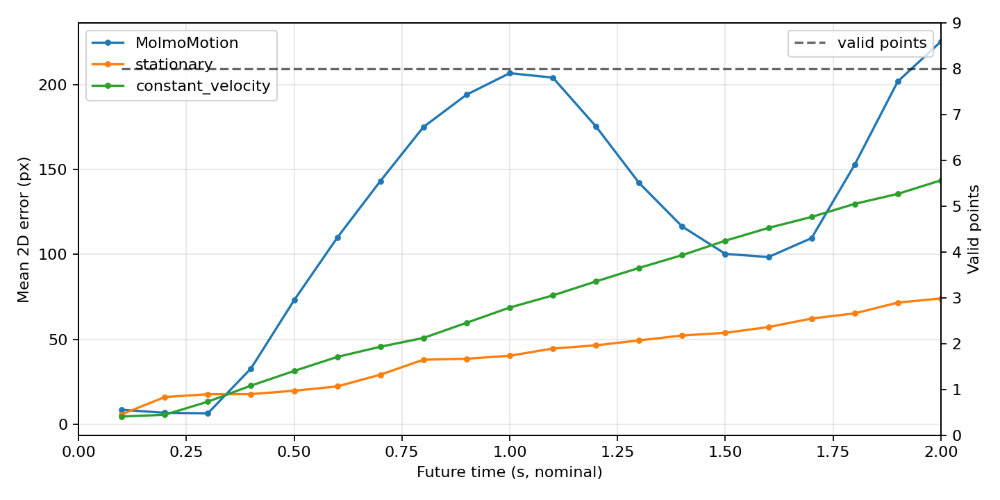

# MolmoMotion на ShareRobot/FMB `episode_5201`: количественная 2D-проверка

> **PRE_CALIBRATION / CONDITIONAL.** Эти ADE/FDE посчитаны при предполагаемой `K_256` и не являются результатом после подтверждённой effective calibration. [Новая проверка K](fmb_effective_k_256_calibration.md) пока не идентифицировала устойчивую калибровку; старые артефакты и числа сохранены.

**Статус: `SUCCESS_WITH_CALIBRATION_UNCERTAINTY` для количественной оценки; вывод на последнем горизонте относительно constant velocity зависит от способа получения 3D-входа.** Здесь измеряется один восстановленный эпизод, камера `side_1`, исходный FMB-файл `1_M_L_3_vertical_n_2.npy`. Все новые результаты лежат в [отдельном каталоге запуска](../runs/sharerobot_fmb_episode_5201/quantitative_2d_sensor_t126/); [предыдущий CAD/depth-отчёт](fmb_cad_metric_depth_experiment.md) и его артефакты сохранены.

**Продолжение:** [тот же расчёт выполнен на другом raw FMB-файле `1_M_L_3_vertical_n_3.npy`](fmb_quantitative_2d_second_trial.md). Там основной прогноз оказывается почти статичным и даёт ADE/FDE 28,26/46,16 px; соответствие второго файла ShareRobot episode ID пока не подтверждено.

## Фиксация эксперимента до прогноза

По [правилу выбора окна](../runs/sharerobot_fmb_episode_5201/quantitative_2d_sensor_t126/window_selection.json) выбран `t0=126`, история FMB 124–126, реальное будущее 127–146: **20 кадров**, номинально **2,0 с** при 10 Гц. На 126→146 TCP перемещается на 90,0 мм, primitive `insert` и состояние захвата не меняются. Следующий кандидат `t0=127` захватил бы смену состояния на шаге 147. Выбор сделан до просмотра прогноза модели; допустимое будущее использовалось только для поиска содержательного окна.

На видимой красной грани зафиксированы восемь внутренних точек. Их RGB-координаты на трёх кадрах хранятся в [history_points_2d.npy](../runs/sharerobot_fmb_episode_5201/quantitative_2d_sensor_t126/history_points_2d.npy). Для каждой из **24/24** точек 5×5 окрестность имеет ≥15 положительных raw depth значений; берётся медиана положительных значений и `depth_scale=0.0001 м/raw`. [Проверка окрестностей](../runs/sharerobot_fmb_episode_5201/quantitative_2d_sensor_t126/history_depth_probe.json) содержит доли valid, медиану, MAD, min/max и 3D-координаты. Полученная [история sensor XYZ](../runs/sharerobot_fmb_episode_5201/quantitative_2d_sensor_t126/history_sensor_3d.npy) имеет форму `3×8×3`, все Z положительны и лежат в диапазоне **0,181–0,2145 м**. [Входные изображения и point ID](../runs/sharerobot_fmb_episode_5201/quantitative_2d_sensor_t126/history_8_points.png) и [визуализация depth](../runs/sharerobot_fmb_episode_5201/quantitative_2d_sensor_t126/history_depth_quality.png) показывают выбранную область.

Основная `K_256` следует из опубликованной `K_640` для `side_1` и гипотезы прямого `cv2.resize(640×480→256×256)` с OpenCV pixel-center convention:

```text
K_nominal = [[152.0836,   0,      124.2908],
             [  0,      202.7781, 129.2973],
             [  0,        0,        1      ]]
```

Это **поддержанная гипотеза**, а не доказанная active `COLOR K`: опубликованные depth и RGB приблизительно совмещены, но точный путь обработки depth 256×256 и дисторсия неизвестны. Формула обратной проекции: `Z=median(depth_raw)×1e-4`, `X=(u-cx)Z/fx`, `Y=(v-cy)Z/fy`. [Параметры K](../runs/sharerobot_fmb_episode_5201/quantitative_2d_sensor_t126/k_nominal.json), [preflight](../runs/sharerobot_fmb_episode_5201/quantitative_2d_sensor_t126/preflight.json) и [контроль заморозки входов](../runs/sharerobot_fmb_episode_5201/quantitative_2d_sensor_t126/input_freeze.json) записаны до inference. Старый `BLOCKED` относился к прежнему окну и прежней геометрии; новый preflight — `PASS_WITH_CALIBRATION_UNCERTAINTY`.

Строка действия, переданная модели: `Insert the red rectangular peg into the matching hole on the blue board.` Это **зафиксированный до запуска пересказ**, а не дословное поле FMB: в FMB primitive — `insert`; в найденных ShareRobot prompts задача описана как `insert the rectangular object into the square slot`. [Точная трассировка формулировок](../runs/sharerobot_fmb_episode_5201/quantitative_2d_sensor_t126/action_traceability.json) различает эти источники.

## Проверки исторической 3D-геометрии

Жёсткая регистрация восьми sensor-точек 124→126 и 125→126 даёт RMS **5,68 и 5,20 мм**; медиана временного стандартного отклонения попарных расстояний **2,23 мм**, наибольший размах пары **15,08 мм**. Это поддерживает локальную пригодность внутренних depth значений, но не доказывает точную идентичность точек на малотекстурной грани. [Матрицы, остатки и все попарные расстояния](../runs/sharerobot_fmb_episode_5201/quantitative_2d_sensor_t126/rigidity_check.json).

Независимый от sensor depth RGB/CAD-контроль использует официальный размер детали **40,32×25,92×150 мм**. По силуэту закруглённой детали и величине движения TCP получены приблизительные позы только из исторических кадров: расхождение с sensor XYZ по 24 точкам — медиана **5,65 мм**, p90 **10,49 мм**, максимум **13,48 мм**, медиана `|ΔZ|` **4,23 мм**. Это содержательная проверка порядка масштаба, но использует приблизительные соответствия на гладкой грани и TCP prior. [Позы и метод](../runs/sharerobot_fmb_episode_5201/quantitative_2d_sensor_t126/cad_pose_fit.json), [поточечное сравнение](../runs/sharerobot_fmb_episode_5201/quantitative_2d_sensor_t126/sensor_vs_cad_silhouette_tcp.json).

Отдельный planar IPPE PnP по RGB-трекам тех же точек даёт медиану расхождения **16,95 мм**, p90 **32,67 мм**, максимум **44,12 мм**, медиану `|ΔZ|` **14,17 мм**. Его поза кадра 124 подразумевает движение около 103 мм и поворот около 48° там, где TCP показывает 19 мм и около 1,5°; это слабый и неоднозначный PnP-контроль, **не вторая надёжная калибровка**. Новая [Monte Carlo проверка на 300 возмущениях разметки σ=2 px для каждого кадра](../runs/sharerobot_fmb_episode_5201/quantitative_2d_sensor_t126/pnp_annotation_noise_sensitivity.json) даёт медианное изменение координат относительно исходной IPPE-ветви **11,05 / 11,57 / 17,70 мм** для шагов 124/125/126; уже исходное IPPE-решение отличается от последующей robust refinement на первых двух кадрах на 22,40/11,36 мм. Это дополнительно ограничивает смысл такого PnP. [Соответствия, обе ветви IPPE, остатки и inliers](../runs/sharerobot_fmb_episode_5201/quantitative_2d_sensor_t126/pnp_correspondences.json), [3D-сравнение](../runs/sharerobot_fmb_episode_5201/quantitative_2d_sensor_t126/sensor_vs_pnp_3d.png). Восемь внутренних точек покрывают только часть грани: [полные CAD-габариты напрямую не проверены](../runs/sharerobot_fmb_episode_5201/quantitative_2d_sensor_t126/cad_dimension_check.json).

## Время, модель и GT

Запущен `allenai/MolmoMotion-4B-H3-F30`, checkpoint revision `3f5e790a511ff2cdf21c8d2a14cb4d8409c94629`, bf16 на RTX 4070, seed 0. [Сведения о запуске](../runs/sharerobot_fmb_episode_5201/quantitative_2d_sensor_t126/model_run.json): **204,07 с**, пик RAM **22,47 GiB**, CUDA allocated **9,585 GiB**. [Сырой ответ](../runs/sharerobot_fmb_episode_5201/quantitative_2d_sensor_t126/raw_model_output.txt) независимо разобран официальным parser: **240/240** видимых конечных точек, tensor `8×30×3` точно совпадает с текстом, все Z положительны, нулевого фиктивного tensor нет. [Parser validation](../runs/sharerobot_fmb_episode_5201/quantitative_2d_sensor_t126/parser_validation.json), [исходный прогноз](../runs/sharerobot_fmb_episode_5201/quantitative_2d_sensor_t126/prediction_15hz.npy).

Принята заданная для этой оценки временная интерпретация: F30 = моменты `j/15 с` до 2,0 с; линейная интерполяция 3D-прогноза к 20 реальным FMB наблюдениям `j/10 с` даёт [prediction_10hz.npy](../runs/sharerobot_fmb_episode_5201/quantitative_2d_sensor_t126/prediction_10hz.npy) формы `8×20×3`. Реальные 15 Гц кадры не создавались. Публичный processor кодирует входные кадры как псевдовремя `0,1,2`, обучающие track timestamps также являются индексами кадров, поэтому **физическая привязка F30 к 2 с — допущение**, особенно при FMB истории 10 Гц вместо обучающей около 15 Гц. [Разбор временной оси](../runs/sharerobot_fmb_episode_5201/quantitative_2d_sensor_t126/temporal_interpretation.json).

Будущие 2D точки создавались из RGB без чтения прогноза: последовательная аффинная ECC-регистрация маски красной детали; все 160/160 точек находятся внутри красного компонента с отступом ≥2 px и score ECC ≥0,95. [GT](../runs/sharerobot_fmb_episode_5201/quantitative_2d_sensor_t126/gt_2d.npy), [общая validity mask](../runs/sharerobot_fmb_episode_5201/quantitative_2d_sensor_t126/validity_mask.npy), [причины](../runs/sharerobot_fmb_episode_5201/quantitative_2d_sensor_t126/reason_mask.npy), [покадровая визуальная проверка](../runs/sharerobot_fmb_episode_5201/quantitative_2d_sensor_t126/gt_all_future_frames.png). **GT coverage = 160/160, FDE имеет 8/8 точек; это отдельная величина от полноты прогноза 240/240.** Прямая повторная регистрация 2 точек × 5 кадров отличается от основного трека в среднем на **0,59 px**, медиана **0,28 px**, p90 **1,59 px**, максимум **2,12 px**. Она независима по пути вычисления, но использует тот же класс масок; не является второй человеческой разметкой. Альтернативный dense flow расходится с ECC медианно на **13,94 px**, что показывает неопределённость физической идентичности на однородной поверхности.

## Результат на общей маске

Ошибка — евклидово расстояние в пикселях после проекции через `K_nominal`. Нормировка — на диагональ изображения `√(256²+256²)=362,039 px`. Координаты вне кадра **не обрезались**: у основного прогноза вне изображения 108/160 точек после проекции.

| Метод | ADE, px | FDE @ 2,0 с, px | ADE / диагональ | FDE / диагональ | valid |
|---|---:|---:|---:|---:|---:|
| MolmoMotion, sensor history | **124,14** | **225,40** | 0,3429 | 0,6226 | 160/160 |
| Stationary | 41,07 | 74,06 | 0,1134 | 0,2046 | 160/160 |
| Constant velocity, 2D история | 72,40 | 143,62 | 0,2000 | 0,3967 | 160/160 |

Ошибка MolmoMotion @0,5/1,0/1,5/2,0 с: **73,00 / 206,76 / 100,31 / 225,40 px**; при каждом сроке доступны все восемь точек. На этом окне прогноз хуже обеих базовых моделей по ADE и FDE. При альтернативном dense-flow GT порядок методов тот же: MolmoMotion **112,48/215,91 px**, stationary **27,41/64,71 px**, constant velocity **82,81/150,35 px** (ADE/FDE). [Полные метрики](../runs/sharerobot_fmb_episode_5201/quantitative_2d_sensor_t126/metrics.json), [ошибка по времени](../runs/sharerobot_fmb_episode_5201/quantitative_2d_sensor_t126/error_by_time.csv), [повторная разметка](../runs/sharerobot_fmb_episode_5201/quantitative_2d_sensor_t126/annotation_repeatability.json).



[Наложение траекторий](../runs/sharerobot_fmb_episode_5201/quantitative_2d_sensor_t126/future_trajectory_overlay.png) · [четыре действительных будущих кадра](../runs/sharerobot_fmb_episode_5201/quantitative_2d_sensor_t126/future_frames_predictions_gt.png) · [покрытие](../runs/sharerobot_fmb_episode_5201/quantitative_2d_sensor_t126/coverage.png) · [ShareRobot→FMB mapping](../runs/sharerobot_fmb_episode_5201/quantitative_2d_sensor_t126/share_to_fmb_mapping.png)

## Неопределённость K и способа подготовки 3D

Для всех трёх K выполнен полный inference с фиксированными `t0`, точками, depth, действием, моделью и GT. `K_simple` отличается только правилом principal point; `K_focal_0925` получен ранее с использованием sensor depth и служит **диагностикой**, а не независимой калибровкой.

| Вариант | Медианное изменение входного XYZ | ADE, px | FDE, px | coverage |
|---|---:|---:|---:|---:|
| `K_nominal`, основной | 0 мм | 124,14 | 225,40 | 100% |
| `K_simple` | 0,44 мм | 117,61 | 195,76 | 100% |
| `K_focal_0925` | 9,89 мм | 117,24 | 202,96 | 100% |

[Полная таблица](../runs/sharerobot_fmb_episode_5201/quantitative_2d_sensor_t126/calibration_sensitivity.csv), [график](../runs/sharerobot_fmb_episode_5201/quantitative_2d_sensor_t126/calibration_sensitivity.png). Для `K_simple` процессор меняет всего **1 из 72** квантованных в миллиметрах компонент истории и сдвигает непрерывный anchor на **0,42 мм**, но итоговые прогнозы расходятся в среднем на **21,78 мм** в 3D, на последнем шаге на **40,08 мм**. [Разбор квантизации](../runs/sharerobot_fmb_episode_5201/quantitative_2d_sensor_t126/prompt_quantization_sensitivity.json). Повтор основного запуска с теми же входами дал **идентичный raw text SHA-256 и массив**, что исключает наблюдаемую случайность этого сравнения. [Контроль повторяемости](../runs/sharerobot_fmb_episode_5201/quantitative_2d_sensor_t126/nominal_repeatability.json). Основной K не выбран по качеству на будущем.

Слабый planar PnP как вход MolmoMotion меняет прогноз относительно sensor варианта на **86,37 мм** в среднем по 3D и **151,38 мм** на горизонте; в проекции — **85,45 и 158,72 px** соответственно. Этот PnP ввод физически противоречит TCP-движению, поэтому его меньшая ошибка относительно GT (`41,75/71,99 px`) **не доказывает правильность калибровки** и не используется для выбора основного результата. [Сравнение прогнозов PnP](../runs/sharerobot_fmb_episode_5201/quantitative_2d_sensor_t126/geometry_prediction_comparison.json).

Более правдоподобный, но также приблизительный RGB/CAD-силуэт с TCP prior расходится с sensor историей медианно всего на **5,65 мм**, а прогнозы расходятся в среднем на **124,52 мм в 3D** и **75,94 px в 2D**. При таком входе MolmoMotion получает диагностические ADE/FDE **98,34/135,12 px**: ADE остаётся выше обеих baseline, FDE — выше stationary, но на **8,50 px ниже** constant velocity. Таким образом, точный порядок **FDE относительно constant velocity** не устойчив к смене правдоподобного метода подготовки 3D. Использовать меньшую GT-ошибку для выбора CAD-входа или K было бы leakage. [Сравнение CAD-силуэта](../runs/sharerobot_fmb_episode_5201/quantitative_2d_sensor_t126/cad_silhouette_prediction_comparison.json), [график расхождения по горизонту](../runs/sharerobot_fmb_episode_5201/quantitative_2d_sensor_t126/cad_silhouette_prediction_disagreement.png).

## Вывод и ограничения

Это законченная **условная 2D-оценка одного эпизода**: полный 2-секундный прогноз, полная 2D-разметка, общая маска, обе baseline и sensitivity по K получены. На зафиксированном sensor-depth входе MolmoMotion имеет ADE/FDE **124,14/225,40 px** против **41,07/74,06 px** у stationary и **72,40/143,62 px** у constant velocity. Более высокая ADE сохраняется для двух заранее заданных K-вариантов, альтернативного 2D-трекинга и CAD-силуэтного 3D-входа. Для FDE сравнение с constant velocity зависит от 3D-входа. Общие утверждения о качестве модели на ShareRobot/FMB из одного эпизода не следуют.

Неопределённость остаётся в active color intrinsics/distortion, скрытой подготовке опубликованного depth, псевдовремени процессора и идентичности физических точек на почти безтекстурной грани. ECC фиксирует видимые координаты на объекте, но не может доказать, что каждый маркер во всех кадрах соответствует одной микроскопической точке поверхности; расхождение с dense flow достигает десятков пикселей. Результат следует читать как **image-derived 2D proxy GT**. Sensor/CAD согласование локально хорошее, а отдельный PnP нестабилен. [Финальный контроль форм, времени, хэшей и отсутствия leakage](../runs/sharerobot_fmb_episode_5201/quantitative_2d_sensor_t126/leakage_and_artifact_audit.json) должен иметь статус `PASS`.

Воспроизведение из локального checkpoint и исходного FMB: [подготовка входа](../scripts/prepare_fmb_quantitative_2d.py), [аннотация GT](../scripts/annotate_fmb_future_2d.py), [модель](../scripts/run_fmb_quantitative_2d.py), [оценка](../scripts/evaluate_fmb_quantitative_2d.py), [parser](../scripts/verify_fmb_quantitative_2d.py), [проверка артефактов](../scripts/audit_fmb_quantitative_2d.py). Код дополнительного CAD-сравнения: [compare_fmb_geometry_forecasts.py](../scripts/compare_fmb_geometry_forecasts.py).
