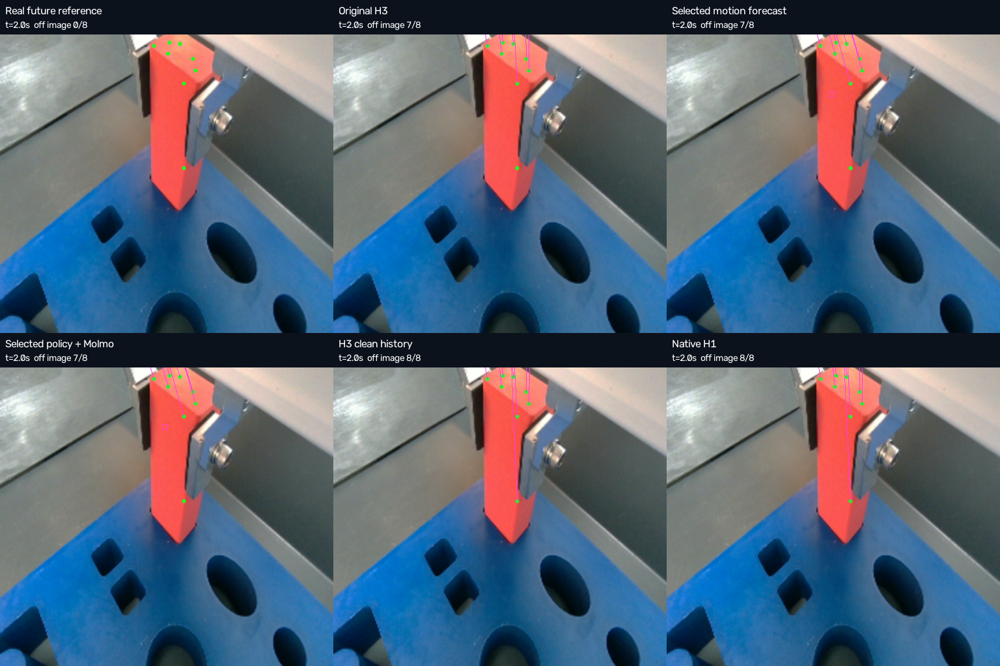
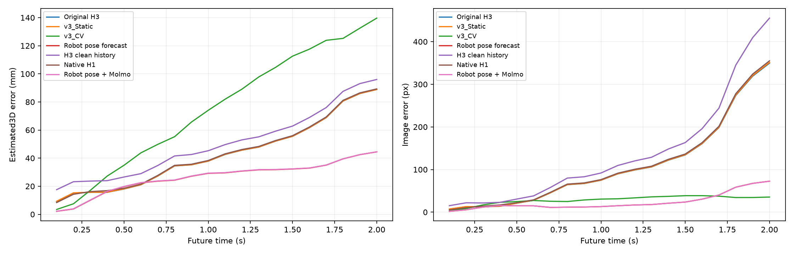
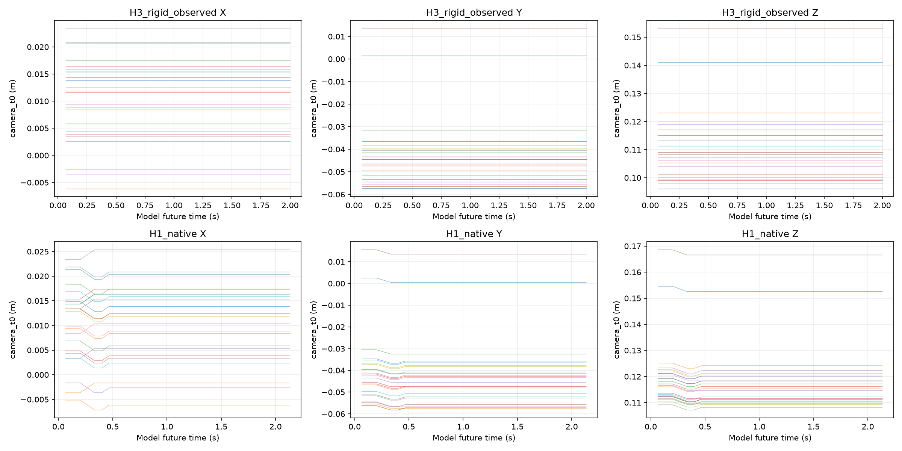
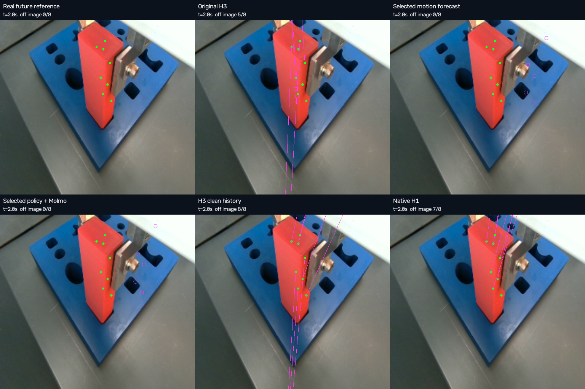
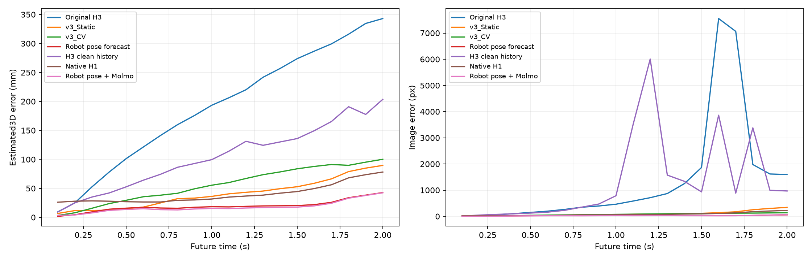
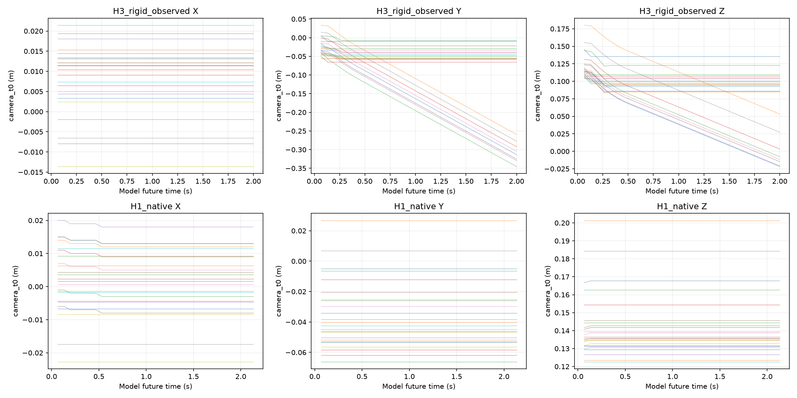

# FMB wrist: проверка способов улучшить прогноз

Исходный [полный отчёт v3](fmb_wrist_v3.md) прочитан и проверен. У исходной MolmoMotion нет убедительного выигрыша у Static на wrist_2, а wrist_1 даёт сильное расхождение групп. Здесь отдельно проверены изменения нейронного выхода и прогноз движения с использованием доступных прошлых TCP-поз робота. Геометрия, reference, ID точек и маски оценки v3 сохранены.

Расчёт завершён.

Итоговый прогноз с использованием прошлых TCP-поз улучшен на обоих ракурсах на прежнем estimated reference. Выигрыш самой нейронной модели оценивается отдельно ниже. Primary 2D ошибки относятся к изображению; 3D_est ошибки зависят от неподтверждённой физической геометрии.

[Новые видео](../runs/fmb_wrist_v4_improvement/index.html) · [Аудит](../runs/fmb_wrist_v4_improvement/completion_audit.json) · [Команды воспроизведения](../runs/fmb_wrist_v4_improvement/REPRODUCE.md)

## Чем v4 отличается от предыдущего v3

В v3 итоговый прогноз строила MolmoMotion по RGB, истории XYZ и тексту действия. Прошлые TCP-позы робота уже участвовали в приведении координат к camera_t0, но отдельного прогноза движения TCP не было. В v4 добавлен forecaster по прошлым TCP-позам: он прогнозирует перенос и поворот робота, затем переносит вместе с ним жёсткий шаблон детали. Это новый источник информации для прогноза и допущение о сохраняющемся захвате. Веса MolmoMotion не менялись и дообучение не выполнялось.

| Компонент | v3 | v4 с улучшениями |
|---|---|---|
| Основной прогноз | Native H3; сравнение со Static и скоростью точек по короткой истории | Дополнительно прогноз TCP и движения захваченной детали; robot-only и hybrid показаны отдельно |
| Движение робота | Past TCP для геометрии; future TCP только для reference и проекции при оценке | Past TCP также служит входом forecaster; future TCP по-прежнему доступен только оценке |
| История для H3 | XYZ каждой точки восстановлены и сглажены отдельно по наблюдениям | В отдельной проверке один sensor-шаблон на t0 преобразован через past TCP во все три history frames, сохраняя форму |
| Нейронный контроль | H3-F30 в прежних геометрических ветках | Новые H3 с жёсткой историей и официальный H1-F32 на том же t0; по три P8 calls на вариант и ракурс |
| Выбор параметров | Геометрия и точки выбраны по observed данным | Дополнительно 50 вариантов двух моделей движения ранжированы по observed pseudo-futures; победили последние три TCP-позы и damping tau=0,8 s |
| Поправка MolmoMotion | Полный нейронный выход оценивается непосредственно | В hybrid общий median displacement ограничен observed p90 drift: 2,41/3,23 мм; форма детали сохраняется |
| Геометрия и reference | Official K, sensor depth, fixed hand-eye X и независимый AllTracker reference | Те же K, X, 24 ID, порядок групп, future reference и masks; изменение оценки не объясняет выигрыш |
| Визуальная оценка | Встроенный просмотр, включая первую blinded проверку | Встроенный просмотр новых изображений; повтор уже знакомого эпизода, без заявления о новом слепом тесте |

Для robot forecaster используется измеренный шаблон t0, а прежний H3 сохраняет исходный сглаженный вход. Это небольшое изменение входной геометрии явно входит в новый вариант; замороженный reference остаётся прежним.

| Ракурс | ADE3D_est: прежний H3 → TCP forecast, мм | ADE2D: прежний H3 → TCP forecast, px |
|---|---:|---:|
| wrist_2 | 42.74 → 26.33 | 109.93 → 23.78 |
| wrist_1 | 193.20 → 19.65 | 1355.61 → 26.71 |

Основной выигрыш обоих ракурсов получен за счёт прогнозирования роботного движения. Очистка H3 помогает только wrist_1 и ухудшает wrist_2. H1 на wrist_1 убирает крупные выбросы, но по 3D_est остаётся близок к Static; на wrist_2 выигрыша нет. Ограниченная neural correction улучшает robot-only ADE3D_est на 1,89 мм для wrist_1 и ухудшает на 0,11 мм для wrist_2. Поэтому общего улучшения самой MolmoMotion на обоих ракурсах не установлено. Через две секунды заметный промах остаётся даже у TCP forecast.

## Что проверено в авторских источниках

На официальном Hub найдены два опубликованных MolmoMotion checkpoint: H3-F30 и H1-F32. Новый checkpoint с исправлением этой демонстрации не найден. H3 рассчитан на три наблюдения и будущее до двух секунд при15Hz; H1 использует одно наблюдение. [Hugging Face](https://huggingface.co/allenai/MolmoMotion-4B-H3-F30), [H1](https://huggingface.co/allenai/MolmoMotion-4B-H1-F32), [сохранённый официальный список](../runs/fmb_wrist_v4_improvement/sources/hf_model_inventory.json).

Целочисленные временные метки processor0/1/2 совпадают с обучающим loader; заменять их реальными долями секунды было бы изменением формата. Физическое время выхода15Hz по-прежнему интерполируется к FMB10Hz. В загруженном released checkpoint внутренний класс Molmo2 не включает опциональную ветку point-feature injection. Поэтому некорректная нормализация pixel metadata в этой необязательной ветке не объясняет текущий результат. [Processor](https://github.com/allenai/molmo-motion/blob/61f5b21b694ad8f854ec7ecd2400005acc73f685/src/molmo_motion/processor.py), [обучающий loader](https://github.com/allenai/molmo-motion/blob/61f5b21b694ad8f854ec7ecd2400005acc73f685/src/molmo_motion/data/trajectory_3d_dataset.py).

В опубликованной training recipe используются пять human-video источников; DROID и MolmoSpaces исключены из стандартной смеси. Перенос на robot insertion нельзя считать проверенным обучением на FMB. Проверялся deterministic best-of-1; выбор лучшего stochastic sample по уже известному future был бы oracle-оценкой. [Авторская training/evaluation recipe](https://github.com/allenai/molmo-motion/blob/61f5b21b694ad8f854ec7ecd2400005acc73f685/README.md).

[Pinned primary-source receipts](../runs/fmb_wrist_v4_improvement/sources/source_receipts.json)

## Диагностика по наблюдаемым кадрам

За последние десять observed кадров target почти неподвижен относительно wrist-camera: median/p90 local3D drift wrist_2=0.73/2.41mm, wrist_1=0.55/3.23mm; median image drift0.15/0.22px. Это поддерживает условную гипотезу жёсткого захвата в данном префиксе. H3 всё же содержит ненулевое движение в общей camera_t0: quantized stationary fraction0% на обоих ракурсах. Почти статичный нейронный выход нельзя объяснить обнулением всех входных скоростей.

[Observed diagnosis](../runs/fmb_wrist_v4_improvement/observed_diagnosis.json)

## Замороженные проверки

| Вариант | Изменение | Будущие данные в прогнозе |
|---|---|---|
| H3 rigid observed | Один t0 sensor template для всех history frames, преобразованный через observed TCP и прежний X; RGB и action прежние | Нет |
| Native H1 | Официальный H1-F32, прежние t0 RGB/XYZ и action | Нет |
| Robot pose forecast | Экстраполяция прошлой TCP translation/rotation, объект жёстко связан с камерой | Нет |
| Robot + bounded Molmo | Та же роботная траектория и общая median neural displacement correction, ограниченная observed p90 local drift | Нет |

На каждой камере сохранены те же24 ID и порядок трёх групп по8. H3 даёт24×30×3, H1 —24×32×3; оцениваются общие0.1…2.0s. Новые native calls используют BF16, greedy и seed0. Поправка гибрида общая для всех точек и сохраняет жёсткую форму; её максимальный радиус2.41mm/3.23mm задан прошлым, а не future.

[Первичная preregistration](../runs/fmb_wrist_v4_improvement/preregistration.json)

## Как выбрана роботная траектория

Проверены окна3/5/8/12/20 observed frames и damping tau0.15/0.4/0.8/1.6s либо без damping. Валидация использует только11 перекрывающихся pseudo-future от source96…106 до максимум126. Первая selection минимизировала ошибку TCP pose. После просмотра промежуточного результата дополнительно сопоставлены full TCP pose и более простое перемещение центра объекта; все параметры повторно ранжированы только по observed target tracks.

Итоговый observed выбор сохранил прежнюю политику: **full_TCP_pose, window=3, tau=0.8s**, observed target ADE=41.30mm. Не принят вариант с минимальным future ADE. Первая centroid-comparison была неполной из-за NaN в невалидных исторических точках; исходная запись сохранена, исправленный selector требует реальные валидные samples для каждого кандидата.

[Observed TCP selection](../runs/fmb_wrist_v4_improvement/robot_observed_model_selection.json) · [Исправленная target-motion selection](../runs/fmb_wrist_v4_improvement/motion_policy_amendment_v2.json)

Этот follow-up выполнен после знакомства с v3 future и первым промежуточным сравнением. Это исследовательская итерация на ранее изученном эпизоде; fixed X также оценён по исходному observed префиксу. Overlapping pseudo-futures не являются независимыми тестовыми эпизодами.

## wrist_2

| Метод | ADE/FDE3D_est mm | ADE/FDE2D px | Вне изображения |
|---|---:|---:|---:|
| v3_Molmo_H3 | 42.74/88.83 | 109.93/349.54 | 61.3% |
| v3_Static | 42.84/88.89 | 110.50/351.29 | 61.3% |
| v3_CV | 74.94/139.67 | 28.49/35.39 | 0.0% |
| Robot_attached_observed_selected | 26.33/44.46 | 23.78/72.64 | 13.5% |
| H3_rigid_observed | 50.28/95.99 | 139.13/455.27 | 65.6% |
| H1_native | 43.12/89.28 | 111.83/355.04 | 62.1% |
| Robot_plus_bounded_Molmo | 26.44/44.49 | 23.80/72.50 | 13.3% |

Robot-only ADE уменьшился на38.4% относительно исходной MolmoMotion и на38.5% относительно Static. Это выигрыш роботной motion-модели; нельзя приписывать его обученной MolmoMotion.

Маски неизменны: 449/480 3D samples и480/480 2D samples. Off-image прогнозы остаются в numerical errors. Future camera poses используются только для проекции и reference.

Native H3 cleanup: хуже исходного H3; native H1: хуже исходного H3. Bounded Molmo correction ухудшает robot-only ADE на0.11mm. Это отдельная ablation; метод не выбирается по этому future сравнению.

[Метрики](../runs/fmb_wrist_v4_improvement/wrist_2/metrics.json) · [Видео](../runs/fmb_wrist_v4_improvement/wrist_2/viz/forecast_comparison.mp4)

При семи прежних observed bootstrap X robot-only ADE3D_est лежит в диапазоне 20.09–26.90 мм и ниже исходной MolmoMotion в 7/7 вариантах, ниже Static в 7/7 и ниже CV в 7/7. Меняется только reference; прогноз остаётся при исходном X. Это описательная проверка чувствительности, а не доверительный интервал либо полная совместная неопределённость.

[Reference sensitivity](../runs/fmb_wrist_v4_improvement/wrist_2/calibration_ranking_sensitivity.json)

## wrist_1

| Метод | ADE/FDE3D_est mm | ADE/FDE2D px | Вне изображения |
|---|---:|---:|---:|
| v3_Molmo_H3 | 193.20/343.00 | 1355.61/1597.53 | 57.1% |
| v3_Static | 40.95/89.66 | 102.66/342.15 | 45.4% |
| v3_CV | 56.72/100.18 | 76.26/137.05 | 2.7% |
| Robot_attached_observed_selected | 19.65/42.76 | 26.71/58.50 | 0.4% |
| H3_rigid_observed | 105.82/203.63 | 1290.69/969.15 | 78.8% |
| H1_native | 40.40/78.20 | 81.08/225.04 | 41.2% |
| Robot_plus_bounded_Molmo | 17.76/42.36 | 23.47/61.37 | 1.2% |

Robot-only ADE уменьшился на89.8% относительно исходной MolmoMotion и на52.0% относительно Static. Это выигрыш роботной motion-модели; нельзя приписывать его обученной MolmoMotion.

Маски неизменны: 420/480 3D samples и480/480 2D samples. Off-image прогнозы остаются в numerical errors. Future camera poses используются только для проекции и reference.

Native H3 cleanup: лучше исходного H3; native H1: лучше исходного H3. Bounded Molmo correction улучшает robot-only ADE на1.89mm. Это отдельная ablation; метод не выбирается по этому future сравнению.

[Метрики](../runs/fmb_wrist_v4_improvement/wrist_1/metrics.json) · [Видео](../runs/fmb_wrist_v4_improvement/wrist_1/viz/forecast_comparison.mp4)

При семи прежних observed bootstrap X robot-only ADE3D_est лежит в диапазоне 16.27–21.77 мм и ниже исходной MolmoMotion в 7/7 вариантах, ниже Static в 7/7 и ниже CV в 7/7. Меняется только reference; прогноз остаётся при исходном X. Это описательная проверка чувствительности, а не доверительный интервал либо полная совместная неопределённость.

[Reference sensitivity](../runs/fmb_wrist_v4_improvement/wrist_1/calibration_ranking_sensitivity.json)

## Встроенная визуальная оценка

Изображения оцениваются встроенным просмотром ассистента. Первое промежуточное сравнение показывает меньшие numerical errors у robot forecast, но существенный endpoint drift остаётся: на wrist_2 через2s семь из восьми отображаемых прогнозных точек всё ещё вне кадра; на wrist_1 прогноз остаётся в кадре, но смещён на gripper/board вправо. Поэтому уменьшение ADE не означает точного попадания на объект во всём будущем.

Встроенным просмотром проверены промежуточные и итоговые изображения. Прогноз по прошлым TCP-позам и bounded hybrid заметно ближе в средней части горизонта, но через2s остаётся большой drift: wrist_2 выходит за верхнюю границу, wrist_1 смещается вправо на захват/доску. H1 на wrist_1 устраняет крупные нейронные выбросы и приближается к Static, оставаясь в основном статичным; на wrist_2 выигрыша нет. H3 cleanup не даёт устойчивого улучшения обоих ракурсов. Численный выигрыш не подтверждает точность физической геометрии, материальные соответствия всех24 точек или обобщение на новые эпизоды.

[Оценка и image hashes](../runs/fmb_wrist_v4_improvement/builtin_visual_review.json)

## Воспроизведение и границы результата

Reference наследует прежнюю неопределённость X/K/depth scale. На двух ракурсах используется один и тот же robot TCP stream; они не являются двумя независимыми роботными демонстрациями. Роботный forecaster требует доступных past TCP и сохраняющегося захвата; для произвольного RGB video без робота это не универсальная замена MolmoMotion.

Исходные v3 файлы и отчёт сохраняются по полному SHA256 manifest. Новые результаты находятся в отдельном run. Инициализация дважды остановилась до новых генераций из-за проверок optional config и resume XYZ; ошибки исправлены. Один частичный H3 вызов сохранён при явной остановке только нашего процесса; все завершённые группы переиспользуются после parser/hash проверки. Первый успешный вызов занял692s, следующие119/115s ещё до изменения CPU threads, поэтому ускорение нельзя уверенно приписать только thread setting.

[Preserved v3](../runs/fmb_wrist_v4_improvement/preserved_v3.json) · [Прерванная попытка](../runs/fmb_wrist_v4_improvement/runtime_interruption_00/receipt.json) · [Тесты геометрии](../runs/fmb_wrist_v4_improvement/coordinate_tests.json) · [Воспроизведение](../runs/fmb_wrist_v4_improvement/REPRODUCE.md)

