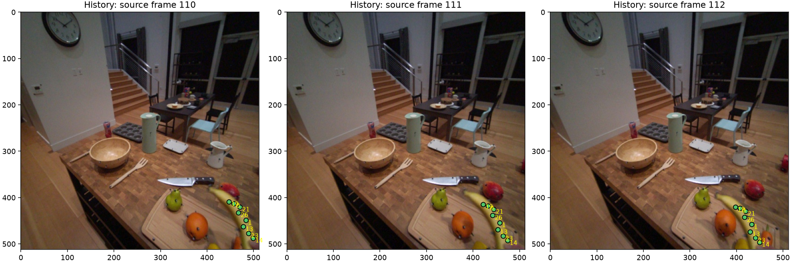
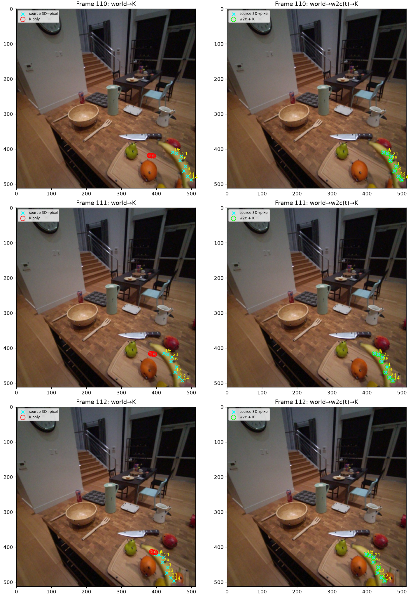
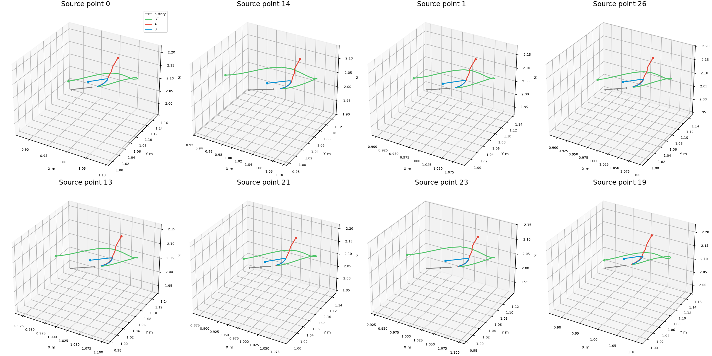
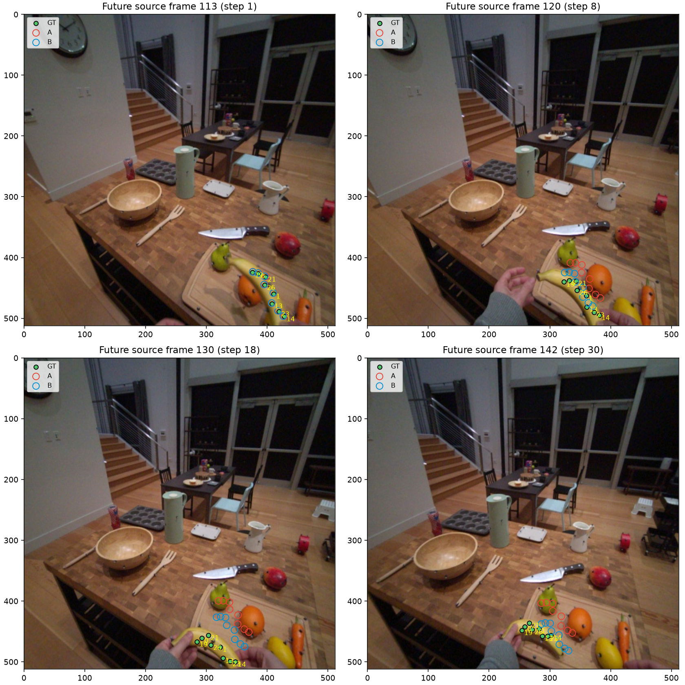
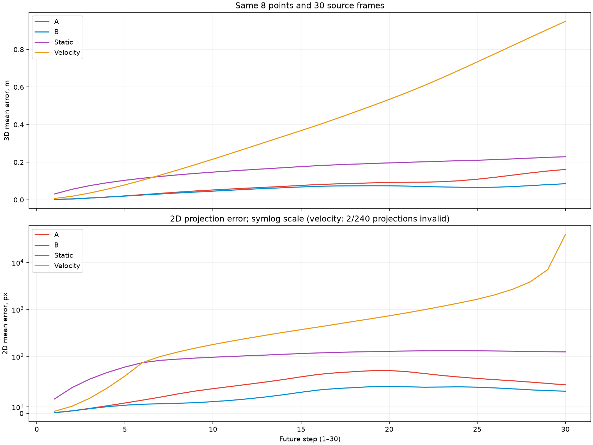

# Второй эпизод: контроль системы координат камеры t₀

**Статус: PASS для согласованности опубликованных данных и полного F=30 прогноза на одном эпизоде.** Оба варианта дали 240 конечных 3D-положений. В этом эпизоде общий 3D-трек нельзя проецировать прямо через K: нужна поза камеры соответствующего кадра. Для входа общего API одна поза в момент t₀ переводит всю историю в одну систему камеры. Это меняет фактические 3D-токены запроса. На выбранном эпизоде вариант B точнее A; это результат двух контролируемых запусков, а не доказательство общей закономерности.

Почти нулевая численная ошибка корректной проекции **не является независимой оценкой физической точности глубины**: общий 3D-трек здесь вычисляется из опубликованных камерных 3D-точек теми же позами. Проверка на реальных JPEG подтверждает визуальное расположение точек на банане; отдельного покадрового 2D-трека, независимого от 3D, источник не содержит. Данные DAVIS `bmx-trees` и его прежний прогноз не изменены.

## Выбор данных и источник

Сначала проверен авторский пример `examples/data/egodex_clean_surface`: его [meta.json](../examples/data/egodex_clean_surface/meta.json) указывает историю **8–10**, t₀=10, а в каталоге нет ни поз, ни продолжения. [EgoDex-пакет MolmoMotion-1M](https://huggingface.co/datasets/allenai/molmo-motion-1m/blob/c3dec07d796ddeccdc8f5a35bf4920b3ee044feb/egodex/README.md) публикует согласованные ViPE-позы и треки, но для адресного извлечения одного примера здесь пришлось бы читать `camera-0000.tar` (2,83 ГБ) и искать пару треков в одном из трёх несортированных `tracks-0000..0002.tar` (примерно по 10,8 ГБ). Исходное видео лежит в архиве Apple `part1.zip` (321,59 ГБ; сервер допускает byte range, но треки остаются проблемой). Полный набор EgoDex не загружался; авторский `.pt` этого примера по этой причине не переинтерпретирован.

В качестве единственного резервного эпизода выбран **авторский PointMotionBench/WorldTrack** `adt_mini/Apartment_release_clean_seq131_0_clip02_obj1_t108-149`: он включён в [индекс PointMotionBench](https://huggingface.co/datasets/allenai/PointMotionBench/blob/564ffa2e3cdb0ba443db8590b40e9691f487436c/worldtrack/worldtrack_index_map.json), а единый исходный файл WorldTrack содержит JPEG, 3D, видимость, K и позы. [Авторский скрипт восстановления](https://huggingface.co/datasets/allenai/PointMotionBench/blob/564ffa2e3cdb0ba443db8590b40e9691f487436c/worldtrack/reconstruct_worldtrack.py) использует именно этот файл и индексы. Выбор сделан по наличию данных и 30 кадров будущего, до измерения ошибок модели. Загружены только файл 33,82 МБ и индекс 68,12 МБ; полный WorldTrack не загружался.

Этот фрагмент входит в **оценочный PointMotionBench**. [Описание авторского обучения](https://github.com/allenai/molmo-motion/blob/61f5b21b694ad8f854ec7ecd2400005acc73f685/README.md) отделяет PointMotionBench от обучающей смеси. Это один специально выбранный разбор, **не официальный агрегатный балл бенчмарка** и не самостоятельное доказательство обобщения базовой модели.

## Кадры, точки и временной протокол

Исходный фрагмент начинается с **кадра 108** полной последовательности, охватывает кадры 108–149 без пропусков; индексы нулевые. Для эксперимента взяты исторические кадры **110, 111, 112** и будущее **113–142**. По авторской подписи и [карточке бенчмарка](https://huggingface.co/datasets/allenai/PointMotionBench/blob/564ffa2e3cdb0ba443db8590b40e9691f487436c/README.md) частота **30 fps**: шаг = 1/30 с, F=30 = 1 с. t₀ — полный кадр 112; целевой FDE — строго кадр 142. Промпт процессора нумерует три входа 0,1,2 и будущее 3..32; это индексы кадров в запросе, а не физические секунды.

Авторская инструкция без изменения: “switch the banana to the left hand and put it down on the cutting board”. Из точек `clip_objects=[1]` выбраны исходные ID **[0, 14, 1, 26, 13, 21, 23, 19]**: сначала требовалась видимость на всех трёх исторических кадрах, затем детерминированно выбирались пространственно разнесённые точки по пикселям t₀. Будущие координаты для выбора не использовались. Во всех 30 будущих кадрах 8/8 выбранных точек видимы: маска эталона содержит 240/240 пар. В тексте модели те же точки имеют номера 1–8 в указанном порядке.

Изображения 512×512 взяты как исходные JPEG-байты из `images_jpeg_bytes[110..142]`; сохранённые файлы совпадают с этими элементами **байт в байт**. Их содержание и ID проверены на исторических кадрах и кадрах продолжения. Поворота или обрезки при извлечении нет. Входные изображения в процессоре A/B совпадают как тензоры; процессор уменьшает целый квадратный кадр для визуального входа. Источник не публикует коэффициенты дисторсии для этого NPZ, поэтому применяется его pinhole K без дополнительной коррекции. Таблица всех 33 соответствий файл → исходная строка RGB/3D/позы → время: [frame_mapping.csv](../runs/second_episode_geometry/frame_mapping.csv).



Фактически сохранённые 378×378 пикселей процессора для тех же трёх кадров: [processor_images.png](../runs/second_episode_geometry/processor_images.png). Все кадры целые, с сохранённой ориентацией; тензор A/B одинаков байт в байт.

## Соглашения координат и проверка камеры

[Формат TAPVid-3D](https://github.com/google-deepmind/tapnet/blob/main/tapnet/tapvid3d/README.md) определяет `tracks_XYZ` в **метрах в камере каждого кадра**, а `extrinsics_w2c` как world-to-camera. Файл этого эпизода имеет `tracks_XYZ (300,825,3)`, `visibility (300,825)`, `extrinsics_w2c (300,4,4)`, `fx_fy_cx_cy=(280,280,256,256)` и `images_jpeg_bytes (300,)`. Авторское восстановление строит общие мировые точки так:

```text
X_camera(t) = R_w2c(t) X_world(t) + t_w2c(t)
X_world(t)  = R_w2c(t)^T [X_camera(t) - t_w2c(t)]
X_B(t)      = T_w2c(112) X_world(t),  t = 110,111,112
```

Камера использует +X вправо, +Y вниз, +Z вперёд, что проверено pinhole-проекцией `u=fx X/Z+cx`, `v=fy Y/Z+cy` на исходные изображения. В файле опубликована **одна постоянная K** для изображений 512×512 и покадровая поза по исходному индексу. Все выбранные исторические точки конечны и имеют положительную глубину. Полная матрица `T_w2c(112)` и обратная `c2w` сохранены в [preflight.json](../runs/second_episode_geometry/preflight.json); её перенос `[2.425861, 1.415707, 0.444597]` м и матрица вращения применены ко всей истории **один раз**. Это перенос в произвольной мировой системе WorldTrack, не перемещение камеры между кадрами 110 и 112.

В исходном WorldTrack готового `.pt` для этого эпизода нет: есть покадровые камерные `tracks_XYZ`, а авторский восстановитель создаёт `tracks_world`. Наш вариант A использует именно подтверждённую общую систему; B — систему камеры кадра 112. **Камерные `tracks_XYZ` разных кадров не складывались в единую 3D-историю.** При подготовке B процессору передана общая история и `c2w_at_t0`; отдельная проверка заранее вычисленного B без `c2w_at_t0` дала полностью одинаковые поля процессора на CPU.

Это отдельный контролируемый опыт: текущий [`Trajectory3DDataset._load_worldtrack_bench_3d`](../src/molmo_motion/data/trajectory_3d_dataset.py#L899) читает покадровые `tracks_XYZ` для стандартной выборки бенчмарка. Наши A/B построены из `tracks_world`, которое создаёт опубликованный скрипт восстановления, поэтому результаты нельзя выдавать за точное воспроизведение стандартного загрузчика бенчмарка.

| Кадр | K без смены системы: средняя / медиана / RMSE / максимум, px | Покадровая `w2c + K`: средняя / медиана / RMSE / максимум, px | Валидно | NaN/Inf / Z≤0 |
|---:|---:|---:|---:|---:|
| 110 | 95,194 / 94,635 / 96,901 / 126,568 | <10⁻¹² / <10⁻¹² / <10⁻¹² / <10⁻¹² | 8/8 | 0 / 0 |
| 111 | 71,127 / 69,027 / 74,614 / 108,875 | <10⁻¹² / <10⁻¹² / <10⁻¹² / <10⁻¹² | 8/8 | 0 / 0 |
| 112 | 52,665 / 49,727 / 59,503 / 96,453 | <10⁻¹² / <10⁻¹² / <10⁻¹² / <10⁻¹² | 8/8 | 0 / 0 |

Ошибки по каждому ID находятся в [projection_history.json](../runs/second_episode_geometry/projection_history.json). Сравнение опирается на опубликованные позы того же NPZ, **PnP не применялся**. Нулевая ошибка следует из того, что общий 3D получен из камерного 3D и поз тем же обратимым преобразованием; она показывает правильность индексов, матриц и реализации, но не даёт независимой оценки точности глубины относительно физической сцены. `queries_xyt` для восьми ID совпали со своей проекцией на их исходных query-кадрах с ошибкой <10⁻¹² px; эти 2D-запросы также происходят из исходной 3D-разметки. Дополнительная визуальная проверка реальных изображений показывает точки на банане.



## Что реально изменилось во входе

Оба запроса используют одинаковые JPEG, выбранные физические точки и их порядок, инструкцию, F=30, checkpoint, bf16 и параметры генерации. `points_2d_at_t0` вычислены из опубликованного камерного `tracks_XYZ[112]` и K; они одинаковы для A/B. У этого checkpoint `model_name: video_olmo`, поэтому 2D-координаты находятся в metadata, но не образуют активный блок point-feature токенов. Видимые модели поля, меняющиеся для прогноза, — токены текста истории, а при восстановлении абсолютного XYZ — anchor.

| Проверка входа | Результат |
|---|---:|
| Визуальные тензоры A/B | точное совпадение |
| Длина `input_ids` | A: 588, B: 589 |
| Число изменённых токенов после выравнивания | 273 |
| Максимальная разница исторических дельт A/B | 0,159251 м |
| Максимальная ошибка миллиметрового квантования | A: 0,000493 м; B: 0,000494 м |
| B через `c2w_at_t0` и явно преобразованную историю | точное совпадение всех полей процессора |

Одинаковый перенос всех точек сокращается после вычитания одной опорной точки, а поворот исходной системы меняет дельты. Поэтому отличие в anchor само по себе не служило критерием; сравнивались [декодированные запросы A](../runs/second_episode_geometry/prompt_A.txt), [B](../runs/second_episode_geometry/prompt_B.txt) и сериализованные [поля процессора](../runs/second_episode_geometry/preflight.json). Поскольку токены различались, выполнены **два настоящих** запуска, по одному на вариант.

## Прогноз и метрики

Каждый сырой ответ разобран независимым строгим декодером: ровно 30 строк с временами 3..32, в каждой ID 1..8 ровно один раз и три целых координаты. Нулевое заполнение штатного парсера не использовалось. Сохранены [сырой A](../runs/second_episode_geometry/model_output_A_raw.txt), [сырой B](../runs/second_episode_geometry/model_output_B_raw.txt), [координаты A](../runs/second_episode_geometry/prediction_A.npz), [B](../runs/second_episode_geometry/prediction_B.npz). B возвращён в общую систему обратной позой t₀; никаких дополнительных подгонок к эталону нет.

Статика равна последнему историческому положению. Постоянная скорость получена по кадрам 111→112 с Δt=1/30 с и продолжена до кадров 113..142. Все методы используют восемь одинаковых точек и фиксированный конечный кадр 142. ADE — среднее по видимым парам, FDE — среднее восьми ошибок на кадре 142. 2D-эталон построен из опубликованного камерного GT и K; предсказания проецируются через опубликованную позу **каждого будущего кадра**. Координаты с положительной глубиной за пределами изображения сохраняются как ошибки, а не отбрасываются.

| Метод | 3D ADE, м ↓ | 3D FDE, м ↓ | 2D ADE, px ↓ | 2D FDE, px ↓ | 3D / 2D покрытие |
|---|---:|---:|---:|---:|---:|
| MolmoMotion A, общий мир | 0,07407 | 0,16151 | 42,65 | 43,79 | 240/240 · 240/240 |
| MolmoMotion B, камера t₀ → мир | **0,05394** | **0,08540** | **27,48** | **34,11** | 240/240 · 240/240 |
| Неподвижность | 0,16400 | 0,22911 | 105,44 | 126,01 | 240/240 · 240/240 |
| Постоянная скорость | 0,41438 | 0,94977 | нет полного значения† | нет полного значения† | 240/240 · 238/240 |

† У скорости две проекции на конечном кадре 142 имеют Z≤0 при полностью валидном GT. Они **не исключены из сведений о неудаче метода**: в [metrics.json](../runs/second_episode_geometry/metrics.json) приведены их ID/шаги, условное 2D ADE 1886,05 px на 238 парах и условное 2D FDE 39104,71 px на 6/8 точках. Эти условные числа не сопоставимы напрямую с полным ADE/FDE других методов. У A/B нет невалидных 3D или 2D предсказаний.

B уменьшил 3D ADE на 0,02013 м (≈27%), FDE на 0,07611 м (≈47%), 2D ADE на 15,17 px (≈36%) относительно A. Среднее 3D-расстояние между прогнозами A/B в общей системе — 0,05026 м, на последнем кадре — 0,09186 м. Это изменение связано с преобразованием координат во входе при фиксированных остальных условиях. Один эпизод не позволяет разделить все возможные причины качества модели и не гарантирует улучшения B на других примерах.







## Контрольные проверки и ресурсы

| Проверка | Результат |
|---|---:|
| `R Rᵀ − I` (норма Фробениуса), det R | 1,76×10⁻¹⁶; 1,000000 |
| Камера → мир → камера, максимальная разница | <10⁻¹² м |
| История мир → камера t₀ → мир, максимальная разница | <10⁻¹² м |
| Сохранение всех 3D L2-ошибок при одном жёстком преобразовании GT и прогноза | ≤5,3×10⁻¹⁶ м |
| Перенос всей истории и anchor; тест синтетической камеры | PASS; PASS |
| Совпадающий прогноз / сдвиг 0,1 м | ADE 0 / 0,1 м |
| Частичная маска / пустая маска / NaN-прогноз | 120 пар / отказ от метрики / ошибка обнаружена |
| Строгая полнота сырых ответов A/B | 240/240 и 240/240 |

Допуски порядка 10⁻¹² относятся к вычислениям в float64 на опубликованных матрицах; различия представления входа ограничены float32 и миллиметровой текстовой квантизацией. Сохранены [массивы ошибок и глубин](../runs/second_episode_geometry/error_arrays.npz), [исходный пакет эпизода](../runs/second_episode_geometry/episode.npz), [проверки](../runs/second_episode_geometry/metrics.json).

Оба запуска выполнены одним загруженным checkpoint: **456,05 с** всего, из них A 160,17 с, B 219,16 с. Пик RAM процесса 22,477 GiB; пик CUDA allocated A/B 9,606/9,632 GiB, reserved 10,590 GiB. Режим bf16 на RTX 4070, `torch.manual_seed(0)`, бюджет генерации по API 160×30=4800 токенов. Версия PyTorch 2.9.1+cu128; полный [run_status.json](../runs/second_episode_geometry/run_status.json) содержит версии и SHA-256 входов/ответов. SHA-256 checkpoint `model.pt`: `506beccd01e9edd4d3ebf0bf88fec00b83530eec525571168187c7c4888ee205`; источник NPZ: `05d3c40e0fc76073899a58a6dba520c7fb3889eb9bcf3f9fd9224287d50bd323`; авторский индекс: `9a3649138ad6493104ed3e1b1be8091086115f3ca7d1eea5df31c0c82d7c7668`.

## Прямые ответы

1. **Начало:** исходный авторский фрагмент начинается с полного кадра 108; выбранная история начинается с 110 и кончается t₀=112.
2. **Координаты:** опубликованный `tracks_XYZ` — в камере каждого кадра; восстановленный авторским скриптом `tracks_world` — общая 3D-система. Отдельного готового `.pt` для этого WorldTrack-фрагмента нет.
3. **Преобразование:** одну `T_w2c(112)` применить ко всем трём мировым наблюдениям. Матрица взята из того же исходного NPZ, что 3D и изображения; соглашение проверено авторским кодом и обратимым преобразованием.
4. **Проекции:** да, покадровая поза устраняет рассогласование с **производным** пиксельным GT; численная нулевая ошибка не независима от построения 3D. Визуально точки согласуются с JPEG.
5. **Запрос модели:** да. Изменены 273 выровненных токена 3D-истории при полностью одинаковом визуальном входе.
6. **Прогноз:** B отличается от A и здесь имеет меньшие 3D/2D ADE/FDE; значения и покрытие приведены выше.
7. **Корректный запуск в камере t₀:** да, для опубликованной геометрии этого WorldTrack-эпизода: CPU-эквивалентность двух способов подготовки B и полный F=30 прогноз проверены.
8. **DAVIS:** опыт показывает рабочий способ согласования входа при доступных позах. Он **не восстанавливает отсутствующие позы и калибровку DAVIS `bmx-trees`** и не меняет заключение [его аудита](author_davis_coordinate_audit.md).

## Воспроизведение

Команды в WSL Ubuntu с существующим окружением, из `F:\AIRI_task\molmo-motion` (`/mnt/f/AIRI_task/molmo-motion`):

```bash
cd /mnt/f/AIRI_task/molmo-motion
PY=/mnt/f/AIRI_task/.venv/bin/python
$PY runs/second_episode_geometry/fetch.py
$PY runs/second_episode_geometry/prepare.py
$PY runs/second_episode_geometry/run.py
$PY runs/second_episode_geometry/evaluate.py
```

`fetch.py` проверяет размеры и SHA-256 и получает только исходный NPZ и авторский индекс. `prepare.py` фиксирует кадры, ID, камеры, проекции и два входа. `run.py` выполняет по одному F=30 запуску, если текстовые входы различаются. `evaluate.py` повторно проверяет сырые ответы, строит метрики и все графики **без загрузки весов модели**. Для одной только повторной оценки достаточно последней команды; исходные крупные данные для неё не нужны.

**Следующий шаг:** отдельно получить согласованные с DAVIS `bmx-trees` покадровые позы и калибровку либо явно сохранить тот результат как воспроизведение авторского входа без подтверждённой камерной проекции. Переносить численное доказательство между эпизодами нельзя.
