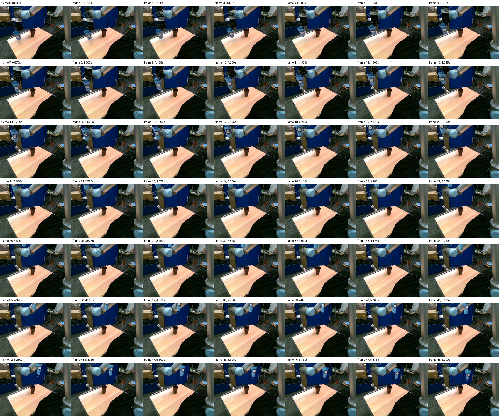

# Полная дуга MolmoMotion → DaS

3 октября 2026. Ветка `codex/das-full-motion-20261003`.

**Первый фактический ролик уже воспроизводит подъём → боковую дугу → опускание:** [H2, 6 секунд, без RGB-prior](H2_group00_6s_no_prior/generated_seed42.mp4). Реальные будущие RGB при подготовке и генерации не используются. Дополнительные парные эксперименты продолжаются; эта версия отчёта промежуточная.



[Старый F и новый H2 рядом](before_after_full_arc.mp4). Это наглядное сравнение результата; условия и временная шкала различаются, поэтому оно не является парным научным экспериментом.

## Почему прежний вариант только поднимал стакан

В прежнем `das_reference_repair` пространственный прогноз заменялся интерполяцией между реальными кадрами 63 и 73; MolmoMotion задавал только скалярную фазу. Сам кадр 73, prompt и фотографический prior описывали подъём. Старый F сохранён без изменений как результат с известным будущим endpoint.

В левой колонке исходного `fixed_comparison.mp4` отображались первые восемь baseline-точек, `group_00`. Три независимые P8-группы не согласованы: первая проходит большую дугу, вторая преимущественно поднимается, третья начинает боковое движение раньше первой. Среднее по 30 шагам RMS жёсткого fit по всем 24 точкам — 73,50 мм; по `group_00` — 1,61 мм. Ошибка проекции rigid-fit первой группы к её исходному raw-прогнозу — 0,75 px. Поэтому здесь сохраняется именно `group_00`, а не среднее трёх прогнозов.

## Геометрия и время

Один SE(3) переносит плотную видимую поверхность стакана, захват и ближайшее запястье. Дальняя часть руки не получает жёсткого control. Поворот интерполируется SLERP, перенос — линейно. Нового запуска MolmoMotion нет. [Диагностика](forecast_diagnostics.json), [группы](group_paths.png), [обычный и robust Kabsch](rigid_methods_comparison.mp4).

Подготовлены варианты на 2, 4 и 6 секунд. Во всех одна геометрия: 30 будущих шагов плюс исходная поза. При 2 секундах после кадра 16 следует hold; при 4 — после кадра 32; при 6 весь путь занимает кадры 0–48. Растяжение времени не исправляет прогноз и не сохраняет физическую временную шкалу. Сохранение поз при одинаковой фазе подтверждено [29 CPU-проверками](cpu_verification.json).

В исходной истории кадры 61, 62 и 63 имеют timestamps 12,2; 12,4; 12,6 с, то есть 5 Hz. Новое разрежение входа изменило бы сам прогноз. Здесь он остаётся замороженным: меняется только скорость прохождения уже сохранённого пути в DaS.

Сам прогноз уходит за верхнюю границу кадра в середине дуги и заканчивается выше и правее коричневого стакана. Эти свойства сохраняются по явному выбору пользователя. Это воспроизведение полного прогнозного пути, а не завершённое вложение в коричневый стакан.

## Первый результат

H2, без фотографического prior: один узнаваемый голубой стакан проходит всю дугу, исходная копия на столе отсутствует. В конце есть деформация силуэта и небольшой светлый фрагмент; дальняя часть руки не сопровождает движение захвата физически корректно. Проверены все 49 кадров.

AllTracker Net(16), 4 итерации, 512×384, независимо отслеживает восемь исходных точек на всём ролике; результат возвращён к 640×480. Добавлен наблюдаемый `t0` как дополнительная опора; его индекс исключён из оценки. Raw-прогноз линейно сопоставляется с фазой каждого кадра, пригодность пары требует видимости трекера и попадания обеих точек в изображение. **ADE 7,92 px; FDE 9,12 px; 252/392 пригодных пар.** Пустые интервалы сохраняются, а не заполняются нулём. Ошибки и покрытие по времени: [motion_metrics.json](H2_group00_6s_no_prior/motion_metrics.json), [треки поверх видео](H2_group00_6s_no_prior/generated_vs_raw_tracking.mp4). Трекер не доказывает сохранение семантической идентичности; цифры дополнены просмотром всех кадров.

## Параметры

Официальный [DaS Wanfun](https://github.com/IGL-HKUST/DiffusionAsShader/tree/47dcaf13f78fe3cafd2a4aed20df1e059917599a), commit `47dcaf13f78fe3cafd2a4aed20df1e059917599a`; [HF-модель](https://huggingface.co/alibaba-pai/Wan2.1-Fun-V1.1-1.3B-Control/tree/a116c52b08182f7a5916eae7a47fcd61a9467a04) `alibaba-pai/Wan2.1-Fun-V1.1-1.3B-Control`, revision `a116c52b08182f7a5916eae7a47fcd61a9467a04`. RTX 4070 12 GB, WSL 24 GiB RAM, BF16, sequential CPU offload, seed 42, Euler/shift 3, guidance 5, 30 шагов, TeaCache выключен, 720×480, 49 кадров, 8 FPS. Первый запуск: 545,9 с; CUDA allocated peak 9,87 GiB, reserved 11,56 GiB; RSS 21,14 GiB.

Выходные RGB получены декодированием сохранённых диффузионных латентов. Guide — отдельный вход; ни один сгенерированный кадр не подменяется фотографией или склейкой. Код и исходные латенты сохранены рядом с видео.

## Дополнительные проверки и состояние запусков

H1 (тот же путь за 2 секунды, без prior), H3 (6 секунд, t0-only prior 0,25) и H4 (6 секунд, без trajectory control и без prior) ожидают освобождения GPU другим исследованием. По выбору пользователя другой процесс не останавливается. Неуспешные попытки H3 сохранены отдельно и не считаются результатами генерации: [описание конфликта VRAM](shared_gpu_incident.json). Сохранённый guide-latent повторно используется побитово, без изменения RGB-guide или условий эксперимента.

При сравнении H1/H2 используются одинаковые 17 фаз исходного двухсекундного прогноза; хвост hold исключён. H2/H3 и H2/H4 сравниваются на пересечении видимых точек. Один seed и одна сцена не дают статистического вывода о модели в целом. [Назначение всех подготовок и отклонённых прототипов](preparation_inventory.json), [просмотр готового H2](visual_review.json). Шесть unit-проверок и 29 проверок геометрии/времени пройдены.

После внешней перезагрузки компьютера ожидающие процессы завершились; готовый H2 повторно прошёл 19 проверок. [Состояние и восстановление](reboot_incident.json). Парные GPU-эксперименты пока не завершены, поэтому вывод о влиянии скорости, prior или отключения control ещё не сделан.

Причинность относится к conditioning текущей генерации. Исходный `metadata.json` отдельно сообщает, что выбор эпизода/t0 в прошлом исследовании включал просмотр будущего. Здесь этот выбор унаследован и такой screening не повторялся. Это один выбранный клип и seed, а не слепой benchmark по датасету: [точные границы вывода](causality_scope.json).

## Воспроизведение

```bash
PY=/mnt/f/AIRI_task/.venv-das/bin/python
REPO=/mnt/f/AIRI_task/das_full_motion_20261003
$PY $REPO/scripts/das_full_motion_generate.py --name reproduced_H2 --no-prior
```

Пути к pinned checkpoint и окружению указаны в script. Генератор требует сохранённый visual review и совпадающие хэши исходных файлов, отказывается перезаписывать готовое видео. Новые версии также блокируют чтение каталога `evaluation` системным audit hook. У первого H2 такого hook ещё не было; отсутствие чтения реального будущего устанавливается его сохранённым кодом и freeze-манифестом.
