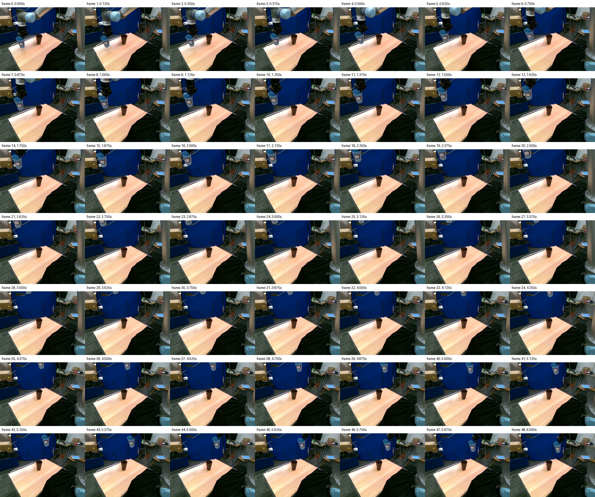
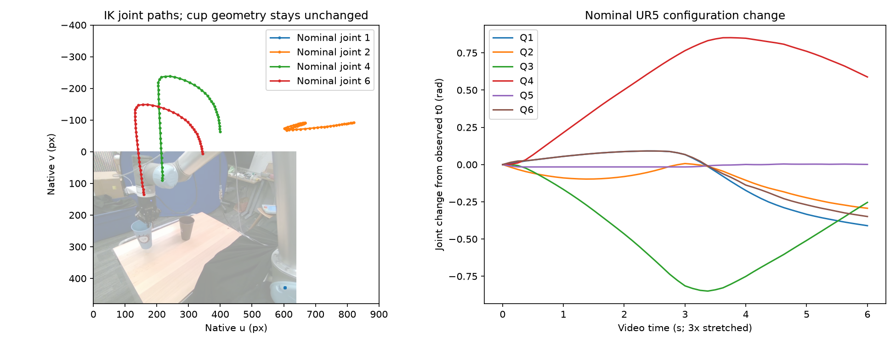

# Полная дуга MolmoMotion и движение руки UR5 → DaS

Исследование начато 3 октября 2026; итог оформлен 4 октября по Москве. Ветка `codex/das-full-motion-20261003`.

**Выбранный результат: [видео H5_group00_6s_whole_robot_prior025](H5_group00_6s_whole_robot_prior025/generated_seed42.mp4).** Сохранена качественная полная дуга одного узнаваемого стакана и захвата. Теперь предплечье поднимается вместе с ними, а плечо меняет наклон и уходит за правую границу; неподвижная старая рука не остаётся в кадре. Закреплённое основание неподвижно. Небольшие изменения рисунка стакана и деталей поверхностей сохраняются.

[H2 / H3 / новое движение руки рядом](H5_group00_6s_whole_robot_prior025_body_comparison.mp4) · [старый F и новый результат](before_after_full_arc.mp4) · [все проверки](verification.json) · [файлы и SHA256](artifact_manifest.json).



## Причина прежнего подъёма на месте

В `das_reference_repair` пространственная траектория MolmoMotion была заменена интерполяцией между реальными кадрами 63 и 73. MolmoMotion задавал только скалярную фазу; endpoint, RGB-prior и prompt описывали подъём. Старый F сохранён без изменений как вариант с известным будущим endpoint. Сравнение F с новым видео наглядное, но не парное: различаются геометрия, timing и тип prior.

В левой колонке исходного `fixed_comparison.mp4` показаны первые восемь baseline-точек, **group_00**. Три независимые P8-группы расходятся. Усреднение 24 точек одним Kabsch даёт средний RMS 73,50 мм; fit group_00 — 1,61 мм. Его средняя ошибка проекции к исходному raw-прогнозу — 0,75 px. Для воспроизведения выбранной пользователем дуги используется group_00. [Диагностика](forecast_diagnostics.json), [три группы и median](group_paths.png), [обычный и robust Kabsch](rigid_methods_comparison.mp4). All24 и robust24 здесь CPU-диагностика, без утверждения об их диффузионной генерации.

Новые редкие реальные кадры на вход MolmoMotion не добавлялись. Наблюдаемые кадры 61, 62, 63 имеют timestamps 12,2; 12,4; 12,6 с — уже 5 Hz, при соглашении модели 15 Hz. Изменение этой истории изменило бы сам прогноз. Здесь прогноз заморожен.

## Время и контролируемые сравнения

Исходные 30 будущих шагов плюс t0 описывают горизонт 2 с. Для вращения применяется SLERP, для переноса — линейная интерполяция. T2 проходит путь за кадры 0–16, затем держит endpoint; T4 — за 0–32; T6 — за 0–48. T4 подготовлен только на CPU. T6 — **time-stretched visualization of the predicted spatial trajectory**, с трёхкратным замедлением, а не исправленный физический прогноз. Контейнер из 49 кадров при 8 FPS имеет длину 6,125 с; между первым и последним кадром проходит 6 с. [29 проверок одинаковых поз при одинаковой фазе](cpu_verification.json).

| Вариант / фактическое видео | Движение | Prior | ADE raw, px | FDE raw, px | Пригодные пары | Время генерации, с |
|---|---|---:|---:|---:|---:|---:|
| [H1_group00_2s_no_prior](H1_group00_2s_no_prior/generated_seed42.mp4) | 2 с + hold | 0.00 | 19.94 | — | 63/392 | 513.8 |
| [H2_group00_6s_no_prior](H2_group00_6s_no_prior/generated_seed42.mp4) | 6 с | 0.00 | 7.92 | 9.12 | 252/392 | 545.9 |
| [H3_group00_6s_prior025](H3_group00_6s_prior025/generated_seed42.mp4) | 6 с | 0.25 | 4.33 | 4.90 | 280/392 | 553.4 |
| [H4_no_trajectory_control](H4_no_trajectory_control/generated_seed42.mp4) | 6 с | 0.00 | 209.18 | 311.61 | 251/392 | 466.2 |
| [H5_group00_6s_whole_robot_prior025](H5_group00_6s_whole_robot_prior025/generated_seed42.mp4) | 6 с | 0.25 | 4.31 | 5.06 | 281/392 | 507.4 |

Это индивидуальные оценки всех 49 кадров, с разным покрытием и, у H1, другим timing. Пропуски не заменяются нулевыми ошибками. Все метрики и видимость по времени: [comparison_metrics.json](comparison_metrics.json).

**Timing H1/H2:** сравниваются 17 одинаковых фаз исходного пути; hold исключён. На 56 общих парах ADE H1 = 7.66, H2 = 4.84 px. Индивидуально пригодны 57/136 и 91/136 пар. Общая маска не покрывает конец пути из-за потери H1, поэтому paired FDE отсутствует. Визуально быстрый вариант меняет материал и форму стакана; шестисекундный перенос устойчивее. [Сравнение одинаковых фаз](timing_comparison_equal_phase.mp4).

**Prior H2/H3:** одинаковые control, seed, prompt, sampler и время. На 252 общих парах ADE 7.92 → 4.09 px. При этом основная рука в обоих остаётся неподвижной.

**Control H2/H4:** в обоих prior выключен; H4 получает `control_video=None`, а официальный pipeline формирует нулевые control latents. На 225 общих парах ADE H2 = 7.21, H4 = 199.91 px. [Все paired metrics](matched_comparisons.json).

**H1_group00_2s_no_prior.** Большое перемещение приблизительно выполняется за первые 2 с, но стакан и захват теряют форму; остаётся серебристый фрагмент на исходном месте. Вариант отклонён как непрерывное качественное движение стакана.

**H2_group00_6s_no_prior.** Один узнаваемый голубой стакан проходит полную дугу, захват следует за ним. Пользователь принял дугу; основная рука неподвижна. Есть деформации рисунка и небольшой светлый фрагмент в конце.

**H3_group00_6s_prior025.** Полная дуга сохранена, форма и рисунок стакана устойчивее, чем в H2; ошибки трекера меньше. Основная рука по-прежнему неподвижна.

**H4_no_trajectory_control.** Без control модель двигает руку около исходного места, но не воспроизводит большую дугу; стакан становится прозрачным и затем плоским фрагментом. Вариант отклонён.

**H5_group00_6s_whole_robot_prior025.** Сохранена качественная полная дуга одного узнаваемого стакана и захвата. Теперь предплечье поднимается вместе с ними, а плечо меняет наклон и уходит за правую границу; неподвижная старая рука не остаётся в кадре. Закреплённое основание неподвижно. Небольшие изменения рисунка стакана и деталей поверхностей сохраняются.

## Новый опыт со всей рукой

После H1–H4 выполнен отдельный запрос пользователя: управлять плечом и предплечьем, сохранив дугу H2. Файл `motion.npz` стакана и локального wrist/gripper в новом опыте **байт-в-байт совпадает с H2**. Стакан не переносится на достигнутую IK-позу: сохраняется исходное преобразование SE(3).

Используются наблюдаемые состояния суставов, маски звеньев и приблизительная регистрация камеры из t0. Номинальная цепь строится по [официальным DH-параметрам UR5](https://www.universal-robots.com/articles/ur/application-installation/dh-parameters-for-calculations-of-kinematics-and-dynamics/). Последовательный bounded IK следует желаемому flange pose с ограничением 2 rad/s. Плечо отображается между неподвижной базовой осью и движущимся локтем; предплечье — между локтем и точкой соединения с неизменным движением запястья. Используются цельные t0 RGB-силуэты и плотные image-space карты материала, чтобы не возвращать дырявую поверхность отражающего металла.

Все старые положения видимых подвижных звеньев очищены t0-only synthetic clean plate. Закреплённое основание остаётся неподвижным. Новые стороны поверхности дорисовывает диффузия. [Подготовленный guide](group00_stretched_6s_whole_robot_v1/photographic_guide.mp4) — входной синтетический сигнал, а не результат генерации. [Кинематика](whole_robot_ik_diagnostic/receipt.json), [границы регистрации](whole_robot_ik_diagnostic/registration_scope.json), [подготовка и ограничения](group00_stretched_6s_whole_robot_v1/preparation.json).



Малый численный residual IK относится к принятой номинальной цепи. Ошибки исходной регистрации четырёх t0 суставов составляют 3,05; 17,07; 13,32; 10,41 px; расхождения depth около 0,14–0,18 м. Поэтому это приблизительное визуальное управление, а не заводская 3D-калибровка или план исполнения роботом. Изображение звеньев отображается 2D similarity, а запястье сохраняет единый rigid transform H2.

Независимо отслеживаются 6 материальных точек плеча/предплечья и 5 точек локального wrist/gripper. Ниже один и тот же набор общих видимых пар H2/H3/выбранного опыта. Цель для всех — новое движение руки; H2/H3 служат сохранёнными отрицательными примерами неподвижной руки.

| Видео / overlay | ADE плеча и предплечья, px | Общие пары | Среднее смещение от t0, px | Максимальное смещение, px |
|---|---:|---:|---:|---:|
| [H2_group00_6s_no_prior](H2_group00_6s_no_prior/robot_tracking_overlay.mp4) | 16.95 | 133 | 0.20 | 0.66 |
| [H3_group00_6s_prior025](H3_group00_6s_prior025/robot_tracking_overlay.mp4) | 17.03 | 133 | 0.22 | 0.62 |
| [H5_group00_6s_whole_robot_prior025](H5_group00_6s_whole_robot_prior025/robot_tracking_overlay.mp4) | 0.90 | 133 | 16.90 | 72.44 |

Числа дополнены просмотром всех кадров. Видимость учитывает реальный выход точки из кадра; скрытые звенья не оцениваются как неподвижные. [Подробности, покрытие по времени и относительное движение cup/gripper](H5_group00_6s_whole_robot_prior025_robot_comparison.json). Это 2D измерения видимых точек, без сертификации 3D-контакта или идентичности предмета.

## Диффузия, prior и ресурсы

Официальный [DaS Wanfun](https://github.com/IGL-HKUST/DiffusionAsShader/tree/47dcaf13f78fe3cafd2a4aed20df1e059917599a), commit `47dcaf13f78fe3cafd2a4aed20df1e059917599a`; [Wan2.1-Fun 1.3B Control на HF](https://huggingface.co/alibaba-pai/Wan2.1-Fun-V1.1-1.3B-Control/tree/a116c52b08182f7a5916eae7a47fcd61a9467a04), revision `a116c52b08182f7a5916eae7a47fcd61a9467a04`. RTX 4070 12 GB, host 32 GiB RAM, WSL limit 24 GiB, BF16, official sequential CPU offload, seed 42, Euler/shift 3, guidance 5, 30 шагов, TeaCache выключен, 720×480, 49 кадров, 8 FPS, initial-only reference (`ref_image=None`). Все текущие успешные запуски локальные; платные HF Jobs не запускались.

У H3 и опыта со всей рукой guide построен только из t0. После каждого Euler step применяется частичный spatial latent prior с корректным уровнем следующего sigma и фиксированным шумом. Первый latent якорится с силой 1.0; остальные веса и их маски сохранены. Для выбранного опыта global strength = 0.25. [Формула и sigma](H5_group00_6s_whole_robot_prior025/photographic_prior_receipt.json), [config](H5_group00_6s_whole_robot_prior025/config.json).

Выходные RGB получены **декодированием сохранённых диффузионных латентов**: после генерации кадры не подменяются фотографиями или композитами. Audit близости к guide исключает initial latent: relative RMS выбранного результата — 15.78% по будущим латентам целиком и 11.28% в moving region. Это мера близости к условию, не реализма или качества движения. Она не сравнима напрямую с 2,56% старого F, у которого использован будущий endpoint и другая область подсчёта. [Latent audit](H5_group00_6s_whole_robot_prior025/prior_latent_audit.json).

Ресурсы выбранного опыта: 507.4 с; CUDA allocated peak 9.88 GiB, reserved 11.56 GiB, RSS 21.14 GiB. Время предварительного ожидания другого GPU-процесса учитывается отдельно. По выбору пользователя другой прогон не останавливался. Неуспешные попытки и внешняя перезагрузка сохранены как инциденты, без выдачи за результаты: [VRAM](shared_gpu_incident.json), [reboot](reboot_incident.json).

## Границы оценки и воспроизведение

AllTracker Net(16), 4 итерации, 512×384, pinned checkpoint, дополнительные наблюдаемые t0 anchors. Из оценки исключён дополнительный anchor; координаты возвращаются к native 640×480. Пара требует tracker visibility и нахождения обеих точек в изображении. Трекер может переключиться на фон или деформированный объект; поэтому всем роликам сопоставлен просмотр 49 кадров. Низкий ADE сам по себе не доказывает идентичность стакана или реалистичность руки.

После завершения всех генераций H1 отдельно оценён на реальном продолжении 0,2–2,0 с: ADE 111.04 px, FDE — px, 29 пригодных пар. Из-за потери трека эта оценка ограничена оставшимися видимыми соответствиями. [H1 metrics](H1_group00_2s_no_prior/motion_metrics.json), [generated vs real](physical_generated_vs_real_2s.mp4).

Точная дуга group_00 выходит за верх кадра и заканчивается выше/правее коричневого стакана. Это сохранено по явному выбору пользователя. Вложение одного стакана в другой не следует из этого endpoint. Причинность здесь относится к conditioning текущей генерации. Выбор эпизода/t0 унаследован из прошлого исследования, где был future screening: одна сцена и seed 42 не образуют слепой dataset benchmark. [Точная область вывода](causality_scope.json).

Старые F/H2 и исходный comparison сохранены и проверяются по SHA256. Выполнены 7 unit-проверок, 29 CPU-проверок геометрии/времени и итоговая проверка всех запрошенных вариантов, frozen inputs, точных латентов, guide cache, одинаковых initial RGB, независимых tracker receipts и ручного просмотра. [verification.json](verification.json), [назначение каждой подготовки](preparation_inventory.json), [visual_review.json](visual_review.json).

Для новой генерации по опубликованной замороженной подготовке в локальном WSL-окружении:

```bash
PY=/mnt/f/AIRI_task/.venv-das/bin/python
REPO=/mnt/f/AIRI_task/das_full_motion_20261003
$PY $REPO/scripts/das_full_motion_generate.py \
  --name reproduced_whole_robot \
  --preparation-subdir group00_stretched_6s_whole_robot_v1 \
  --strength 0.25
```

Генератор требует совпадения frozen SHA256 и принятого review, ждёт освобождения GPU перед загрузкой моделей, запрещает чтение реального `evaluation` и перезапись готового видео. Первому H2 audit hook добавлен позднее; отсутствие будущих RGB устанавливается по его сохранённому коду и freeze manifest. H3 повторно использовал точно тот же guide latent из сохранённой прерванной попытки, что проверяется по SHA256 и `torch.equal`. Все исходные латенты, snapshots кода, окружение, input receipts, видео, previews и измерения сохранены в этой директории.
