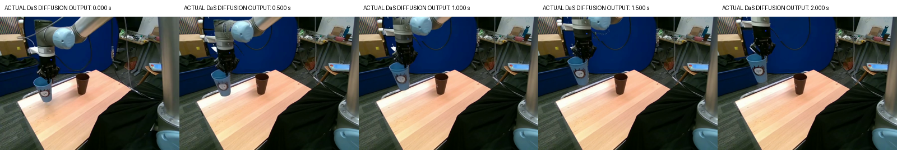

# DaS: исправление неподвижной копии и сохранение узнаваемого стакана

3 октября 2026. Ветка `codex/das-reference-repair-20261003-1642`.

Получено более качественное видео: один голубой стакан поднимается вместе с захватом, рисунок сохраняется, исходная копия и след на столе исчезли. Проверены все 49 кадров. Небольшие изменения формы запястья и предплечья при подъёме остаются.

**Этот опыт использует разрешённый пользователем будущий RGB-кадр 73 как референс положения через 2 секунды. Пространственная траектория исходного MolmoMotion заменена траекторией между двумя RGB-опорами; MolmoMotion задаёт только темп движения. Результат показывает качество синтеза при известном конечном кадре, а не улучшение прогнозирования MolmoMotion.** Прежние причинные эксперименты и их отрицательные выводы сохранены: [MolmoMotion → DaS](../das_wanfun/README.md), [робот + стакан, A/B/C](../das_robot_cup/README.md).

## Видео и сравнения

- **[Новое выбранное видео F](guided_endpoint_background/generated_seed42.mp4)** — фактический результат диффузии DaS, 720×480, 49 кадров, 8 FPS.
- [Старое и новое видео, все 6 секунд](before_after_full_6s.mp4).
- [Старый C / E без RGB-prior / новый F / реальное продолжение, первые 2 секунды](old_ablation_new_real_2s.mp4).
- [Обычный DaS с новым control — E](endpoint_without_rgb_prior/generated_seed42.mp4), [без траектории — G](no_trajectory_control/generated_seed42.mp4), [парное сравнение E/G](native_control_vs_no_control_2s.mp4).
- [Все кадры F](guided_endpoint_background/all_49_generated_frames.png), [точные моменты 0, 1, 2 с](comparison_exact_times.png), [проверка всех кадров](visual_review.json).



Файл длится 6.125 с: 49 отсчётов времени от 0 до 6 с. Движение задано на 0–2 с; после 2 с поза удерживается. Эти 2 секунды показывают подъём, а не завершение размещения в коричневом стакане.

## Что вызывало ошибку и как исправили

В старом C исходный стакан остаётся на месте, а управление создаёт смазанный движущийся фрагмент. В предыдущих A/B пустой reference и vacancy-prior убирали исходные силуэты, но разрушали подвижные объекты. Рендер робота имел пропуски: около 58% его глубины оценивалось из-за отражающего металла. Сам прогноз стакана существенно расходился с реальным движением и частично выводил его из кадра. Эти факторы дают противоречивые и неполные условия; вклад каждого по старому/новому видео отдельно не идентифицирован.

Исправление использует только исходный кадр 63 и конечный RGB-кадр 73. **Кадры 64–72 не открываются при подготовке или генерации.** Они используются в оценке после завершения всех новых генераций. SAM2.1 выделяет стакан и левую часть робота в конечном кадре; начальные маски взяты из предыдущего опыта. Для стакана строится ограниченное аффинное соответствие по размерам масок, для видимой левой цепи — общий перенос. Плотный image-space control покрывает силуэты целиком, не требует невалидной глубины металла и не оставляет неподвижный цветовой силуэт старого стакана. Цвета соответствий выводятся из t0 XY и обратной глубины; обратное соответствие конечного вида приближённое, это не точная регистрация новых 3D-поверхностей.

Время движения взято из нормированной накопленной длины пути центроида сохранённого MolmoMotion-прогноза. Это монотонная фаза между начальным и известным конечным видом; исходные пространственные координаты прогноза не используются как новый путь. 2D-перенос робота не заменяет откалиброванную IK/FK и не является планом исполнения для реального UR5.

Для F построен фотографический RGB-ориентир между двумя опорными видами. Смешивается внешний вид, а непрозрачность объекта сохраняется; первая неудачная прозрачная версия отклонена до запуска модели — [контрольные кадры](rejected_translucent_preparation.png). В первом сгенерированном D большой дубликат исчез, но на старом месте сохранялся небольшой след: [видео D](guided_strength045/generated_seed42.mp4). В окончательном F фон берётся из конечного реального кадра, что удаляет след и неподвижные фрагменты крепления. Фон, скрытый в обоих опорных кадрах, заполнен уже сохранённой пустой подложкой прошлого опыта; её происхождение зафиксировано в [preparation.json](refined_background/preparation.json).

RGB-ориентир кодируется Wan VAE. После каждого шага Euler латенты частично притягиваются к нему с правильным уровнем шума следующего шага:

`z ← (1 − w) z + w [(1 − sigma_next) z_guide + sigma_next epsilon]`.

Для будущих латентов `w=0.45`, для первого — `w=1`. Это **расширение inference**, а не стандартный режим DaS, новое обучение или новый checkpoint. Весь внешний вид и значительная часть движения уже заданы фотографическим ориентиром; модель выполняет диффузионное уточнение. [Receipt](guided_endpoint_background/photographic_prior_receipt.json) фиксирует 30 применений, sigma и веса. Выходные латенты отличаются от guide на 2.56% относительного RMS; после VAE-декодирования RGB не склеивается с исходным видео и не заменяется фотографиями. [Photographic guide](refined_background/photographic_guide.mp4) — отдельный вход, он не выдан за сгенерированный ролик.

Photoshop/Adobe не был подключён в этой сессии. Новое редактирование изображения не потребовалось: использованы исходные RGB-кадры и подложка предыдущего запуска, созданная тогда встроенным imagegen. Новая модель HF для редактирования изображений в этом опыте не загружалась и не оценивалась.

## Качественная оценка

В F на каждом из 49 кадров виден один голубой стакан; белый рисунок остаётся узнаваемым. Большой неподвижной копии, лишнего ободка и следа под исходным положением после подъёма не видно. Стакан и захват имеют согласованный видимый подъём и контакт. Это визуальная 2D-проверка, не доказательство физического контакта или точной 3D-кинематики. При переходе между опорами детали запястья и предплечья слегка меняют форму.

В E один узнаваемый стакан перемещается уже без фотографического prior. Это показывает, что исправленный плотный control позволяет штатному sampler DaS получить хороший результат. В G без траектории подъём не соответствует заданному пути, движение и форма стакана менее стабильны, а в конце шестисекундного хвоста узнаваемость ухудшается. Сам по себе новый текст и 30 шагов проблему управления движением не решают.

## Количественная оценка

AllTracker Net(16) независимо отслеживает 24 точки стакана и 14 точек робота. Масштаб 720×480 возвращён к исходным 640×480; треки 8 Hz линейно сопоставлены с десятью реальными моментами 0.2–2.0 с на 5 Hz. Проверяется видимость обоих соседних отсчётов. Один и тот же ROI объединяет старое место, старую и новую области движения; его средняя площадь — 22.00% кадра. Ошибки трекера и замена объекта фоном остаются возможны, поэтому численные результаты дополнены просмотром всех кадров.

| Видео | PSNR, dB ↑ | Общий ROI MAE ↓ | ROI MAE только 0.2–1.8 с ↓ | Flow warp MAE ↓ |
|---|---:|---:|---:|---:|
| Старый C: прогноз MolmoMotion | 17.47 | 43.84 | 42.74 | 7.89 |
| G: без траектории | 16.86 | 46.58 | 46.22 | 4.97 |
| E: исправленный control | 21.08 | 21.60 | 21.43 | 4.10 |
| F: control + RGB-ориентир | 22.06 | 19.93 | 21.40 | 3.68 |

MAE выражен на шкале 0–255. В столбце 0.2–1.8 с исключён известный конечный кадр, но **условие будущего endpoint всё равно присутствует**. F снижает ошибку изображения в этих промежуточных кадрах относительно старого C примерно на 49.9%. По этой метрике F и E практически равны: 21.40 и 21.43. Преимущество F заметнее в сохранении деталей, конечного вида, чистого фона и точности движения. Низкая warp-ошибка сама по себе также поощряет неподвижное видео; она не заменяет проверку фактического переноса.

Реконструкция движения стакана относительно реального продолжения на общей для всех четырёх видео маске:

| Видео | ADE, px ↓ | FDE в 2 с, px ↓ | Общие видимые пары |
|---|---:|---:|---:|
| Старый C: прогноз MolmoMotion | 46.85 | 84.03 | 222/240 |
| G: без траектории | 56.91 | 63.20 | 222/240 |
| E: исправленный control | 11.84 | 4.50 | 222/240 |
| F: control + RGB-ориентир | 6.68 | 0.42 | 222/240 |

Общее покрытие — 222/240, или 92.5%; обе ошибки считаются на совпадающих подмножествах. Очень малая FDE у F ожидаема, поскольку конечный вид был известен. Это не результат предсказания неизвестного будущего. Старый C имеет другие control, prompt, 25 шагов и TeaCache; его сравнение с F описательное, не изоляция одного параметра.

В **парной E/G абляции** одинаковы checkpoint, seed, prompt, negative prompt, start image, CLIP, отсутствие persistent reference, Euler, 30 шагов, guidance 5 и выключенный TeaCache. Различается только подача trajectory control; G использует нативную ветку `control_video=None`, а не VAE-кодирование чёрного ролика. На общих 224/240 парах ADE/FDE к заданной endpoint-траектории: **E 8.74/8.91 px**, **G 59.33/58.58 px**. Оба варианта используют общий описательный prompt, выбранный после просмотра endpoint; в G будущие RGB/control/guide тензоры модели не передаются. Эта абляция изолирует пользу dense control при фиксированном тексте, но не сравнивает чистое прогнозирование с доступом к будущему.

В **парной F/E абляции** тот же dense control и sampler; добавляется фотографический latent prior. Нативный E уже переносит объект; prior уточняет внешний вид и уменьшает дрейф. Пустая подложка, endpoint RGB и их интерполяция входят в это добавленное условие. Полные метрики, покрытие, роботные треки, ошибки по времени и выровненные массивы доступны в [comparison_metrics.json](comparison_metrics.json).

## Модель, ресурсы и воспроизведение

Использованы официальная ветка DaS `Wanfun`, commit `47dcaf13f78fe3cafd2a4aed20df1e059917599a`, и уже обученный Alibaba PAI `Wan2.1-Fun-V1.1-1.3B-Control`, revision `a116c52b08182f7a5916eae7a47fcd61a9467a04`. [Авторская интеграция DaS](https://github.com/IGL-HKUST/DiffusionAsShader/blob/47dcaf13f78fe3cafd2a4aed20df1e059917599a/models/pipelines_wanfun.py), [checkpoint HF](https://huggingface.co/alibaba-pai/Wan2.1-Fun-V1.1-1.3B-Control). Отдельный DaS robot checkpoint не обучался. Runtime сохраняет модели и VAE автора; добавлены single-GPU shim отсутствующего distributed-модуля и явные изменения условий inference.

RTX 4070, 12 GB VRAM; host 32 GiB RAM, лимит WSL 24 GiB; BF16, sequential CPU offload, 720×480, 49 кадров, 8 FPS, seed 42, Euler/shift 3, 30 шагов, guidance 5, TeaCache выключен. Новые GPU-запуски выполнялись последовательно.

| Запуск | Время, с | Peak CUDA allocated, GiB | CUDA reserved, GiB | Process RSS, GiB |
|---|---:|---:|---:|---:|
| guided_strength045 | 518.1 | 9.88 | 11.56 | 21.13 |
| endpoint_without_rgb_prior | 465.5 | 9.87 | 11.56 | 21.14 |
| guided_endpoint_background | 490.1 | 9.88 | 11.56 | 21.14 |
| no_trajectory_control | 448.0 | 9.68 | 11.37 | 21.14 |

Config, версии пакетов, GPU-info, исходные латенты и логи находятся рядом с каждым видео. Снимки использованного кода сохранены в `source_snapshot/` для D/E, и в `guided_endpoint_background/source_snapshot/`, `no_trajectory_control/source_snapshot/` для последующих запусков. Финальные scripts поддерживают повторение всех четырёх режимов. Команды ниже рассчитаны на использованное WSL-окружение и существующие pinned checkpoints; большие веса в GitHub не включены. Другому окружению нужно изменить пути в scripts.

```bash
# Сохранённые control, guide и visual review уже входят в эту ветку.
PY=/mnt/f/AIRI_task/.venv-das/bin/python
REPO=/mnt/f/AIRI_task/das_reference_repair_20261003
$PY $REPO/scripts/das_reference_generate.py --name reproduced_F --preparation-subdir refined_background
$PY $REPO/scripts/das_reference_generate.py --name reproduced_E --no-prior
$PY $REPO/scripts/das_reference_generate.py --name reproduced_G --no-prior --no-control
# Оценка канонических сохранённых F/E/G и старого C:
/mnt/f/AIRI_task/.venv/bin/python $REPO/scripts/das_reference_evaluate.py
/mnt/f/AIRI_task/.venv/bin/python $REPO/scripts/das_reference_verify.py
```

Скрипты отказываются перезаписывать видео. Для воспроизведения подготовки можно создать отдельный `--output-subdir`, скопировать сохранённые endpoint masks и вызвать `das_reference_prepare.py --output-subdir <name> --background endpoint`; новое управление требует фактического visual review с совпадающими хэшами. Исходный прогноз MolmoMotion не запускается повторно.

Итог: **65 проверок PASS**, включая неизменность исходного причинного опыта, точный t0, временную сетку, удержание позы, dimensions control, реальные latent tensors, partial prior, совпадение условий абляций, пересчёт ошибок на общей маске и семантический просмотр всех кадров F. [Verification](verification.json), [manifest](artifact_manifest.json). Результат удовлетворяет новой цели улучшения видео с разрешённым референсом; успех чистого MolmoMotion → DaS без будущего кадра этим опытом не установлен.
